# Chukta: Product Requirements

| | |
|---|---|
| **Purpose** | Defines what Chukta v1 does, who it is for, and how we will know it works. Every other design doc implements this one. |
| **Intended reader** | The developer building v1, the Hat B and Hat C reviewers, and the owner who verifies statutory claims against primary sources. |
| **Status** | In Review (Hat A, checkpoint after the PRD) |
| **Author hat** | Hat A, Systems Architect |
| **Last updated** | 2026-09-11 |
| **Source brief** | [`BRIEF.md`](BRIEF.md). Decisions that change the brief are in Appendix C. |

### Conventions used in this document

- `[VERIFY Vnn: provision]` marks a statutory or regulatory claim that has not been checked against a primary source. Each ID appears once in Appendix A, with the exact provision and the source to check it against. Nothing tagged here is settled law.
- Every target number carries a label. **[System]** means it can be measured on synthetic data now. **[Business outcome]** means it needs a real pilot and cannot be claimed yet. Figures inside worked examples are synthetic illustrations, not metrics.
- **"The 43B(h) rule"** means s.43B(h) of the Income-tax Act 1961 for tax years up to 2025-26, and its equivalent provision in the Income-tax Act 2025 from 1 April 2026 [VERIFY V03: Income-tax Act 2025, provision equivalent to s.43B(h)].
- ADR-0001 to ADR-0019 are the checkpoint-1 decisions. Appendix C maps each one to this document. The ADR files are written later in Hat A's set.

---

## 1. Problem

### 1.1 How receivables stall

An Indian MSME sells on credit and waits 70 to 120 days to be paid. The owner or accountant chases by hand. Invoices stall for three specific reasons. All three examples below are synthetic. Supplier S is a micro enterprise. Buyer B is a private limited company.

**Blocker 1: the document wall.** S raises invoice SI-1182 for ₹3,48,000. On day 50, B's AP team replies: "Please share invoice copy, PO, signed DC, e-way bill and GRN for SI-1182. Also send ledger confirmation." The signed challan is a phone photo somewhere in the driver's WhatsApp. S's accountant takes nine days to assemble the packet. B pays in two batches a month, so S misses both. The invoice reaches day 80 before it even enters B's approval queue.

B's AP asks for these papers because its own **AP three-way match** failed. That is B's internal check that the PO, the GRN and the invoice agree before payment is released. The packet exists to make B's match pass. Chukta's job is to assemble exactly what was asked for, quickly, and say clearly what is missing.

**Blocker 2: the ledger mismatch.** S's books show ₹4,70,000 due from B. B's quarterly ledger statement, an Excel file in a new layout, shows ₹4,20,000. The ₹50,000 gap has four causes:

| Cause | Amount | Why S's balance is higher |
|---|---:|---|
| TDS deducted by B, not yet booked by S | ₹11,800 | B reduced its payable when it deducted TDS |
| Credit note B raised for a short supply, never booked by S | ₹18,000 | S never recorded the credit note |
| Payment B made on 30 June, booked by S on 2 July | ₹15,000 | Timing difference across the statement date |
| Invoice S raised that B has not booked (GRN missing) | ₹5,200 | B has no GRN, so no liability in its books |
| **Total** | **₹50,000** | |

Finding these means matching about sixty lines across two layouts and reading free-text narrations. Nobody does it, so the balance freezes. Chukta's job is to produce a **Balance Confirmation Statement (BCS)** that itemises each difference by cause and ties out to the rupee.

We call this **ledger reconciliation**: matching the counterparty's ledger against our internal ledger and bank credits. The brief called it "three-way match". That term is reserved for the buyer's AP check above (see §12).

**Blocker 3: the unused statutory position.** S makes machined parts and was registered on Udyam before the PO date. B's PO says "payment 60 days from invoice". Goods are delivered on 10 January 2027, and B makes no written objection. So acceptance is that day [VERIFY V07: MSMED Act 2006 s.2(b), Explanation]. Where there is a written agreement, the payment period cannot exceed 45 days from acceptance [VERIFY V08: MSMED Act 2006 s.15]. We count days excluding the acceptance day [VERIFY V09: General Clauses Act 1897 s.9]. On that basis the statutory due date is 24 February 2027, which is earlier than the PO's own terms. From 25 February, s.16 interest accrues [VERIFY V11: MSMED Act 2006 s.16]. If B is still unpaid at 31 March 2027, B's deduction for this purchase moves to the tax year in which B pays [VERIFY V01: Income-tax Act 1961 s.43B(h)], [VERIFY V03].

Had the same goods been delivered in June, the 43B(h) rule would have no effect unless B were still unpaid at 31 March. For most of the year, s.16 interest is the only lever. §5.8 turns this into a named behaviour.

Using this position needs facts sellers rarely gather: the acceptance date, whether the terms are written, the seller's classification on the relevant date, and whether the supply is trading. §3.2 sets out who qualifies.

### 1.2 Today's workflow and where it breaks

These are working assumptions from the brief. A pilot must confirm them.

- Chasing happens on WhatsApp and phone, from the owner's or accountant's own number. Nobody keeps a shared record of what was asked, promised or sent.
- Ageing comes from a Tally or Excel report. It says what is overdue, not why.
- Documents are scattered across email attachments, WhatsApp photos and paper files. Assembling a packet is a search task.
- Reconciliation happens when an auditor asks for balance confirmations. Between audits, a mismatch just freezes the balance.
- The statutory position is rarely computed. The seller may not know the rule, may not have the acceptance date, or may worry about the relationship.

### 1.3 What Chukta is for

- **Primary product: Evidence and Reconciliation.** They remove the two blockers that apply to every seller, qualifying or not.
- **Conversation** keeps case state current from the buyer's replies, so the next action is based on what the buyer actually said.
- **Statutory is a high-value feature for a qualifying subset** (§3.2). It is not the centrepiece. It is gated by eligibility, and the ladder reaches it only after documents and reconciliation are dealt with (§5.8).
- **Everything outbound is drafted for a human to approve and send.** Chukta has no send capability in v1 (ADR-0011).

---

## 2. Users and roles

| Role | Who | What they do in Chukta | Approval rights (detail in §7.2) |
|---|---|---|---|
| Owner | Proprietor, partner or director | Sets policy (tone, ladder limits, CA review). Sees everything. | All artifact types |
| Accountant | In-house or part-time | Uploads registers, ledgers and bank statements. Runs reconciliation. Links documents. | Conversational messages, evidence packets, BCS |
| Collections staff | Person who works the queue | Logs calls, pastes replies, prepares drafts. | None by default |
| Read-only CA | The seller's chartered accountant | Reads everything in the tenant. Adds review notes and review attestations on statutory artifacts. Cannot change data or approve. | None. Attests review only. |

- A **tenant** is one seller business. A CA may belong to several tenants. A session has exactly one active tenant at a time, and nothing is ever returned across tenants (ADR-0012).
- **Counterparties are not users.** The buyer's AP contact, stores team and finance head never log in. Everything they send is untrusted input (§9, NFR-04).

---

## 3. Assumptions and eligibility

### 3.1 Operating assumptions

- INR only. The seller is GST-registered and issues tax invoices.
- Indian financial year, April to March. All dates and times in IST.
- The seller's books live in Tally or Excel and are exported as CSV or XLSX. There is no live ERP link in v1 (NG3).
- Counterparty ledgers and bank statements arrive as XLSX, CSV, text PDF or scanned PDF.
- **Inbound channels:** a per-tenant forwarding email address (signed webhook), manual paste, WhatsApp chat export files, and call notes typed by staff.
- **Outbound:** Chukta never transmits. Approval produces the final artifact plus a `wa.me` or `mailto` link, and a human sends it (ADR-0011). Approved artifacts can carry a Razorpay test-mode payment link.
- **Languages:** inbound English, Hinglish (Roman script) and Hindi (Devanagari). Other languages are detected and routed to a human. Notices and BCS go out in English. Conversational drafts use the language of the thread.
- v1 runs on synthetic data only (NG4).

### 3.2 Statutory eligibility: the qualifying subset

Chukta decides eligibility per invoice. There are two levers, and they have different conditions.

| ID | Condition | Gates s.16 interest | Gates the 43B(h) rule | Tag |
|---|---|:---:|:---:|---|
| E1 | Seller was a micro or small enterprise on the relevant date. Medium does not qualify. | Yes | Yes | [VERIFY V17: MSMED Act s.7 and the current MoMSME classification notification]; [VERIFY V21: reclassification rules and which date governs] |
| E2 | Seller held Udyam registration on the relevant date | Yes | Yes | [VERIFY V18: MSMED Act s.2(n) and s.8]; [VERIFY V19: whether registration must precede the contract or supply] |
| E3 | The supply is manufacturing or services, not trading | Yes | Yes | [VERIFY V20: MoMSME notification bringing traders under Udyam for priority-sector lending only] |
| E4 | Acceptance date is known from evidence (challan, GRN, POD, or a resolved objection) | Yes | Yes | [VERIFY V06: MSMED Act s.2(b)]; [VERIFY V07] |
| E5 | Payment terms are known: whether a written agreement exists, and its period | Yes | Yes | [VERIFY V08]; [VERIFY V10: whether an accepted PO is a "written agreement"] |
| E6 | Buyer claims the expense as a business deduction under income tax | No | Yes | [VERIFY V22: s.43B scope for presumptive-tax and non-assessee buyers]; [VERIFY V23: MSMED Act s.2(d), "buyer"] |

Each invoice ends in one of three states:

- **Qualifying.** The conditions hold for one or both levers. Chukta says which.
- **Not qualifying.** One or more reason codes, shown to the owner. For example `E3_TRADING` or `E1_MEDIUM`.
- **Undetermined.** A required input is missing. Chukta creates a task for it, for example "Upload the signed challan for SI-1182 to fix the acceptance date". It never guesses. An unknown acceptance date is never replaced by the invoice date (ADR-0002).

Payment terms extracted by a model (E5) drive a legal deadline. A human must confirm them before they count.

Classification can change from year to year, so it is stored with effective dates (ADR-0003). Chukta does not automate the Udyam portal. It extracts classification from the uploaded certificate, and a human confirms it (NG5), [VERIFY V24: Udyam verification access and terms].

### 3.3 What non-qualifying sellers get

Everything except the statutory levers: evidence packets, reconciliation and BCS, reply classification, dispute investigation, analytics and payment links. Statutory screens show "not applicable" with the reason codes. How large the qualifying subset is among real users is unknown. It is a pilot question (BO-10), not an assumption.

---

## 4. Goals and non-goals for v1

**Goals**

| ID | Goal |
|---|---|
| G1 | Turn an AP document request into a complete, correctly linked evidence packet, with missing items named. |
| G2 | Turn a counterparty ledger in any supported format into a BCS that ties out exactly and itemises every difference by cause. |
| G3 | Classify inbound replies, including Hinglish and fragments. Extract and validate entities. Update case state. |
| G4 | For qualifying invoices, compute the statutory position (due date, s.16 interest, 43B(h) exposure by date) and draft a notice whose every citation is verified. |
| G5 | Investigate disputes against the evidence and return a validity assessment with cited spans. |
| G6 | Answer cash questions (forecast, DSO, CEI, payroll chase list) from deterministic computation. |
| G7 | Attach Razorpay test-mode payment links to approved artifacts, and close the loop through verified webhooks. |
| G8 | Guarantee that no artifact is finalised without human approval, and that no fact or citation appears in an artifact without a bound source. |
| G9 | Measure all of the above on synthetic and hand-written data, reported per data source. |

**Non-goals**

| ID | Non-goal |
|---|---|
| NG1 | No transmission of messages by the system (email, WhatsApp, SMS). The send adapter is specified in `07-API-CONTRACTS.md` but not implemented (ADR-0011). |
| NG2 | No legal advice. Statutory output is a computed position and a draft for the owner or CA to review. |
| NG3 | No live ERP integration. The Tally adapter is an interface spec only. |
| NG4 | No real customer data. |
| NG5 | No automated Udyam portal verification or scraping. |
| NG6 | No MSEFC or Samadhaan filing workflow. Section 18 is cited only (ADR-0006). |
| NG7 | No live payments. Razorpay runs in test mode only. |
| NG8 | No bank integrations (Account Aggregator, bank APIs). Statements are uploaded. |
| NG9 | No "probability of payment" learned from synthetic history. |
| NG10 | No automated write-offs or credit notes. The system recommends and a human decides. |

---

## 5. Core workflows

There is one durable case per customer account (ADR-0009). Inside it, each invoice has its own state machine (§5.9). A case wakes on four events: an inbound message, an upload, a Razorpay webhook, or a `wake_at` timer (ADR-0013). Each wake produces **at most one outbound draft per account**, which combines invoices at different steps. Every draft passes the gate (§7) before it reaches the approval queue. The diagrams show the main path and the main exits to a human.

### 5.1 Document request → evidence packet → approval

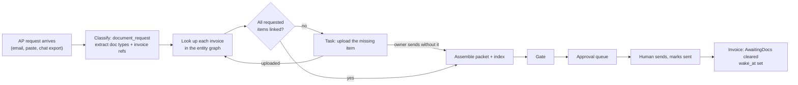

- The packet contains exactly the requested items and nothing else, so unrelated data never reaches the buyer. Missing items are listed with the reason.
- The model reads the AP request and classifies and extracts scans at upload. Assembly is code.

### 5.2 Ledger statement → reconciliation → BCS → approval

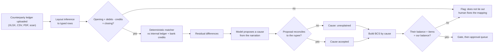

- The matcher runs in a fixed order: exact reference, then amount within a date window, then deduction patterns, then credit-note links, then one payment split across many invoices.
- **A false match is worse than a miss,** because it hides a real difference. When unsure, the matcher leaves a row unmatched.
- The matcher does not hard-code TDS rates. It explains a deduction from the narration and the arithmetic, and a human confirms any new pattern.

### 5.3 Qualifying invoice past its statutory due date → notice → approval

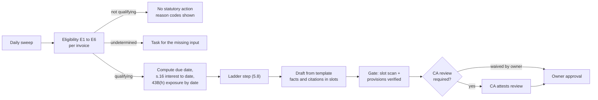

- The statutory corpus starts empty. Until the owner loads and verifies provisions (Appendix B), the gate blocks every statutory draft (FR-STA-6).
- Every computed figure shows its method parameters and the bank rate used, so a CA can reproduce it by hand (ADR-0004).

### 5.4 Inbound reply → classification → case update

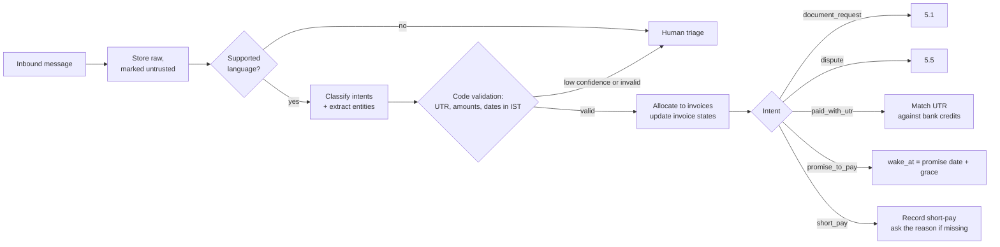

- A message can carry more than one intent ("payment 15 ko karenge, DC copy bhejo"), so classification is multi-label.
- A claimed UTR with no matching bank credit never marks an invoice paid. The invoice waits for the next bank statement, and the owner is asked.

### 5.5 Dispute → investigation → validity assessment

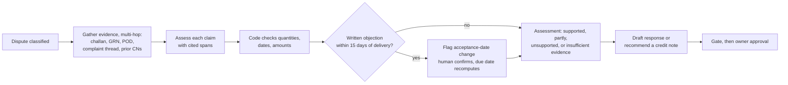

- A written objection within 15 days of delivery moves the acceptance date [VERIFY V07: MSMED Act 2006 s.2(b), Explanation]. That is why the Dispute path feeds the Statutory path (ADR-0002).
- Chukta never issues a credit note. It recommends one, and a human decides (NG10).

### 5.6 "Payroll is on the 7th": chase list

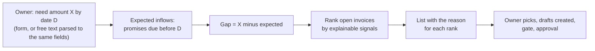

- **Ranking signals:** promise dates before D, blockers cleared (packet sent, BCS confirmed), amount, days overdue, and the buyer's historical days-to-pay taken from the ledger. There is no probability score (NG9).

### 5.7 Payment-link loop (Razorpay test mode)

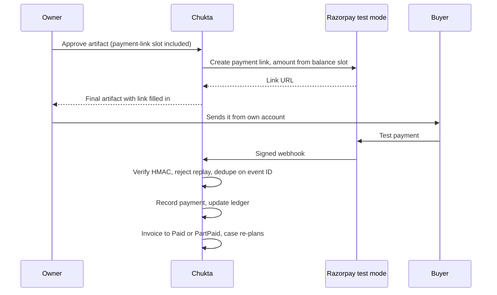

- Creating a link is an API call to Razorpay. It sends nothing to the buyer, and it happens only after approval.
- Approval covers the artifact including a payment-link slot. After the link is filled in, the gate checks only that the link's amount equals the approved amount (§7.1, A6).

### 5.8 Named behaviour B-1: the year-end lever window

The two statutory levers have different shapes across the year. Chukta models this explicitly.

- **s.16 interest is the year-round lever.** It accrues from the day after the statutory due date [VERIFY V11: MSMED Act 2006 s.16], and it is not deductible for the buyer [VERIFY V14: MSMED Act 2006 s.23].
- **The 43B(h) rule is the January to March lever.** It has an effect only when a qualifying invoice's statutory due date has passed and the invoice is still unpaid at 31 March. The buyer's deduction then moves to the tax year of payment [VERIFY V01: Income-tax Act 1961 s.43B(h)], [VERIFY V05: exposure arises only if the due date is on or before 31 March]. **This is a deferral, not a loss.**

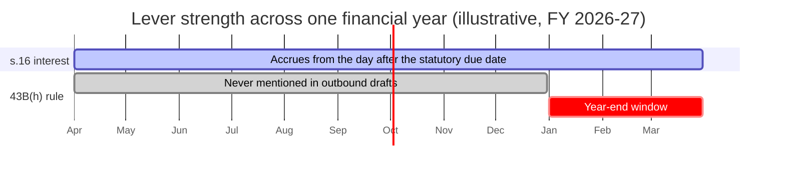

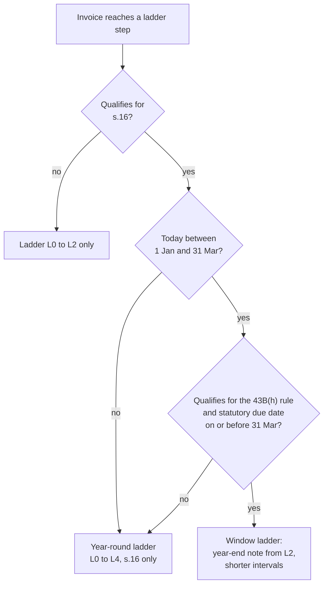

**The ladder**

| Step | April to December | January to March, for invoices that qualify for the 43B(h) rule and are due by 31 March | Applies to |
|---|---|---|---|
| L0 | Courtesy reminder with statement of account | Same | All invoices |
| L1 | Clear blockers: offer the packet or BCS | Same | All invoices |
| L2 | Firm reminder with payment link | Firm reminder, payment link and a dated year-end note | All invoices. The year-end note only for invoices that qualify for the 43B(h) rule. |
| L3 | s.16 interest statement | s.16 interest statement plus 43B(h) exposure | Qualifying invoices only |
| L4 | Formal notice citing s.15, s.16, s.17 and s.18 [VERIFY V08], [VERIFY V11], [VERIFY V15: MSMED Act 2006 s.17], [VERIFY V16: MSMED Act 2006 s.18] | Same, plus 43B(h) exposure if before 31 March | Qualifying invoices only. CA review by default. |

**Rules of B-1**

1. From 1 April to 31 December, no outbound draft mentions the 43B(h) rule.
2. From 1 January to 31 March, invoices that qualify for the 43B(h) rule (E1 to E6 all hold) and are due on or before 31 March get the window ladder. Intervals between steps shrink so that L2 and L3 can happen before 31 March. Intervals are tenant configuration, and their defaults are set in `03-AGENT-DESIGN.md`. They are not targets.
3. The wording is fixed by template: "the deduction moves to the tax year of payment". The word "lost" never appears.
4. From 1 April, 43B(h) wording is withdrawn for invoices of the year that just closed. The deferral has already happened. The ladder reverts to s.16.
5. An invoice whose statutory due date falls after 31 March has no 43B(h) exposure in that year [VERIFY V05].
6. Invoices payable under the 1961 Act and paid on or after 1 April 2026 are "undetermined" for the 43B(h) rule until the transition rule is verified [VERIFY V04: Income-tax Act 2025, repeal and savings provision].
7. The ladder reaches statutory steps only after blockers are cleared or offered. An unanswered document request or an open reconciliation difference comes first. A notice that ignores an open document request is weak, and it harms the relationship.

### 5.9 Case and invoice lifecycle

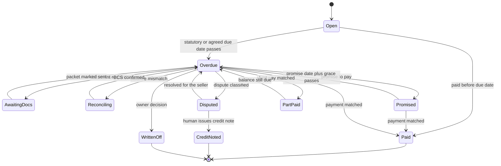

| Account case state | Meaning | Leaves when |
|---|---|---|
| Active | At least one invoice needs an action now | A draft or task is produced |
| Waiting | Every invoice waits on the buyer or a timer, and `wake_at` is set | A message, upload, webhook or timer arrives |
| NeedsHuman | A task or triage item blocks progress | A human resolves it |
| Closed | No open invoices | A new invoice or a payment reversal reopens it |

Case and invoice state live in Postgres. LangGraph checkpoints live in a separate schema (ADR-0014). A case resumes after days through the `wake_at` sweep, not through a held process (ADR-0013).

---

## 6. Why AI is load-bearing, and where it was removed

### 6.1 The test

A component uses a model only if its input is unstructured and code alone would lose correctness or coverage. Model output is a proposal, and code validates it before it changes any state. This applies the brief's own rule: if code can replace a component without loss, the model comes out. This section covers subtraction as much as addition.

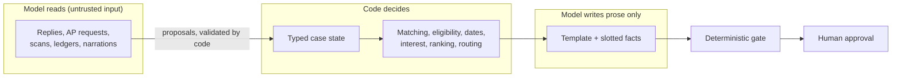

### 6.2 Where the model is load-bearing

| Component | Input | What the model does | What breaks with code only | Driver | Tier (ADR-0016) |
|---|---|---|---|---|---|
| Reply classification (Conversation) | English, Hinglish and Hindi fragments | Multi-label intent. Extracts UTR, amounts, dates and invoice refs. Resolves "month-end tak" to a candidate date. | Keyword rules fail on code-mixed, misspelled, fragmentary text | LLM, then code validates | SLM |
| AP request parsing (Evidence) | Free-text AP email | Maps "DC copy", "inward slip", "POD" to document types and invoice refs | Synonyms and implicit references vary per buyer | LLM + code | SLM |
| Scan classification and extraction (Evidence) | Phone photos and scans of challans, GRNs, e-way bills | Document type, number, date, quantities, references, signature or stamp present | Template OCR breaks on layout variance, handwriting and stamps | LLM + code, human queue on low confidence | Vision-capable model |
| Ledger layout inference (Reconciliation) | Counterparty XLSX, CSV, PDF | Finds header rows, maps columns, detects sign convention | Every buyer's layout differs and changes by quarter | LLM, then code checks tie-out | SLM |
| Narration reading (Reconciliation) | "TDS Q1", "CN agst short supply" | Proposes a cause for each residual difference | Narrations are free text | LLM proposes, code checks arithmetic | SLM, frontier on residuals the SLM cannot explain |
| Payment-terms extraction (Statutory input) | PO and contract text | Finds the payment term and whether it is written | Clause wording varies | LLM, then a human confirms, because it drives a legal deadline | SLM |
| Dispute investigation | Complaint thread, challan, GRN, POD, prior credit notes | Multi-hop reasoning to assess each claim, with cited spans | Needs reading across several unstructured sources | LLM + code | Frontier |
| Draft prose (all artifacts) | Typed facts and a template | Writes the connecting prose in the thread's language and register | Template-only prose cannot follow the thread's language. Facts stay in slots. | LLM for prose only | Frontier; SLM for short messages |

### 6.3 Where AI was removed

| Brief's component | What the brief implied | What we do instead | Why nothing is lost | ADR |
|---|---|---|---|---|
| Orchestrator planning and routing | An LLM plans the next action and routes to specialists | A LangGraph state machine whose conditional edges are plain functions of typed case state | The next action is a function of state. An LLM planner makes the approval path nondeterministic and hard to test and audit. The hard judgments already happen inside nodes. | 0007 |
| Statutory: eligibility, due dates, interest | An agent computes | A deterministic engine with versioned method parameters | This is arithmetic over dates and rates. A model can only add error, and a CA must be able to reproduce every figure by hand. | 0004, 0007 |
| Statutory: provision retrieval | RAG over a statutory corpus | Lookup by provision ID in a verified table | There are about fifteen provisions. Retrieval would add a wrong-section failure to the highest-severity path. | 0008 |
| Statutory: Udyam verification | An agent verifies | Extraction from the uploaded certificate, then human confirmation | There is no public API we rely on, and scraping is out of scope (NG5). The model is used only to read the certificate. | 0003 |
| Analyst: forecast, DSO, CEI | An agent analyses | Deterministic analytics | Standard formulas. A "probability of payment" learned from synthetic history would be fiction (NG9). | 0007 |
| Analyst: payroll chase ranking | An agent decides whom to chase | Deterministic ranking with the reason shown per row | The owner must see why an invoice ranks where it does | 0007 |
| Reconciliation matching | An agent matches | Deterministic matcher. The model is used only for residuals. | Matching rules are exact. The model is needed only where a narration must be read. | 0007 |
| Evidence packet assembly | An agent assembles | Graph traversal and PDF bundling | Once documents are linked, assembly is lookup | 0007 |
| Citation enforcement | "Must carry a source span", judged by an unspecified check | Deterministic slot scanner. An LLM entailment check is a second layer only. | If a model decides what counts as a claim, the gate is only as strong as that model | 0010 |
| Payment matching (UTR, webhooks) | Not specified | Code | Exact identifiers | 0007 |

### 6.4 Net result

The brief's seven agents become:
- four model-driven specialists: Conversation, Evidence, Reconciliation and Dispute
- two deterministic engines: Statutory and Analyst
- one deterministic orchestrator

Model calls concentrate in three places: reading at ingestion, writing prose around slotted facts, and dispute reasoning. The share of calls that stays on the local SLM is SM-20 (§10).

---

## 7. Approval and trust model

### 7.1 Rules

| ID | Rule |
|---|---|
| A1 | Every outbound artifact enters the approval queue. v1 has no send capability. Approval produces the final artifact, and a human sends it (ADR-0011). |
| A2 | An artifact that fails the gate never reaches the queue. The gate checks four things. Every amount, date, day count, percentage, document reference and section reference renders from a bound slot (ADR-0010). Every cited provision is verified (ADR-0005). A BCS ties out. A packet matches the request. The drafter receives the failure reason. |
| A3 | Approval binds to a content hash. Any edit voids the approval and re-runs the gate. Approvers may edit prose freely. To change a slotted fact, they edit the source record and the artifact re-renders. |
| A4 | "Sent" is a human assertion, recorded with who, when and which channel. v1 cannot verify delivery. |
| A5 | Approvals, rejections, edits, waivers and sent-marks are append-only audit events. |
| A6 | Payment links are created only after approval, in Razorpay test mode, for the amount in the balance slot. Filling in the link re-checks that amount and nothing else. |
| A7 | Statutory artifacts carry a fixed banner: "Computed position for review. Not legal advice." (NG2) |

### 7.2 Approval matrix

| Artifact | Prepared by | Approved by | Extra conditions |
|---|---|---|---|
| Conversational message | System, staff, accountant | Owner, accountant | None |
| Evidence packet | System, accountant | Owner, accountant | Missing items listed with reasons |
| Balance Confirmation Statement | System | Owner, accountant | Tie-out passes |
| Dispute response | System | Owner | Assessment and cited spans shown |
| s.16 interest statement (L3) | System | Owner | Invoice qualifying. All cited provisions verified. |
| Formal notice (L4) | System | Owner | As L3, plus a CA review attestation, unless the owner waives it (logged as an audit event). Default open as O-07. |

- Collections staff cannot approve by default. The owner can grant conversational-message approval to named staff.
- A read-only CA never approves. The CA can attest a review.

### 7.3 What the approver sees

- The rendered artifact, with each slot highlighted and linked to its source: document page, ledger row, or provision plus its verified span.
- For statutory figures: method parameters, the bank rate and its effective date, the day-count convention, and which B-1 rule applied.
- For a BCS: the tie-out table.
- For a dispute: the evidence spans behind each finding.
- Which models produced which parts, with a trace link.

---

## 8. Functional requirements

Driver: **code**, **LLM+code** (model proposes, code validates), or **LLM**. Targets referenced as SM-nn are in §10.

**Ingestion**

| ID | Requirement | Driver | Acceptance criterion |
|---|---|---|---|
| FR-ING-1 | Load invoice, customer and payment registers from CSV or XLSX in a documented schema, with a mapping step for other layouts | LLM+code | Every seed row loads, or is rejected with a row-level reason. Nothing is dropped silently. |
| FR-ING-2 | Parse counterparty ledgers and bank statements from XLSX, CSV, text PDF and scanned PDF | LLM+code | Each statement ties out, or is flagged with the gap (SM-08) |
| FR-ING-3 | Ingest messages from the forwarding address, manual paste and WhatsApp chat exports | code | Each message is stored once with channel, sender, time and raw content. Duplicates are dropped. |
| FR-ING-4 | Classify uploaded documents and extract key fields | LLM+code | SM-15. Low confidence goes to a human queue. |
| FR-ING-5 | Treat all ingested content as data. It cannot change instructions, tools, tenant or approval state. | code | SM-04 = 0 |

**Cases**

| ID | Requirement | Driver | Acceptance criterion |
|---|---|---|---|
| FR-CASE-1 | One durable case per customer account, with a state machine per invoice | code | State survives restarts. A case resumed after a simulated 10-day wait continues at the correct step. |
| FR-CASE-2 | Wake on message, upload, webhook or `wake_at` | code | Each timer fires once (SM-23) |
| FR-CASE-3 | At most one outbound draft per account per wake | code | An account with three invoices at different steps yields exactly one draft |
| FR-CASE-4 | Apply the ladder, including B-1 (§5.8) | code | SM-07 |

**Evidence**

| ID | Requirement | Driver | Acceptance criterion |
|---|---|---|---|
| FR-EVD-1 | Map an AP request to document types and invoice references | LLM+code | SM-14 |
| FR-EVD-2 | Link documents into the entity graph (customer, PO, invoice, challan, GRN, payment, dispute, credit note) | LLM+code | Every link records the field it was based on. A human can unlink. |
| FR-EVD-3 | Assemble a packet of exactly the requested items, with an index and a missing-items list | code | No unrequested item is ever included |

**Reconciliation**

| ID | Requirement | Driver | Acceptance criterion |
|---|---|---|---|
| FR-REC-1 | Match counterparty rows to the internal ledger and bank credits, deterministic rules first | code | SM-09 |
| FR-REC-2 | Propose causes for residuals from narrations. Code verifies each one. | LLM+code | No cause is accepted unless its amount reconciles (SM-10) |
| FR-REC-3 | Emit a BCS itemised by cause: TDS, credit note, short-pay, timing, missing entry, unexplained | code | Their balance plus the items equals our balance exactly, or the BCS is blocked (SM-11) |

**Statutory** (qualifying subset only)

| ID | Requirement | Driver | Acceptance criterion |
|---|---|---|---|
| FR-STA-1 | Determine eligibility per invoice, with reason codes (§3.2) | code | Every invoice is qualifying, not qualifying with codes, or undetermined with the missing input (SM-06) |
| FR-STA-2 | Compute the statutory due date from the acceptance date and payment terms | code | SM-06. An unknown acceptance date returns "cannot compute". |
| FR-STA-3 | Compute s.16 interest with named, versioned parameters and an effective-dated bank-rate table | code | SM-06. The output lists every parameter used. |
| FR-STA-4 | Compute 43B(h) exposure by date under B-1 | code | SM-07. Wording is always "moves to the tax year of payment". |
| FR-STA-5 | Draft notices from templates with fact and citation slots | LLM+code | SM-01 = 0 |
| FR-STA-6 | Load statute text with provenance. Unverified provisions cannot be cited. | code | Corpus starts empty. Statutory drafts are blocked until provisions are verified. |

**Conversation, Dispute, Analytics**

| ID | Requirement | Driver | Acceptance criterion |
|---|---|---|---|
| FR-CNV-1 | Multi-label classification: promise_to_pay, dispute, document_request, paid_with_utr, short_pay, other | LLM | SM-12, reported per source |
| FR-CNV-2 | Extract UTR, amounts, dates and invoice refs, and validate them in code | LLM+code | SM-13. Invalid extractions go to a human. |
| FR-CNV-3 | Route low-confidence and unsupported-language messages to a human | code | They never change case state automatically |
| FR-DSP-1 | Investigate a dispute against challan, GRN, POD, complaint thread and prior credit notes | LLM+code | SM-18, SM-19. Every finding cites a span. |
| FR-DSP-2 | Flag a written objection within 15 days of delivery as an acceptance-date change | LLM+code | Due date recomputes after a human confirms |
| FR-ANL-1 | DSO, CEI, ageing and cash forecast | code | Matches reference calculations on the seed data |
| FR-ANL-2 | Given amount X by date D, rank invoices to chase, with reasons | code | Same inputs give the same ranking. Each row shows its inputs. |

**Payments, approval, audit, interfaces**

| ID | Requirement | Driver | Acceptance criterion |
|---|---|---|---|
| FR-PAY-1 | Create Razorpay test-mode payment links for approved artifacts | code | Link amount equals the balance slot. No link on an unapproved artifact. |
| FR-PAY-2 | Ingest Razorpay webhooks: verify signature, reject replays, dedupe by event ID, record payment, advance invoice state | code | Tampered, replayed and duplicate events have no effect. A valid test payment moves the invoice to Paid or PartPaid. |
| FR-APR-1 | Queue every outbound artifact under the §7.2 matrix | code | SM-03 = 0 |
| FR-APR-2 | Bind approval to a content hash. Any edit voids it. | code | An edit after approval re-runs the gate and requires re-approval |
| FR-AUD-1 | Append-only audit event for every state change, model call, approval, waiver and sent-mark | code | Any artifact traces back to its inputs, model calls and approver |
| FR-INT-1 | Tally adapter interface | spec only | Contract in `07-API-CONTRACTS.md` |
| FR-INT-2 | Outbound send adapter interface, and the gate it would need | spec only | Contract and gate design in `07-API-CONTRACTS.md` |
| FR-INT-3 | MCP server with read and draft tools only | code | No tool approves, sends, waives or changes approval state |

---

## 9. Non-functional requirements

| ID | Requirement | How it is checked | Target |
|---|---|---|---|
| NFR-01 | **Correctness gate.** Slot scan, provision verification, tie-out, packet match (A2). | Adversarial gate suite | SM-01 = 0 [System] |
| NFR-02 | **Tenant isolation.** Retrieval API enforcement plus Postgres RLS. Tenant is bound at graph start and is never a tool argument (ADR-0012). | Isolation suite, including direct SQL with the wrong tenant setting | SM-02 = 0 [System] |
| NFR-03 | **Privacy.** Raw ingested content is processed locally. Hosted-model calls receive pseudonymised personal identifiers. Amounts and document refs are kept (ADR-0016). | PII scanner over logged hosted payloads | SM-05 = 0 [System] |
| NFR-04 | **Untrusted content.** Ingested text enters prompts only as delimited data. It never selects tools or changes state. Mitigation design is in `06`. | Injection suite | SM-04 = 0 [System] |
| NFR-05 | **Auditability.** Append-only audit log. Every artifact can be reproduced from its recorded inputs. | Replay test | 100% of sampled artifacts reproduce [System] |
| NFR-06 | **Determinism.** Engines (statutory, analytics, matching) are pure functions of inputs and versioned parameters. | Repeat-run test | Identical output across runs [System] |
| NFR-07 | **Durability.** Cases, timers and the outbox live in Postgres and survive restarts (ADR-0013). | Kill-and-restart test mid-case | 100% of cases resume at the correct step [System] |
| NFR-08 | **Exactly-once effects.** Webhooks, timers and the outbox relay are idempotent. | Duplicate-delivery test | SM-23 = 100% [System] |
| NFR-09 | **Statutory versioning.** Provisions, bank rates and method parameters are effective-dated. | Recompute a past case | Uses the values in force on that date [System] |
| NFR-10 | **Observability.** Every model call is traced with tenant, case, model, tokens and cost. Traces are masked (ADR-0015). | Trace coverage over an eval run | 100% of calls traced [System] |
| NFR-11 | **Cost reporting.** Cost per case is reported with and without amortised local GPU time. | Eval run report | Both figures in every run (SM-21) |
| NFR-12 | **Security baseline.** RBAC per §7.2, sessions, secrets, webhook verification, rate limits. | Defined in `06` | Set in `06` |
| NFR-13 | **Latency.** Ledger upload to BCS draft. | Timed eval run on reference hardware, defined in `05` | SM-22 [System] |

---

## 10. Metrics

This is the most important section. It separates what we can measure now from what only a pilot can show.

### 10.1 Rules

- **System metrics** are measured now, on the four data sources below. We set their targets. The targets are provisional and change only through an ADR after the first baseline run, so they cannot drift quietly.
- **Business outcome metrics** need a real pilot. They get definitions and a measurement design only. They have no targets, and every one is labelled **Not claimable until pilot**.
- **Data sources:**
  - **G:** generated, by a different model family from the one that classifies (ADR-0017).
  - **H:** human-written. 80 messages by the owner and 2 or 3 contributors, plus hand-built ledgers and dispute cases.
  - **A:** adversarial. Hand-crafted attacks and cases designed to slip past the gate.
  - **R:** reference. Hand-computed statutory and B-1 cases, each stating its method parameters.
- **Every metric is reported per source. A blended number is never reported.** Publishing one is logged as a defect.
- **H is small.** With 80 messages, per-label counts are in the teens. Every H figure is shown with its label counts and a bootstrap 95% interval next to it. A target on H is met by the point estimate, and the interval is always shown.
- **Synthetic results only show that the pipeline is correct against known ground truth.** They say nothing about accuracy on real buyers' data.
- Exact thresholds, k values, sample sizes and reference hardware are fixed in `05-EVAL-PLAN.md`.

### 10.2 System metrics (measurable now)

**Safety invariants**

| ID | Metric | Definition | Method | Sources | Target |
|---|---|---|---|---|---|
| SM-01 | Gate escape rate | Seeded bad artifacts that reach the approval queue, divided by all seeded bad artifacts. "Bad" means an unslotted amount, date, day count, percentage, reference or section; an unverified or invented provision; or a failed tie-out. | Adversarial gate suite in CI | A | 0 [System] |
| SM-02 | Cross-tenant leakage | Rows or chunks from another tenant returned by any query or retrieval path | Two seeded tenants with near-identical data. API calls, and direct SQL with the wrong tenant setting. | A, G | 0 [System] |
| SM-03 | Approval bypass | Final artifacts or payment links with no matching approval record | Static check that no send path exists and links are created only by the approval handler, plus a runtime reconciliation of the audit log against artifacts | All | 0 [System] |
| SM-04 | Injection-induced change | State changes, tool calls or tenant switches caused by instructions embedded in ingested content | Injection suite (`06`) | A | 0 [System] |
| SM-05 | Unredacted identifiers sent to hosted models | Names, phone numbers, emails or individual PANs found in logged hosted-model payloads | PII scanner over every hosted payload in an eval run | G, H, A | 0 [System] |
| SM-23 | Exactly-once effects | Duplicate webhooks, timers and outbox messages that produce exactly one effect, divided by all duplicates injected | Duplicate-delivery test | A | 100% [System] |

**Correctness**

| ID | Metric | Definition | Method | Sources | Target |
|---|---|---|---|---|---|
| SM-06 | Statutory engine exactness | Cases where eligibility (state and reason codes), due date and s.16 interest all match the hand computation, to the day and the rupee | Reference cases with stated parameters | R | 100% [System] |
| SM-07 | B-1 behaviour | Cases where the ladder step and wording follow §5.8. Covers dates either side of 1 Jan, 31 Mar and 1 Apr, and due dates either side of 31 Mar. | Reference cases with a frozen "today" | R | 100% [System] |
| SM-08 | Ledger parse tie-out | Statements that tie out with no human mapping fix, divided by all statements | Each seeded layout | G, H | G ≥ 95%, H ≥ 90% [System] |
| SM-09 | Line-match precision and recall | Precision is correct matches over matches made. Recall is correct matches over true matches. | Seeded ledger pairs with ground truth | G | Precision ≥ 0.98, recall ≥ 0.95 [System]. Precision is set higher on purpose, because a false match hides a real difference. |
| SM-10 | Residual cause accuracy | Residual items given the correct cause | Seeded pairs with known causes | G, H | ≥ 0.90 [System] |
| SM-11 | BCS tie-out invariant | BCS artifacts emitted that do not tie out | Check on every BCS | All | 0 [System] |
| SM-12 | Reply classification | Macro-F1 over the six labels, multi-label | Held-out labelled messages | H and G, separately | H ≥ 0.85 with interval shown; G ≥ 0.90 [System] |
| SM-13 | Entity extraction | Exact match per field: UTR, amount, date, invoice ref | Labelled messages | H, G | G ≥ 0.95 per field; H ≥ 0.90 per field [System] |
| SM-14 | AP request parsing | Precision and recall of requested document types and invoice refs | Labelled AP requests | G, H | ≥ 0.95 each [System] |
| SM-15 | Document classification | Type accuracy, and field accuracy per field | Synthetic scans with layout and image noise | G | Type ≥ 0.95, fields ≥ 0.90 [System]. Synthetic scans understate how hard real phone photos are. |
| SM-16 | Retrieval quality | recall@10 and MRR on the evidence, contractual and conversational corpora | Labelled query-to-chunk pairs | G, H | recall@10 ≥ 0.90, MRR ≥ 0.70 [System] |
| SM-17 | Citation faithfulness | Cited spans that actually support the sentence they are attached to | Second-layer judge, plus a human spot check of a sample | G | ≥ 0.95 [System] |
| SM-18 | Dispute assessment agreement | Assessments matching the labelled validity (supported, partly, unsupported, insufficient) | Labelled dispute cases | G, H | ≥ 0.80 [System] |
| SM-19 | Dispute evidence recall | Cases where every labelled required evidence item was retrieved during the investigation | Trajectory eval | G, H | ≥ 0.90 [System] |

**Efficiency**

| ID | Metric | Definition | Method | Sources | Target |
|---|---|---|---|---|---|
| SM-20 | Local SLM share | Local SLM calls divided by all model calls | Traces over an eval run | All | ≥ 80% [System], from the brief |
| SM-21 | Cost per case | Model spend per account case, reported two ways: hosted API cost only, and hosted plus amortised local GPU time | Traces plus infra cost for the run | All | No target yet. A rupee target before the first run would be invented. It will be set by ADR after the first baseline. |
| SM-22 | Ledger-to-BCS latency | p95 time from uploading a ledger of up to 500 rows to the BCS draft | Timed run on reference hardware | G | ≤ 3 minutes [System] |

### 10.3 Business outcome metrics (need a pilot)

**Every row: Not claimable until pilot. No targets.** Pilot size, duration and selection are set in a pilot plan, which does not exist yet. Known confounders: seasonality (B-1 makes Q4 look different by design), buyer mix, and owners changing behaviour because they are being observed.

| ID | Metric | Definition | Measurement design |
|---|---|---|---|
| BO-01 | DSO change | DSO per pilot tenant over the pilot, against that tenant's baseline | Baseline from the tenant's own historical ledger. Compare the same calendar months of the prior year. Report per tenant, never pooled. |
| BO-02 | CEI change | Monthly CEI against baseline | As BO-01 |
| BO-03 | Time to cash, document-blocked invoices | Days from an AP document request to payment | Pilot against pre-pilot for the same buyers, where history allows |
| BO-04 | Time to confirmed balance | Days from a detected mismatch to a BCS confirmed by both sides | No pre-pilot baseline exists, because mismatches were not tracked. Report absolute values only, with no improvement claim. |
| BO-05 | Aged recovery | Share of the amount over 90 days old at pilot start that is recovered within the pilot | Per tenant. Qualifying and non-qualifying invoices reported separately. |
| BO-06 | Collections effort | Owner and staff hours per week on collections | Weekly self-report plus console activity time, against a two-week pre-pilot log |
| BO-07 | Draft acceptance | Share of approved drafts sent without edits, and the edit distance of edited ones | From approval records |
| BO-08 | Buyer response | Share of sent artifacts answered within 7 days, and the median time to reply | From sent-marks and inbound messages |
| BO-09 | Relationship guardrail | A buyer's order value in the 90 days after an L3 or L4 artifact, against the 90 days before | Per buyer. Small numbers, so reported as counts, never as a rate. |
| BO-10 | Qualifying subset size | Share of pilot sellers' overdue invoices, by count and value, that qualify for s.16 and for the 43B(h) rule | From eligibility records |

### 10.4 What we will not claim

- Any DSO, CEI, recovery, time-saved or effort figure before a pilot.
- A blended accuracy number across data sources.
- That accuracy on synthetic data predicts accuracy on real buyer messages, ledgers or scans.
- That a notice or ladder step causes payment.
- That statutory figures are legal advice.
- A cost per case without saying whether GPU time is included.

---

## 11. Risks and open questions

| ID | Risk | Impact | Mitigation |
|---|---|---|---|
| R-01 | Statute text is not loaded by Phase 4 | Statutory cannot be tested end to end | Design against an empty corpus. The gate blocks unverified citations. Appendix B is the loading checklist. |
| R-02 | The qualifying subset is small | Statutory delivers limited value | Positioned as a subset feature (§1.3). BO-10 measures the subset. |
| R-03 | Synthetic data is unlike real layouts, scans and Hinglish | Metrics overstate quality | Per-source reporting, the H set, and §10.4 |
| R-04 | A statutory notice damages the buyer relationship | The seller loses a customer | The ladder clears blockers first (B-1 rule 7). Owner approval, CA review by default, BO-09 guardrail. |
| R-05 | The local SLM is too weak for Hinglish | More frontier calls, higher cost, more data leaving | SM-12 decides routing per task. Pseudonymisation before hosted calls (NFR-03). |
| R-06 | Prompt injection through buyer content | Wrong state change or data leak | NFR-04. Mitigation design in `06`. |
| R-07 | The 1961 to 2025 Act transition is unclear | Wrong 43B(h) wording | Invoices that straddle 1 April 2026 stay undetermined (B-1 rule 6) [VERIFY V04] |
| R-08 | OCR on phone photos is unreliable | Wrong acceptance dates feed statutory dates | Acceptance dates need human confirmation. Low-confidence extractions go to a queue. |
| R-09 | The buyer's CA disputes an s.16 method choice | The figure is rejected | Method printed on the output. Parameters versioned. CA review. |
| R-10 | Scope exceeds 28 days for one developer | Not everything ships | Hat B's feasibility review (step 3) decides the cuts. |

| ID | Open question | Where it gets answered |
|---|---|---|
| Q-01 | Which date governs classification and registration: contract, supply or acceptance? | [VERIFY V19], [VERIFY V21] |
| Q-02 | Does an accepted PO count as a written agreement? | [VERIFY V10] |
| Q-03 | Is the acceptance day excluded from the day count? | [VERIFY V09] |
| Q-04 | Which s.16 method choices are standard practice? | [VERIFY V12] |
| Q-05 | Default CA-review policy for L4. Proposed: required, and waivable with an audit event. | Owner (PROJECT_CONTEXT O-07) |
| Q-06 | Local model tag and default frontier model | Owner, then ADR-0016 (PROJECT_CONTEXT O-06) |

---

## 12. Glossary

| Term | Meaning |
|---|---|
| Acceptance, deemed acceptance | The day goods or services count as accepted, which starts the statutory clock. Deemed acceptance applies when no written objection is made within 15 days of delivery [VERIFY V07]. |
| Appointed day | The day after 15 days from acceptance, used when there is no written agreement [VERIFY V06] |
| **AP three-way match** | The **buyer's** own check that the PO, GRN and invoice agree before payment. It is why the buyer asks for documents. Chukta does not perform it. |
| **Ledger reconciliation** | **Chukta's** matching of the counterparty ledger against the internal ledger and bank credits. The brief called this "three-way match". This document does not. |
| B-1 | The year-end lever window (§5.8) |
| BCS | Balance Confirmation Statement. Itemises the difference between two ledgers by cause and ties out exactly. |
| Case | One durable record per customer account, holding a state machine per invoice |
| CEI | Collection Effectiveness Index. (Opening receivables + credit sales − closing total receivables) ÷ (opening receivables + credit sales − closing current receivables) × 100. |
| Challan (DC) | Delivery challan. It travels with the goods, and a signed copy proves delivery. |
| DSO | Days Sales Outstanding. Receivables ÷ credit sales × days in the period. |
| Gate | The deterministic checks an artifact must pass before the approval queue (§7.1, A2) |
| GRN | Goods Receipt Note. The buyer's record that goods arrived. |
| Ladder (L0 to L4) | The escalation steps in §5.8 |
| POD | Proof of delivery |
| Qualifying invoice | An invoice for which the §3.2 conditions hold for at least one lever |
| Short-pay | A payment below the invoice amount without an agreed credit note |
| Slot | A template placeholder bound to a source record. Every regulated token renders from a slot. |
| SLM, frontier model | The local small language model, and the hosted large model (ADR-0016) |
| TDS | Tax deducted at source by the buyer. It reduces the cash paid and often explains ledger differences. |
| Tenant | One seller business |
| The 43B(h) rule | See Conventions at the top |
| Udyam | MSME registration. The certificate records the classification [VERIFY V18]. |
| UTR | Unique Transaction Reference of a bank transfer |
| `wake_at` | The time at which a waiting case is due to wake, stored in Postgres |

---

## Appendix A. VERIFY register

Every `[VERIFY]` tag in this document, in one place. Each row states the claim as this document uses it, the exact provision to check, and where to check it. When a row is confirmed or corrected, update the text that uses it and log the change in `PROJECT_CONTEXT.md`.

| ID | Claim as used here | Exact provision to check | Check against | Used in |
|---|---|---|---|---|
| V01 | A sum payable to a micro or small enterprise and paid after the s.15 time limit is deductible only in the year it is actually paid | Income-tax Act 1961, s.43B, clause (h) | incometaxindia.gov.in (Acts); indiacode.nic.in | §1.1, §5.8 |
| V02 | The first proviso to s.43B (payment before the return due date) does not apply to clause (h), so the cut-off is 31 March | Income-tax Act 1961, s.43B, first proviso | incometaxindia.gov.in | §5.8 |
| V03 | The Income-tax Act 2025 has an equivalent of s.43B(h), in force from 1 April 2026, using "tax year" wording | Income-tax Act 2025: the section corresponding to s.43B(h), the definition of "tax year", and commencement | incometaxindia.gov.in; indiacode.nic.in; egazette.gov.in | Conventions, §1.1 |
| V04 | A transition or savings rule governs sums payable under the 1961 Act and paid on or after 1 April 2026 | Income-tax Act 2025, repeal and savings provision | incometaxindia.gov.in; indiacode.nic.in | §5.8, §11 |
| V05 | Exposure under the 43B(h) rule arises only if the statutory due date is on or before 31 March and the sum is still unpaid then | s.43B(h) and its 2025 equivalent; any CBDT circular or FAQ on s.43B(h) | incometaxindia.gov.in (circulars) | §5.8 |
| V06 | "Appointed day" is the day after 15 days from acceptance or deemed acceptance | MSMED Act 2006, s.2(b) | indiacode.nic.in | §3.2, §12 |
| V07 | The days of acceptance and deemed acceptance, and a written objection within 15 days of delivery moving acceptance to the day it is removed | MSMED Act 2006, s.2(b), Explanation | indiacode.nic.in | §1.1, §3.2, §5.5, §12 |
| V08 | With a written agreement, the payment period cannot exceed 45 days from acceptance | MSMED Act 2006, s.15 | indiacode.nic.in | §1.1, §3.2, §5.8 |
| V09 | The day count excludes the acceptance day | General Clauses Act 1897, s.9, read with MSMED Act s.15 | indiacode.nic.in | §1.1, §11 |
| V10 | Whether a PO accepted by the seller is a "written agreement" under s.15 | MSMED Act 2006, s.15; case law | indiacode.nic.in; court judgments; your CA | §3.2, §11 |
| V11 | s.16 compound interest with monthly rests at three times the RBI bank rate, from the appointed day or the day after the agreed date | MSMED Act 2006, s.16 | indiacode.nic.in | §1.1, §5.8 |
| V12 | s.16 leaves method choices open: rate changes mid-period, where rests start, part months, and whether deposited TDS reduces the principal | MSMED Act 2006, s.16; MSEFC practice | indiacode.nic.in; your CA | §11 |
| V13 | The RBI Bank Rate and every change to it, with effective dates | RBI press releases announcing Bank Rate changes | rbi.org.in | FR-STA-3, Appendix B |
| V14 | Interest under s.16 is not deductible for the buyer (s.23, not s.16) | MSMED Act 2006, s.23 | indiacode.nic.in | §5.8 |
| V15 | The buyer is liable to pay the amount with s.16 interest | MSMED Act 2006, s.17 | indiacode.nic.in | §5.8 |
| V16 | A party to a dispute over an amount due under s.17 may refer it to the Micro and Small Enterprises Facilitation Council | MSMED Act 2006, s.18 | indiacode.nic.in | §5.8 |
| V17 | Micro and small classification criteria (investment and turnover limits) | MSMED Act 2006, s.7; the current MoMSME classification notification and amendments | egazette.gov.in; msme.gov.in | §3.2 |
| V18 | A "supplier" is a micro or small enterprise that has filed a memorandum, now Udyam registration | MSMED Act 2006, s.2(n) and s.8; the Udyam registration notification | indiacode.nic.in; egazette.gov.in | §3.2, §12 |
| V19 | Whether registration must exist on the date of contract or supply for s.15 and s.16 to apply | Supreme Court case law on the MSMED Act | main.sci.gov.in; your CA | §3.2, §11 |
| V20 | Traders registered on Udyam get priority-sector lending benefits only, outside the delayed-payment chapter | MoMSME notification or OM on retail and wholesale traders, around July 2021 | msme.gov.in; egazette.gov.in | §3.2 |
| V21 | How and when classification changes on reclassification, and which date governs | MoMSME Udyam classification notifications | msme.gov.in; egazette.gov.in | §3.2, §11 |
| V22 | The 43B(h) rule affects only buyers claiming the expense as a business deduction. Presumptive-tax and non-assessee buyers are unaffected. | Income-tax Act 1961, s.43B and s.44AD, and their 2025 equivalents | incometaxindia.gov.in | §3.2 |
| V23 | "Buyer" under the MSMED Act covers anyone buying goods or receiving services from a supplier, including government buyers | MSMED Act 2006, s.2(d) | indiacode.nic.in | §3.2 |
| V24 | Whether the Udyam portal offers any verification API, and its terms of use | Udyam portal terms and help pages | udyamregistration.gov.in | §3.2 |

---

## Appendix B. Statute text loading checklist (for the owner, build Phase 4)

Chukta's statutory corpus starts empty. This is everything to load, in one sitting. The loader rejects a file with a missing required field. A provision stays uncitable until its `status` is `verified` (ADR-0005). The same source pages answer most of Appendix A, so resolve those tags while you have them open.

### B.1 File format: one YAML file per provision

Use one file per section. Where we cite a single clause (s.43B(h)), use one file per clause.

```yaml
provision_id: msmed-2006-s15      # act-year-section[-clause], lowercase
act: "<short title of the Act, as printed>"
section: "15"
clause: null                       # e.g. "h" for s.43B(h)
heading: "<section heading, as printed>"
text: |
  <Verbatim text, including every proviso and explanation.
  No edits, no paraphrase. Keep numbering and line breaks as printed.>
effective_from: <YYYY-MM-DD>       # when this version of the text took effect
effective_to: null                 # set if later amended or repealed
text_as_of: <YYYY-MM-DD>           # date of the consolidated text you copied
source_url: "<URL on an allowed domain>"
source_type: india_code            # india_code | gazette | income_tax_dept | rbi | msme_ministry
gazette_ref: "<notification number, if any>"
amendments_noted: []               # amending Acts or notifications listed on the source page
verified_by: "<your name>"
verified_on: <YYYY-MM-DD>
status: verified                   # leave as unverified if anything is uncertain
notes: ""                          # anything you were unsure about
```

- Copy verbatim from the source page. Do not merge amendments by hand. Use the consolidated text and record `text_as_of`.
- **Allowed source domains:** indiacode.nic.in, incometaxindia.gov.in, egazette.gov.in, rbi.org.in, msme.gov.in, udyamregistration.gov.in. The loader rejects anything else.
- If a provision changed during the period our invoices cover, load each version as its own file, with effective dates that do not overlap.
- If anything is uncertain, set `status: unverified` and write a note. The gate treats that provision as uncitable.

### B.2 What to load

| # | Provision | Why Chukta needs it | Granularity | Source | Done |
|---|---|---|---|---|:---:|
| 1 | MSMED Act 2006, s.2 | Definitions: appointed day, buyer, micro enterprise, small enterprise, supplier, acceptance (E1 to E4) | One file per definition we cite. Take the clause letter from the text. | indiacode.nic.in | ☐ |
| 2 | MSMED Act 2006, s.7 | Classification basis (E1) | Whole section | indiacode.nic.in | ☐ |
| 3 | MSMED Act 2006, s.8 | Memorandum and registration (E2) | Whole section | indiacode.nic.in | ☐ |
| 4 | MSMED Act 2006, s.15 | Statutory due date (FR-STA-2) | Whole section | indiacode.nic.in | ☐ |
| 5 | MSMED Act 2006, s.16 | Interest (FR-STA-3) | Whole section | indiacode.nic.in | ☐ |
| 6 | MSMED Act 2006, s.17 | Cited in L4 | Whole section | indiacode.nic.in | ☐ |
| 7 | MSMED Act 2006, s.18 | Cited in L4 | Whole section | indiacode.nic.in | ☐ |
| 8 | MSMED Act 2006, s.23 | Non-deductibility of interest | Whole section | indiacode.nic.in | ☐ |
| 9 | Income-tax Act 1961, s.43B(h) | The 43B(h) rule up to tax year 2025-26 | One file `ita-1961-s43b-h`: opening words, clause (h), and every proviso or explanation that mentions (h) | incometaxindia.gov.in | ☐ |
| 10 | Income-tax Act 2025, the equivalent of s.43B(h) | The 43B(h) rule from 1 April 2026 | Same granularity as row 9. You identify the section. | incometaxindia.gov.in | ☐ |
| 11 | Income-tax Act 2025, definition of "tax year" | Notice wording | The clause | incometaxindia.gov.in | ☐ |
| 12 | Income-tax Act 2025, repeal and savings | Transition (V04) | The relevant sub-sections | incometaxindia.gov.in | ☐ |
| 13 | General Clauses Act 1897, s.9 | Day count (V09) | Whole section | indiacode.nic.in | ☐ |
| 14 | MoMSME classification notification in force, with amendments | E1 limits | One file per version | egazette.gov.in | ☐ |
| 15 | MoMSME notification on traders | E3 | Notification text | egazette.gov.in or msme.gov.in | ☐ |
| 16 | MoMSME notifications on reclassification | E1 effective dates | Notification text | egazette.gov.in or msme.gov.in | ☐ |
| 17 | RBI Bank Rate history | s.16 rate (V13) | CSV, see B.3 | rbi.org.in | ☐ |

s.44AD (V22) is used only to decide E6 and is never cited, so it needs no file. Its tag in Appendix A still needs checking.

### B.3 Bank rate file

```csv
effective_from,bank_rate_percent,source_url,retrieved_on
<YYYY-MM-DD>,<rate>,<rbi.org.in press release URL>,<YYYY-MM-DD>
```

Add one row per change, with no gaps. Every change since 1 April 2023 covers v1's synthetic data range. `08-SYNTHETIC-DATA-SPEC.md` confirms the range.

### B.4 Order for one sitting

1. India Code, MSMED Act 2006: rows 1 to 8.
2. Income Tax Department site: rows 9 to 12.
3. India Code, General Clauses Act 1897: row 13.
4. Gazette and MoMSME site: rows 14 to 16.
5. RBI press releases: row 17.
6. Set `status: verified` file by file, then tick Appendix A rows as you go.

---

## Appendix C. Decisions this document depends on

All 19 were accepted at checkpoint 1 on 2026-09-11. The ADR files follow in Hat A's set. The one-line reasons are in the decision register in `PROJECT_CONTEXT.md`.

| ADR | Decision | Where it shows up here |
|---|---|---|
| 0001 | The 43B(h) rule is a year-end deferral, as named behaviour B-1 | §1.1, §5.8, FR-STA-4, SM-07 |
| 0002 | The statutory clock starts at acceptance, and disputes can reset it | §3.2, §5.5, FR-STA-2, FR-DSP-2 |
| 0003 | Per-invoice eligibility. Statutory is a subset feature. | §1.3, §3.2, §3.3, BO-10 |
| 0004 | s.16 method parameters and the bank-rate table | §5.3, FR-STA-3, NFR-09 |
| 0005 | Owner-supplied verified statute text | §5.3, FR-STA-6, Appendix B |
| 0006 | s.18 cited, with no filing workflow | NG6, §5.8 (L4) |
| 0007 | The Orchestrator, Statutory and Analyst roles are deterministic | §6.3, §6.4 |
| 0008 | The statutory corpus is a verified table, not RAG | §6.3 |
| 0009 | One case per customer account | §5, §5.9, FR-CASE-1, FR-CASE-3 |
| 0010 | The citation gate uses typed slots and a deterministic scanner | §7.1 (A2), SM-01 |
| 0011 | No send in v1. The send adapter is specified. Razorpay test mode is in scope. | §1.3, §3.1, §5.7, NG1, NG7, FR-INT-2, FR-PAY-1, FR-PAY-2 |
| 0012 | Tenant isolation through the retrieval API and RLS, with a bound tenant | §2, NFR-02, SM-02 |
| 0013 | Celery, Postgres `wake_at` timers, outbox | §5, §5.9, NFR-07, NFR-08 |
| 0014 | A separate Postgres schema for the agent runtime | §5.9 |
| 0015 | Langfuse Cloud with trace masking | NFR-10 |
| 0016 | Model routing: local SLM for privacy, frontier model behind an interface | §6.2, NFR-03, SM-20, SM-21 |
| 0017 | H set, generation by another model family, per-source metrics | §10.1 |
| 0018 | Hat C delta pass after step 4 | Process only (`PROJECT_CONTEXT.md`) |
| 0019 | Repo conventions and the verbatim brief | Header, `BRIEF.md` |

**Corrections to the brief applied in this document**

- "Three-way match" for our matching becomes "ledger reconciliation". "AP three-way match" now means only the buyer's PO/GRN/invoice check (§12).
- "Owns each overdue invoice as a case" becomes one case per customer account (ADR-0009).
- "Loses the tax deduction" becomes "the deduction moves to the tax year of payment", and it matters only in the year-end window (§5.8).
- The buyer's non-deductibility of interest is attributed to s.23, not s.16 [VERIFY V14].
- Six of the seven "agents" are re-scoped. Four stay model-driven, and three become deterministic code (§6).
- The statutory corpus is removed from RAG (ADR-0008).
- "Human approval gate" is strengthened to "no send capability in v1" (ADR-0011).
