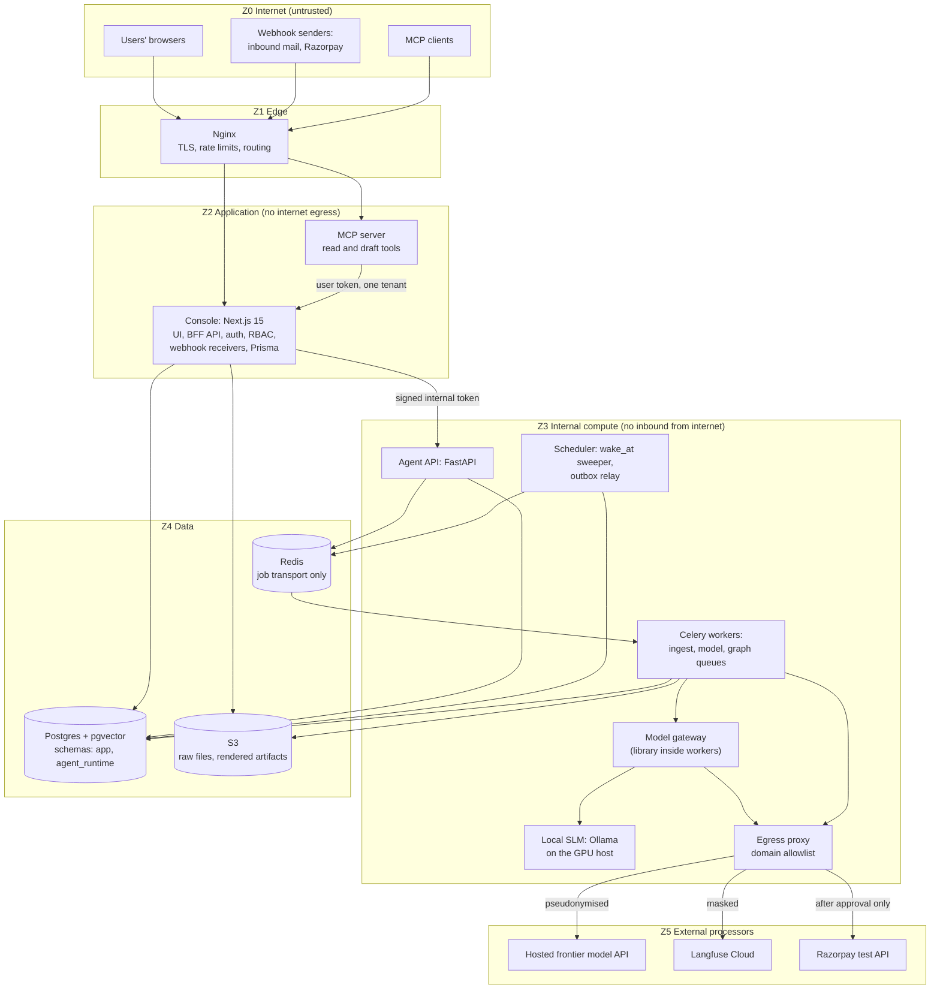
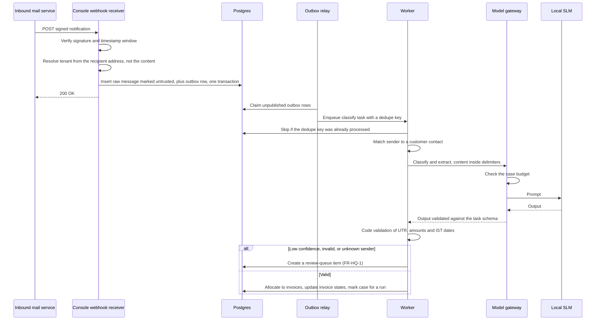
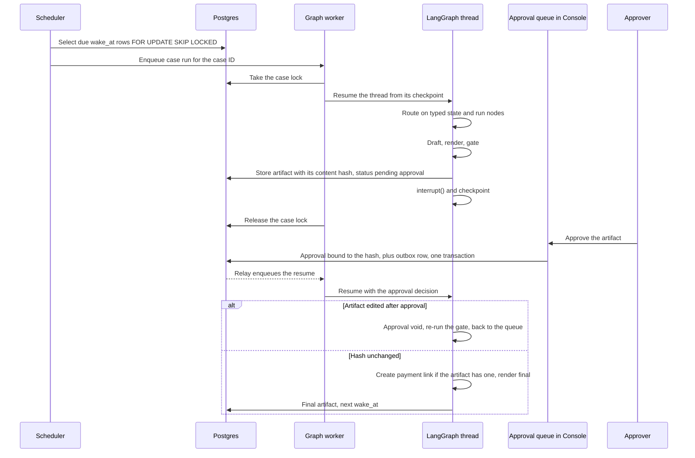
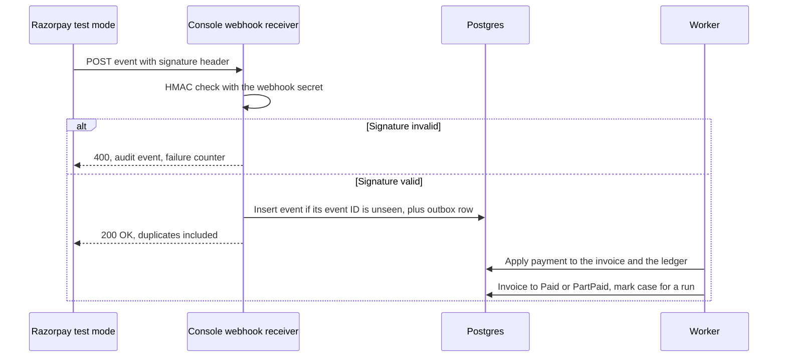
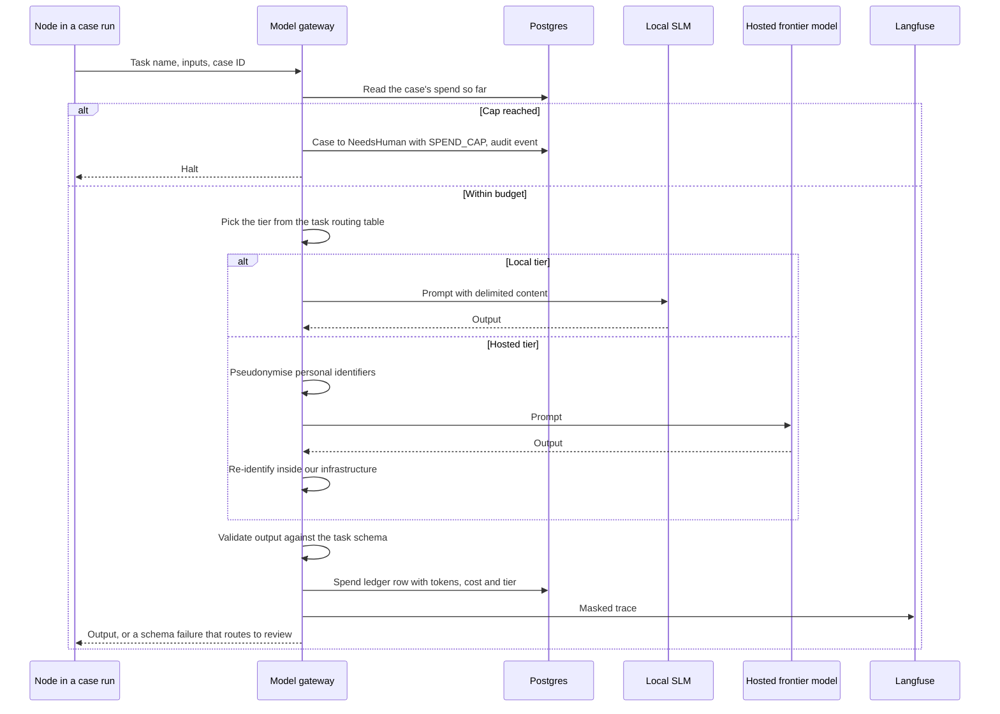
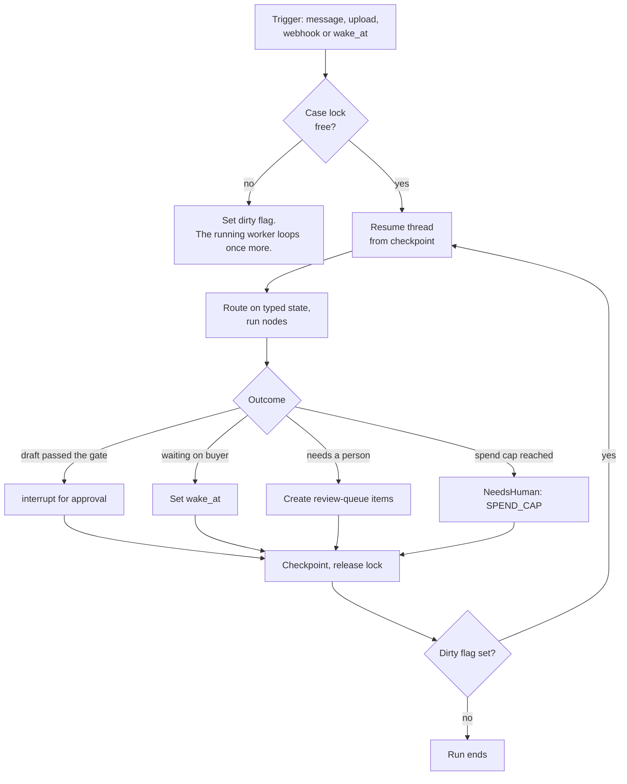
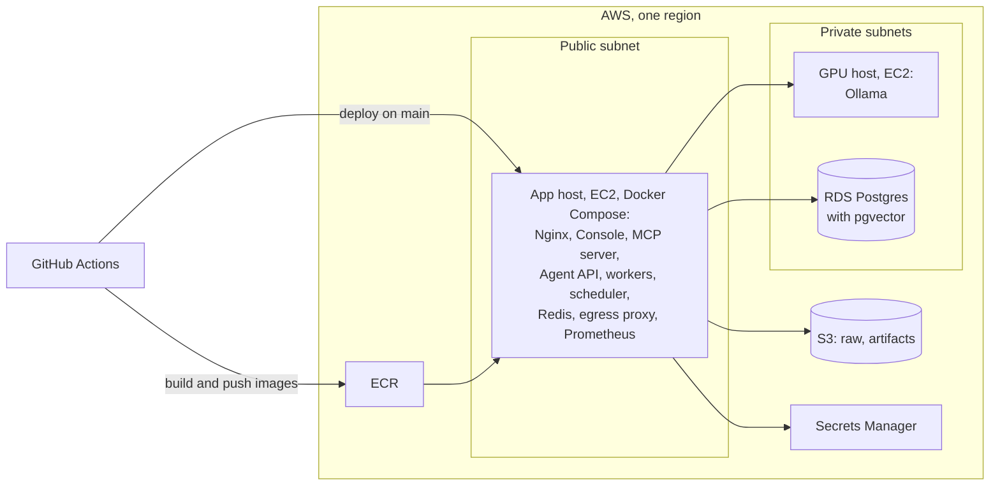
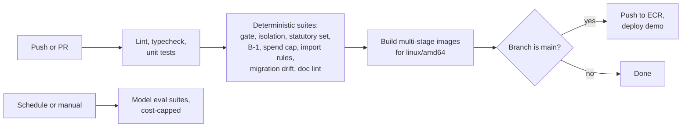

# Chukta: System Architecture

| | |
|---|---|
| **Purpose** | Defines the components, boundaries, runtime behaviour and deployment of Chukta v1, and shows how each PRD requirement is met. |
| **Intended reader** | The developer building v1, and the Hat B and Hat C reviewers. Read the PRD first. |
| **Status** | In Review |
| **Author hat** | Hat A, Systems Architect |
| **Last updated** | 2026-09-11 |
| **Depends on** | [`00-PRD.md`](00-PRD.md) (Frozen for step 2 review) and [ADR-0001 to ADR-0019](adr/) |

### Conventions

- Requirement IDs (FR, NFR, SM) and `[VERIFY Vnn]` tags refer to the PRD. This document makes no new statutory claims.
- Numbers here are configuration defaults, not targets, unless labelled **[System]**.
- Decisions made first in this document are numbered D-01 onward and listed in §15 with their reasoning. They are promoted to ADRs when Hat A's set closes. Until then §15 is their only record, so it must not be cut.
- **Out of scope here:** table-level schema (`02`), graph and node internals (`03`), retrieval internals (`04`), evaluation (`05`), threat analysis (`06`), and API payloads and adapter contracts (`07`).

---

## 1. Principles

Every component and flow below follows these. When a design choice is unclear, the principle decides.

| ID | Principle | Source |
|---|---|---|
| P1 | Models read unstructured input and write prose. Code makes every decision that changes state. | PRD §6, ADR-0007 |
| P2 | No code path sends a message to a counterparty. | ADR-0011 |
| P3 | Postgres holds all durable state: cases, timers, outbox, audit, document metadata, vectors and the entity graph. Redis only moves jobs. | ADR-0013, ADR-0014 |
| P4 | The tenant comes from the session or the case record, never from a request body or a model's output. It is enforced twice. | ADR-0012 |
| P5 | Ingested content is data. It reaches a prompt only inside delimiters, and it never selects a tool or changes state directly. | NFR-04 |
| P6 | Every regulated token in an outbound artifact renders from a slot bound to a source record. | ADR-0010 |
| P7 | Anything that law or rates can change is effective-dated. | NFR-09, ADR-0004 |
| P8 | Every model call goes through one gateway, which routes it, redacts it, budgets it, traces it and charges it to a case. | NFR-03, NFR-10, NFR-14, ADR-0016 |
| P9 | Raw counterparty content stays on our infrastructure. Hosted models receive pseudonymised identifiers only. | ADR-0016 |

---

## 2. System context

- **No arrow runs from Chukta to the buyer.** The only path to a buyer is a person (P2, ADR-0011).
- WhatsApp content arrives as chat exports and pastes, uploaded by a user. Chukta has no WhatsApp integration.
- **Data leaves our infrastructure by four routes:** pseudonymised prompts, masked traces, payment-link requests, and whatever an MCP tool returns to the user's own MCP client. The last one is the least controlled. In v1 it carries synthetic data only, under ADR-0015's real-data gate, and Hat C must review it.

---

## 3. Containers and trust zones

| Zone | Accepts traffic from | Sends traffic to | Rule |
|---|---|---|---|
| Z0 Internet | None | Z1 only | Everything that arrives from here is untrusted. |
| Z1 Edge | Z0 | Z2 | Nginx is the only public listener. FastAPI, Redis, Postgres and Ollama never listen publicly. |
| Z2 Application | Z1 | Z3 (Agent API), Z4 | **No internet egress.** Z2 holds no model client and no messaging client. |
| Z3 Internal compute | Z2, and jobs from Z4 | Z4, and Z5 only through the egress proxy | The only zone that calls external processors. |
| Z4 Data | Z2, Z3 | None | Private network. Encrypted at rest. |
| Z5 External processors | Z3, through the proxy | None | Allowlist: the model API, Langfuse and the Razorpay test API. Nothing else. |

Keeping all egress in Z3, behind one proxy, turns two promises into network facts (D-03). There is no route to a messaging service, and no data leaves except through the three allowlisted domains.

---

## 4. Components and what they must never do

The "must never" column matters as much as the responsibilities. Each entry is enforced by an automated check, such as an import rule, a dependency rule or a network test, defined in `11-TEST-STRATEGY.md`.

| Component | Runtime | Responsible for | Must never |
|---|---|---|---|
| Nginx | Container | TLS, rate limits per route and per client, request size limits, routing to the Console and MCP server | Expose FastAPI, Redis, Postgres or Ollama |
| Console | Next.js 15, Node | UI, BFF API, sessions and MFA, RBAC and active-tenant checks, approval and review-queue screens, webhook receivers (verify, persist, acknowledge), Prisma migrations as sole owner | Call a model or any external API. Process a webhook payload inline. Depend on a messaging SDK. |
| MCP server | Container | Read and draft tools for a user's MCP client. Calls the Console API with a user token scoped to one tenant. | Approve, send, waive, or read outside its token's tenant (FR-INT-3). Connect to Postgres directly. |
| Agent API | FastAPI, Python | Internal endpoints: submit work, read agent outputs, resume a graph after approval. Verifies the Console's signed internal token. | Accept traffic from outside the private network |
| Workers | Celery, Python | Three queues. `ingest`: OCR, layout inference, classification. `model`: model-bound tasks. `graph`: case runs, drafting, gate, rendering, payment links. | Send a message. There is no client to send with. |
| Scheduler | Python | `wake_at` sweep, outbox relay, review-queue ageing and escalation (FR-HQ-5), daily spend-cap reset | Run business logic. It only enqueues. |
| Model gateway | Library in workers | The only path to any model: routing, pseudonymisation, spend breaker, schema validation, tracing, cost ledger (D-01) | Be bypassed. No other module may import a model SDK. |
| Retrieval API | Library in workers | The only path for model-facing retrieval: hybrid search, entity graph, multi-hop (`04`). Tenant comes from bound context. | Accept a tenant argument |
| Engines: statutory, analyst, matcher | Pure Python libraries | Deterministic computation with versioned parameters (ADR-0004, ADR-0007) | Perform I/O or call a model |
| Gate | Pure Python library | Slot scan, provision verification, tie-out, packet match (PRD §7.1, A2) | Be skipped. The approval queue accepts only gate-passed artifacts. |
| Renderer | Library in workers | Templates to PDF and text, with the slot provenance map | Render a regulated token outside a slot |
| Payments adapter | Receiver in Console, logic in workers | Payment-link creation after approval, and webhook application | Create a link for an unapproved artifact |
| Local SLM | Ollama on the GPU host | Serves the configured local model | Be reachable from outside Z3 |
| Send adapter | Interface only | Contract and gate design in `07` | Be deployed in v1 |
| Tally adapter | Interface only | Contract in `07` | Be deployed in v1 |

---

## 5. Key runtime flows

The PRD (§5) shows these flows from the user's side. The diagrams below show which component does what, and where each guarantee is enforced.

### 5.1 Inbound email → case update

The tenant is fixed before any model sees the content, and it comes from infrastructure (the recipient address), not from anything the sender wrote (P4).

### 5.2 Case run, approval and resume

No process waits for a buyer. A run lasts seconds to minutes, then ends in one of four ways: an approval interrupt, a `wake_at`, review-queue items, or a spend-cap halt (§6).

### 5.3 Razorpay webhook → invoice state

A duplicate gets the same 200 as the original, so Razorpay stops retrying, but it has no effect (SM-06).

### 5.4 One model call through the gateway

Every control that P8 promises lives in this one sequence: budget, routing, redaction, validation, cost and trace.

Ledger uploads follow PRD §5.2. They run on the `ingest` queue for parsing, then the matcher and the gate run in a case run as in §5.2 above.

---

## 6. Durable execution

A case can stay open for months, but nothing in the system waits for months. The case sleeps in Postgres, and short runs move it forward.

- **One LangGraph thread per case**, with thread ID equal to case ID (ADR-0009). Checkpoints live in the `agent_runtime` schema (ADR-0014).
- **Four triggers:** an inbound message, an upload, a webhook, or a due `wake_at`. Each trigger writes a case event and an outbox row in the same transaction as the fact that caused it (ADR-0013).
- **One run per case at a time.** A run takes a transaction-scoped Postgres advisory lock on the case ID. A trigger that arrives mid-run sets a dirty flag instead, and the running worker loops once more before it exits. A trigger is never lost (D-07).
- **One clock.** Every due-time comparison uses Postgres `now()`, never a host clock (D-05).
- **Idempotency.** Every task carries a dedupe key. A task checks the processed-tasks table in the same transaction as its effect (SM-06).
- **Retries.** Transient errors retry with backoff up to a configured limit. After that, the task moves to a dead-letter table, the affected case gets a review-queue item, and an alert fires. Nothing is dropped silently.
- **Approval interrupts** use LangGraph `interrupt()`. The approval handler writes the decision and an outbox row. The worker resumes the thread with the decision (§5.2).
- **The spend breaker** runs in the gateway before every call (NFR-14).

---

## 7. Data architecture

Table-level design is in `02-DATA-MODEL.md`. This section fixes where each kind of data lives and who may write it.

| Store | Holds | Written by | Read by | Rules |
|---|---|---|---|---|
| Postgres `app` schema (Prisma-owned) | Tenants, users, memberships, customers, contacts, invoices, payments, ledger lines, document metadata, entity-graph edges, chunks and embeddings, cases, invoice states, case events, review-queue items, artifacts, approvals, audit events, outbox, `wake_at`, provisions, bank rates, method profiles, spend ledger, pseudonym map | Console (Prisma), workers (SQLAlchemy) | Both | RLS on every tenant-scoped table. The audit table is append-only (D-08). |
| Postgres `agent_runtime` schema | LangGraph checkpoints | Workers | Workers | Not managed by Prisma (ADR-0014) |
| S3 raw bucket | Uploads, inbound MIME, WhatsApp exports | Console receivers, workers | Workers | Keyed by tenant and SHA-256 of content. Immutable. Encrypted with KMS. |
| S3 artifacts bucket | Rendered artifacts | Workers | Console, which offers the download for sending | Immutable. The object hash equals the approval-bound hash. |
| Redis | Celery messages | Outbox relay, Agent API | Workers | Nothing durable. Anything lost is republished from the outbox (P3). |

- The **pseudonym map** never leaves Postgres. It is never sent to a hosted model and never written to a trace.
- Retention and deletion periods are set by Hat C in `12-DATA-CLASSIFICATION.md`.

---

## 8. Model routing and pseudonymisation

The gateway reads this table from configuration. Per-task changes follow eval results (ADR-0016).

| Task | Tier | Content sent | Redaction | When unsure |
|---|---|---|---|---|
| Reply classification and extraction | Local SLM | Raw message | None, it stays local | Review queue |
| AP request parsing | Local SLM | Raw email | None | Review queue |
| Scan classification and extraction | Local OCR, then local SLM | Text from OCR | None | Review queue |
| Ledger layout inference | Local SLM | Header rows and sample rows | None | Review queue |
| Narration reading | Local SLM. Frontier only for residuals the SLM cannot explain. | Narrations and amounts | Hosted calls: pseudonymised | Cause marked "unexplained" |
| Payment-terms extraction | Local SLM | PO or contract text | None | Always confirmed by a human |
| Dispute investigation | Frontier | Retrieved spans | Pseudonymised | "Insufficient evidence" |
| Draft prose | Frontier. Local SLM for short conversational messages. | Typed facts and template | Pseudonymised | Fixed template |
| Chase-list question | Local SLM | The owner's question | None | The form |

- **No raw document image goes to a hosted model in v1** (D-04). Text can be pseudonymised, and a photo of a signed challan cannot. OCR and extraction stay local, and low confidence goes to the review queue.
- **How pseudonymisation works:**
  1. Known identifiers are replaced first: names from the tenant's own contact records, phone numbers, emails and individual PANs. Unknown person names are caught by a local SLM pass.
  2. Each identifier becomes a stable token for that case, such as `PERSON_3`. Amounts, dates and document references stay as they are, because reasoning needs them.
  3. The reply is re-identified inside our infrastructure.
  4. The SM-05 scanner checks every logged hosted payload for leftovers.
- **Low confidence falls back to the review queue, not to the frontier model** (D-09). A tenant can switch one task to frontier fallback after evals justify it.
- **Budgets.** Each task has a token budget. Budgets add up into the per-case caps that the breaker enforces (NFR-14).

---

## 9. Security architecture hooks

Hat C designs the threat model in `06`. This table fixes where each control lives, so the threat model has a structure to attach to.

| Concern | Mechanism in this architecture | Detailed in |
|---|---|---|
| Authentication | Auth.js database sessions in the Console. MFA for every role that can approve. | `06` |
| Authorisation | The PRD §7.2 matrix is checked in the BFF on every action. The active tenant is pinned in the session. | `06` |
| Service to service | The Console signs a short-lived internal token (tenant, user, role, purpose) for the Agent API. The MCP server uses user tokens scoped to one tenant with read and draft rights only. | `06`, `07` |
| Tenant isolation | Bound tenant in retrieval and tools. RLS with `SET LOCAL`. The app's database role lacks `BYPASSRLS`, and tables use `FORCE ROW LEVEL SECURITY`. | ADR-0012, `02` |
| Untrusted content | Stored with a trust label. A prompt builder wraps it in delimiters. Each node has a fixed tool set. Outputs must match strict schemas. | `03`, `06` |
| Webhooks | Signature verification, timestamp window, event-ID dedupe, persist then acknowledge | `07` |
| Egress | Only Z3 has egress, through a domain-allowlisted proxy. The Console has none. | D-03 |
| Secrets | AWS Secrets Manager, read at container start. Never in images or the repo. | `06` |
| Audit | Append-only. The app role has INSERT only on the audit table. Each row carries the hash of the previous row. | D-08, `02` |
| Approval gate | No send path. Approvals bind to a content hash. Payment links are created only after approval. | ADR-0011, PRD §7.1 |

---

## 10. Deployment

This is the v1 target on AWS, in one region (ap-south-1 proposed, A-Q7). Hat B decides the final deployment form (A-Q2).

- **Egress is enforced on the host.** Firewall rules in the Docker host's `DOCKER-USER` chain let containers reach only the VPC: RDS, the GPU host, and VPC endpoints for S3, ECR and Secrets Manager. They can also reach the egress proxy. Only the proxy can reach the internet, and only the allowlisted domains on port 443 (D-03). AWS Network Firewall is the alternative (A-Q3).
- **Model weights** are pulled once through the proxy when the GPU host is provisioned, and pinned by digest.
- **One CPU architecture:** every image is built for `linux/amd64`, because the GPU host is x86 (D-06).
- **Backups:** RDS automated backups with point-in-time recovery, a manual snapshot before every migration, and versioning on the artifacts bucket. A restore drill is part of `11`.

| Environment | Purpose | Models | Data |
|---|---|---|---|
| Local | Development | Ollama on the developer's machine. A smaller tag of the same model family is allowed when memory is short, but evals never use it. | Synthetic |
| CI | Every push | Deterministic suites use stub models. Model suites run on a schedule or on demand. | Synthetic fixtures |
| Demo (AWS) | The only deployed environment in v1 | The configured SLM on the GPU host and the configured frontier model | Synthetic only, under ADR-0015's real-data gate |

SM-01, SM-02, SM-03, SM-06, SM-07, SM-08 and SM-24 need no real model, so they run on every push. The suites that need real models run on a schedule, which keeps eval cost bounded.

---

## 11. Observability and cost

| Signal (Prometheus) | Emitted by | Why it matters |
|---|---|---|
| Request rate, latency and errors per route | Nginx, Console, Agent API | Baseline health |
| Queue depth per Celery queue | Workers | Backlog |
| Outbox lag: age of the oldest unpublished row | Scheduler | Redis or the relay is stuck (P3) |
| `wake_at` lag: age of the oldest due row not yet run | Scheduler | Timers are firing late |
| Review-queue depth and oldest age, by item type | Console | FR-HQ-6 |
| Breaker trips | Gateway | NFR-14 |
| Gate blocks by reason | Gate | A spike points at a prompt or template problem |
| Webhook signature failures | Console | Attack or misconfiguration |
| Model calls, tokens and cost by tier and task | Gateway | SM-21, SM-22 |
| Dead-letter count | Workers | Nothing is dropped silently |

- **Alerts** fire on: breaker trips, outbox lag, `wake_at` lag, a spike in signature failures, dead letters, and a review-queue item past its age limit. Thresholds are configuration, not targets.
- **A nightly job re-scans approved artifacts with the gate scanner.** SM-01 says no artifact escapes the gate. This re-scan is how production would notice if one did, and a hit pages immediately.
- **Cost per case** (SM-22) is computed from the spend ledger:
  - Hosted cost is the sum of the case's hosted calls, as tokens times the price from a versioned price table.
  - Local cost is the GPU host's cost for the period, times the case's share of all local tokens in that period.
  - Both figures are reported, hosted only and hosted plus local.
- **The spend ledger in Postgres is the source of truth for cost.** Langfuse is for inspecting traces. If Langfuse is unreachable, calls continue and dropped traces are counted. An eval run fails if trace coverage is below 100% (NFR-10).

---

## 12. How the architecture meets the NFRs

| NFR | Mechanism | Where | Verified by |
|---|---|---|---|
| NFR-01 Correctness gate | Gate library. The queue accepts only gate-passed artifacts. Nightly re-scan. | Workers, Console | SM-01 |
| NFR-02 Tenant isolation | Bound tenant, RLS, retrieval API as the only path | Workers, Postgres | SM-02 |
| NFR-03 Privacy | Gateway pseudonymisation. No raw images to hosted models. | Gateway | SM-05 |
| NFR-04 Untrusted content | Trust labels, prompt builder, fixed tools per node, strict schemas | Workers | SM-04 |
| NFR-05 Auditability | Append-only hash-chained audit. Immutable S3 objects. | Postgres, S3 | Replay test |
| NFR-06 Determinism | Pure engines with versioned parameters | Libraries | Repeat-run test |
| NFR-07 Durability | Checkpoints, `wake_at` and outbox in Postgres | Postgres | Kill-and-restart test |
| NFR-08 Exactly-once effects | Dedupe keys, processed-tasks table, webhook event-ID dedupe | Workers, receivers | SM-06 |
| NFR-09 Statutory versioning | Effective-dated provisions, rates and method profiles | Postgres | Recompute test |
| NFR-10 Observability | The gateway traces every call | Gateway | Trace coverage in eval runs |
| NFR-11 Cost reporting | Spend ledger plus GPU amortisation | Gateway, Prometheus | SM-22 report |
| NFR-12 Security baseline | Rate limits, RBAC, secrets, webhook verification | Edge, Console | `06` |
| NFR-13 Latency | Separate `ingest`, `model` and `graph` queues | Workers | SM-23 |
| NFR-14 Spend circuit breaker | Pre-call check against the spend ledger | Gateway | SM-24 |

---

## 13. Failure modes

| Failure | What happens | Why that is safe |
|---|---|---|
| Local SLM down | SLM tasks retry, then go to dead letter and create a review-queue item. There is no silent switch to a hosted model. | Raw content never leaves because of an outage (P9) |
| Hosted model down | Drafting and dispute tasks retry and cases stay Waiting | Nothing is sent anyway (P2) |
| Redis lost | Outbox rows stay unpublished, and the relay republishes them when Redis is back | Postgres is the source of truth (P3) |
| Worker crash mid-run | The thread resumes from its last checkpoint. The lock was transaction-scoped, so it is already released. | Durable execution (§6) |
| Postgres unavailable | Everything stops. Receivers return 5xx so senders retry. | No state can change outside Postgres |
| Duplicate webhook | Event-ID dedupe returns 200 with no effect | SM-06 |
| Clock skew between hosts | No effect. Due times compare against Postgres `now()`. | D-05 |
| Langfuse unreachable | Calls continue. Traces are dropped and counted. | Cost truth is the spend ledger |
| Runaway agent loop | The breaker halts the case | NFR-14 |
| Statutory corpus empty | The gate blocks every statutory draft | ADR-0005 |

---

## 14. Extension points

| Extension | Where it plugs in | What stays unchanged |
|---|---|---|
| Send adapter (`07`) | Behind the approval handler, as a new outbox consumer | Gate, approval binding, audit |
| Tally adapter (`07`) | Ingestion, as a register source | Case model, engines |
| A new inbound channel | A new receiver and normaliser writing the same message record | Classification, cases |
| A new language | A prompt set and a human-written eval set for that language | Everything else |
| A new statutory provision | A corpus row, an engine rule and an ADR | Gate logic |
| A new model provider | A provider class in the gateway | Every caller |
| A new corpus | An index in the retrieval API and an eval set | Tenant enforcement |

---

## 15. Decisions made in this document

These are promoted to ADRs when Hat A's set closes. Until then, this table is their only record.

| ID | Decision | Why | Alternatives rejected |
|---|---|---|---|
| D-01 | All model calls go through one gateway library. CI fails if any other module imports a model SDK. | One place enforces routing, redaction, budget, validation, tracing and cost (P8) | A client per agent: every agent would reimplement the controls, and one would miss something |
| D-02 | The Console receives all webhooks and is the only public application surface. The Agent API is internal only. | One public surface to secure. Receivers verify, persist and acknowledge, and the real work runs asynchronously. | Webhooks straight to FastAPI: a second public surface to harden |
| D-03 | Only the compute zone has internet egress, through a domain-allowlisted proxy. All external API calls happen in workers. | Makes "no send path" and "data leaves only by three routes" checkable at the network layer | An allowlist in application code only: one new import away from a new egress path |
| D-04 | No raw document image goes to a hosted model in v1. OCR and extraction run locally. | An image cannot be pseudonymised the way text can (P9) | Hosted vision for better accuracy: sends raw personal data out |
| D-05 | Every timer compares against Postgres `now()` | One clock, so host skew cannot fire a timer early or miss it | Host time in each worker |
| D-06 | Every image is built for `linux/amd64` | The GPU host is x86, and one architecture avoids mismatch bugs | Multi-arch builds: more CI time for no v1 benefit |
| D-07 | Case runs are serialised by a Postgres advisory lock plus a dirty flag | One run per case (ADR-0009) without losing a trigger that arrives mid-run | A lock alone: loses triggers. A queue per case: more moving parts. |
| D-08 | Audit events are append-only and hash-chained. The app's database role has INSERT only on the audit table. | Tamper evidence for approvals, waivers and sent-marks | A plain table: edits could not be detected |
| D-09 | Low-confidence fallback defaults to the review queue, not the frontier model | Keeps raw content local and cost bounded. A tenant can override per task once evals justify it (ADR-0016). | Automatic escalation to the frontier model |

---

## 16. Open questions

| ID | Question | Answered by | Lands in |
|---|---|---|---|
| A-Q1 | Inbound mail provider: SES receiving or another provider, and whether it is available in the chosen region | Hat B, then an ADR | `07` |
| A-Q2 | Deployment form: Docker Compose on one EC2 host (proposed) or ECS | Hat B | `09`, `10` |
| A-Q3 | Egress enforcement: host firewall rules plus a proxy (proposed), or AWS Network Firewall | Hat C, Hat B | `06` |
| A-Q4 | Auth library details and MFA policy | Hat C | `06` |
| A-Q5 | Is the GPU host always on, or started for eval runs and set hours? | Hat B, using SM-22 figures | `09` |
| A-Q6 | A local OCR engine that meets SM-16 on synthetic scans | Hat A, through evals | `03`, `05` |
| A-Q7 | Region: ap-south-1 proposed for data locality, to be confirmed by the DPDP analysis | Hat C | `12` |
