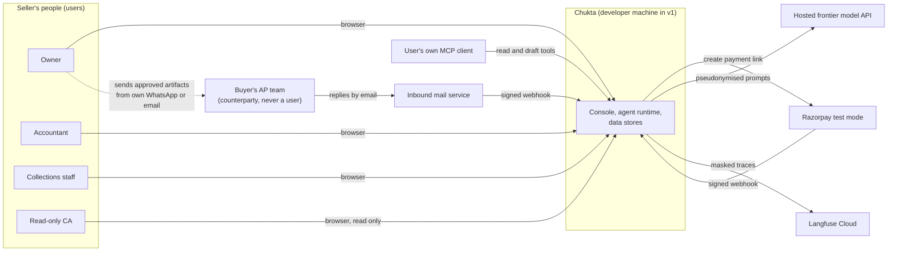
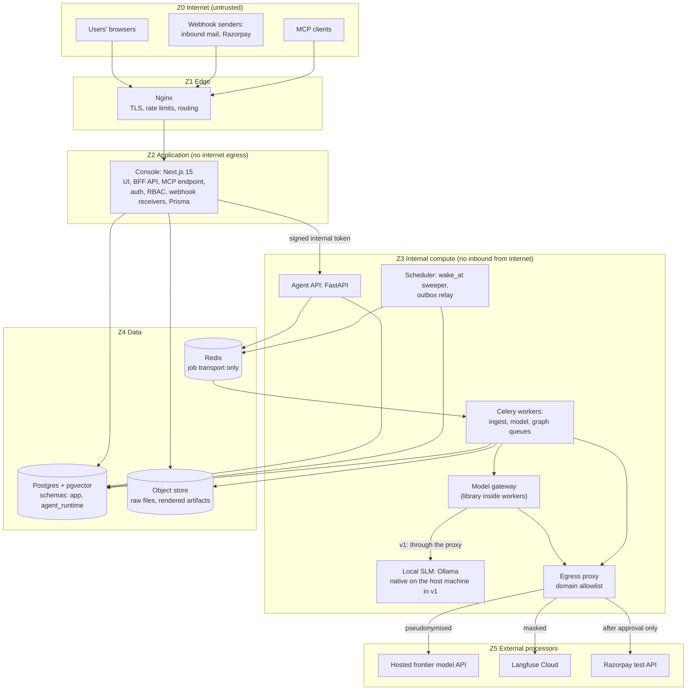
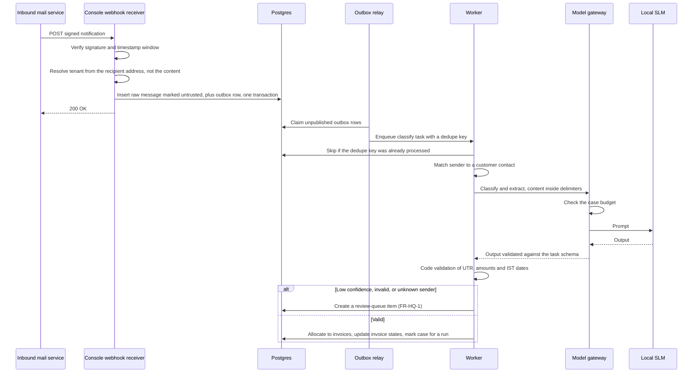
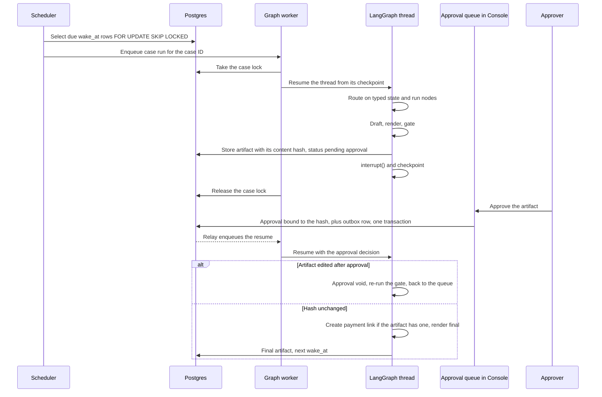
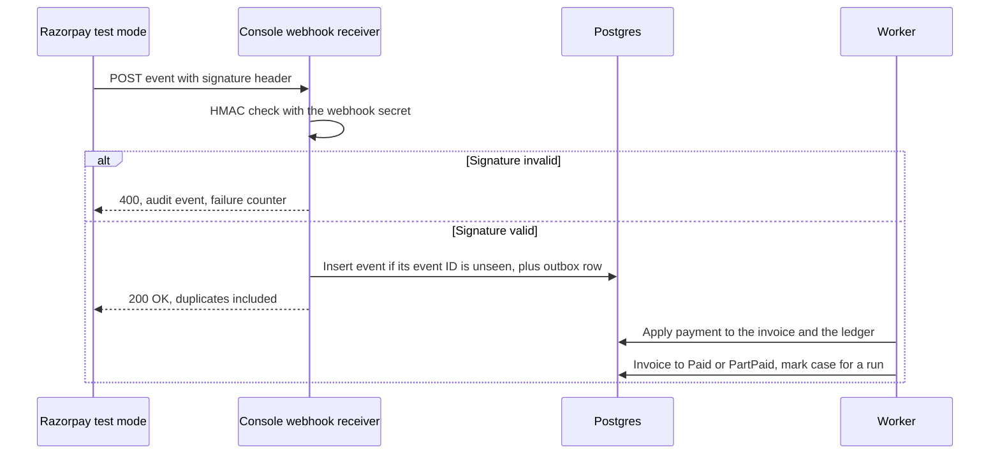
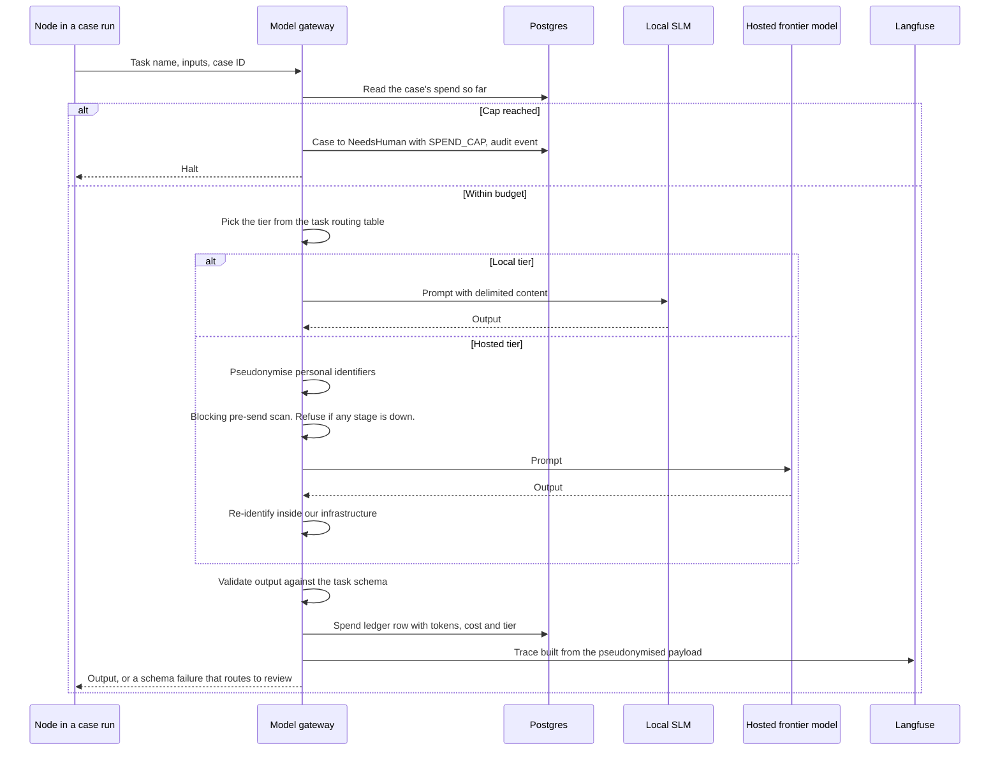
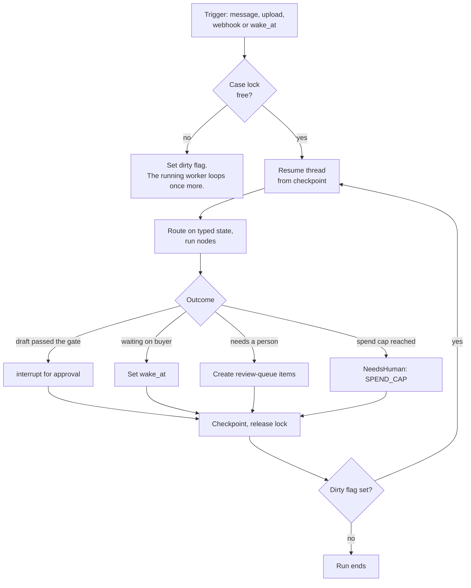
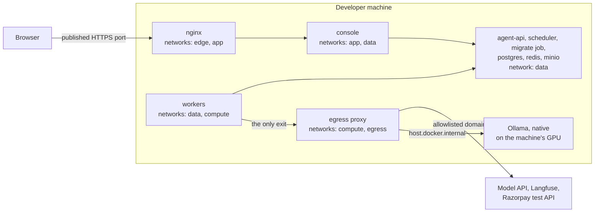
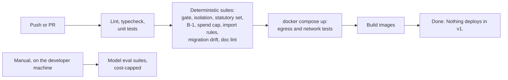
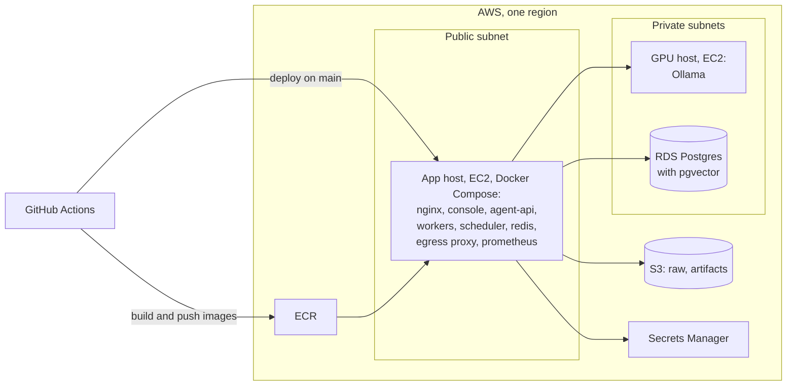

# Chukta: System Architecture

| | |
|---|---|
| **Purpose** | Defines the components, boundaries, runtime behaviour and deployment of Chukta v1, and shows how each PRD requirement is met. |
| **Intended reader** | The developer building v1, and the Hat B and Hat C reviewers. Read the PRD first. |
| **Status** | Revised at step 4 (2026-09-12) through ADR-0020 to ADR-0031. The revision history is §17. Frozen for the Hat C delta pass. Later changes go through an ADR. |
| **Author hat** | Hat A, Systems Architect |
| **Last updated** | 2026-09-12 |
| **Depends on** | [`00-PRD.md`](00-PRD.md) (Frozen for step 2 review) and [ADR-0001 to ADR-0019](adr/) |

### Conventions

- Requirement IDs (FR, NFR, SM) and `[VERIFY Vnn]` tags refer to the PRD. This document makes no new statutory claims.
- Numbers here are configuration defaults, not targets, unless labelled **[System]**.
- Decisions made first in this document are numbered D-01 onward and listed in §15 with their reasoning. They were promoted to ADRs at step 4, and §15 says where. §15 is kept as history.
- **Out of scope here:** table-level schema (`02`), graph and node internals (`03`), retrieval internals (`04`), evaluation (`05`), threat analysis (`06`), and API payloads and adapter contracts (`07`).

---

## 1. Principles

Every component and flow below follows these. When a design choice is unclear, the principle decides.

| ID | Principle | Source |
|---|---|---|
| P1 | Models read unstructured input and write prose. Code makes every decision that changes state. | PRD §6, ADR-0007 |
| P2 | No code path sends a message to a counterparty. | ADR-0011 |
| P3 | Postgres holds all durable state: cases, timers, outbox, audit, document metadata, vectors and the entity graph. Redis only moves jobs. | ADR-0013, ADR-0014 |
| P4 | The tenant comes from the session or the case record, never from a request body or a model's output. It is enforced twice. | ADR-0012 |
| P5 | Ingested content is data. It reaches a prompt only inside delimiters, and it never selects a tool or changes state directly. | NFR-04 |
| P6 | Every regulated token in an outbound artifact renders from a slot bound to a source record. | ADR-0010 |
| P7 | Anything that law or rates can change is effective-dated. | NFR-09, ADR-0004 |
| P8 | Every model call goes through one gateway, which routes it, redacts it, budgets it, traces it and charges it to a case. | NFR-03, NFR-10, NFR-14, ADR-0016 |
| P9 | Raw counterparty content stays on our infrastructure. Hosted models receive pseudonymised identifiers only. | ADR-0016 |

---

## 2. System context

- **No arrow runs from Chukta to the buyer.** The only path to a buyer is a person (P2, ADR-0011).
- WhatsApp content arrives as chat exports and pastes, uploaded by a user. Chukta has no WhatsApp integration.
- **Data leaves our infrastructure by four routes:** pseudonymised prompts, masked traces, payment-link requests, and whatever an MCP tool returns to the user's own MCP client. The first three pass through the model gateway or the egress proxy. **The fourth does not, and as written it contradicts P9.** An MCP client is usually an LLM app pointed at a hosted model we do not control, so raw content returned by an MCP tool would leave our infrastructure without pseudonymisation or trace masking. A-Q8 is now closed: MCP is deferred from v1, and when it is built it returns only pseudonymised structured records (ADR-0026).

---

## 3. Containers and trust zones

| Zone | Accepts traffic from | Sends traffic to | Rule |
|---|---|---|---|
| Z0 Internet | None | Z1 only | Everything that arrives from here is untrusted. |
| Z1 Edge | Z0 | Z2 | Nginx is the only public listener. FastAPI, Redis, Postgres and Ollama never listen publicly. |
| Z2 Application | Z1 | Z3 (Agent API), Z4 | **No internet egress.** Z2 holds no model client and no messaging client. |
| Z3 Internal compute | Z2, and jobs from Z4 | Z4, and Z5 only through the egress proxy | The only zone that calls external processors. |
| Z4 Data | Z2, Z3 | None | Private network. Encrypted at rest. |
| Z5 External processors | Z3, through the proxy | None | Allowlist: the model API, Langfuse and the Razorpay test API. Nothing else. |

Keeping all egress in Z3, behind one proxy, turns two promises into network facts (D-03). There is no route to a messaging service, and no data leaves except through the three allowlisted domains.

---

## 4. Components and what they must never do

The "must never" column matters as much as the responsibilities. Each entry is enforced by an automated check, such as an import rule, a dependency rule or a network test, defined in `11-TEST-STRATEGY.md`.

| Component | Runtime | Responsible for | Must never |
|---|---|---|---|
| Nginx | Container | TLS, rate limits per route and per client, request size limits, routing to the Console, including its MCP endpoint | Expose FastAPI, Redis, Postgres or Ollama |
| Console | Next.js 15, Node | UI, BFF API, sessions (MFA waits for the pilot gate, ADR-0028), RBAC and active-tenant checks, approval and review-queue screens, webhook receivers (verify, persist, acknowledge), owner of the Prisma schema definition. It connects as the runtime database role and never runs migrations (ADR-0027). | Call a model or any external API. Process a webhook payload inline. Depend on a messaging SDK. |
| Migrate job | One-shot Compose service | Runs Prisma migrations and the LangGraph checkpointer setup as the migration role, then exits (ADR-0027) | Stay running, or share its database credentials with any other service |
| MCP endpoint | A route inside the Console (D-02) | Read and draft tools for a user's MCP client. Authenticated by an access token scoped to one tenant with read and draft rights, and checked by the same RBAC layer as the UI. Deferred from v1 (DF-12). When built, it follows ADR-0026. | Expose an approve, send or waive tool (FR-INT-3). Act outside its token's tenant. |
| Agent API | FastAPI, Python | Internal endpoints: submit work, read agent outputs, resume a graph after approval. Verifies the Console's signed internal token. | Accept traffic from outside the private network |
| Workers | Celery, Python | Three queues. `ingest`: OCR, layout inference, classification. `model`: model-bound tasks. `graph`: case runs, drafting, gate, rendering, payment links. | Send a message. There is no client to send with. |
| Scheduler | Python | `wake_at` sweep, outbox relay, review-queue ageing and escalation (FR-HQ-5), daily spend-cap reset | Run business logic. It only enqueues. |
| Model gateway | Library in workers | The only path to any model: routing, pseudonymisation, spend breaker, schema validation, tracing, cost ledger (D-01) | Be bypassed. No other module may import a model SDK. |
| Retrieval API | Library in workers | The only path for model-facing retrieval: hybrid search, entity graph, multi-hop (`04`). Tenant comes from bound context. | Accept a tenant argument |
| Engines: statutory, analyst, matcher | Pure Python libraries | Deterministic computation with versioned parameters (ADR-0004, ADR-0007) | Perform I/O or call a model |
| Gate | Pure Python library | Slot scan, provision verification, tie-out, packet match (PRD §7.1, A2) | Be skipped. The approval queue accepts only gate-passed artifacts. |
| Renderer | Library in workers | Templates to PDF and text, with the slot provenance map | Render a regulated token outside a slot |
| Payments adapter | Receiver in Console, logic in workers | Payment-link creation after approval, and webhook application | Create a link for an unapproved artifact |
| Local SLM | Ollama: native on the developer machine in v1, a GPU host in the production target | Serves the configured local model | Listen on anything but the local machine (v1) or the private network (target) |
| Send adapter | Interface only | Contract and gate design in `07` | Be deployed in v1 |
| Tally adapter | Interface only | Contract in `07` | Be deployed in v1 |

---

## 5. Key runtime flows

The PRD (§5) shows these flows from the user's side. The diagrams below show which component does what, and where each guarantee is enforced.

### 5.1 Inbound email → case update

The tenant is fixed before any model sees the content, and it comes from infrastructure (the recipient address), not from anything the sender wrote (P4).

### 5.2 Case run, approval and resume

No process waits for a buyer. A run lasts seconds to minutes, then ends in one of four ways: an approval interrupt, a `wake_at`, review-queue items, or a spend-cap halt (§6).

### 5.3 Razorpay webhook → invoice state

A duplicate gets the same 200 as the original, so Razorpay stops retrying, but it has no effect (SM-06).

### 5.4 One model call through the gateway

Every control that P8 promises lives in this one sequence: budget, routing, redaction, validation, cost and trace. Redaction fails closed, and traces never carry the re-identified reply (ADR-0021). In v1, only drafting prompts take the hosted branch.

Ledger uploads follow PRD §5.2. They run on the `ingest` queue for parsing, then the matcher and the gate run in a case run as in §5.2 above.

---

## 6. Durable execution

A case can stay open for months, but nothing in the system waits for months. The case sleeps in Postgres, and short runs move it forward.

- **One LangGraph thread per case**, with thread ID equal to case ID (ADR-0009). Checkpoints live in the `agent_runtime` schema (ADR-0014).
- **Four triggers:** an inbound message, an upload, a webhook, or a due `wake_at`. Each trigger writes a case event and an outbox row in the same transaction as the fact that caused it (ADR-0013).
- **One run per case at a time.** A run takes a transaction-scoped Postgres advisory lock on the case ID. A trigger that arrives mid-run sets a dirty flag instead, and the running worker loops once more before it exits. A trigger is never lost (D-07).
- **One clock.** Every due-time comparison uses Postgres `now()`, never a host clock (D-05).
- **Idempotency.** Every task carries a dedupe key. A task checks the processed-tasks table in the same transaction as its effect (SM-06).
- **Retries.** Transient errors retry with backoff up to a configured limit. After that, the task moves to a dead-letter table, the affected case gets a review-queue item, and an alert fires. Nothing is dropped silently.
- **Approval interrupts** use LangGraph `interrupt()`. The approval handler writes the decision and an outbox row. The worker resumes the thread with the decision (§5.2).
- **The spend breaker** runs in the gateway before every call (NFR-14).

---

## 7. Data architecture

Table-level design is in `02-DATA-MODEL.md`. This section fixes where each kind of data lives and who may write it.

| Store | Holds | Written by | Read by | Rules |
|---|---|---|---|---|
| Postgres `app` schema (Prisma-owned) | Tenants, users, memberships, customers, contacts, invoices, payments, ledger lines, document metadata, entity-graph edges, chunks and embeddings, cases, invoice states, case events, review-queue items, artifacts, approvals, audit events, outbox, `wake_at`, provisions, bank rates, method profiles, spend ledger, pseudonym map | Console (Prisma), workers (SQLAlchemy) | Both | RLS on every tenant-scoped table. The audit table is append-only (D-08). |
| Postgres `agent_runtime` schema | LangGraph checkpoints | Workers | Workers | Not managed by Prisma (ADR-0014) |
| S3 raw bucket | Uploads, inbound MIME, WhatsApp exports | Console receivers, workers | Workers | Keyed by tenant and SHA-256 of content. Immutable. Encrypted with KMS. |
| S3 artifacts bucket | Rendered artifacts | Workers | Console, which offers the download for sending | Immutable. The object hash equals the approval-bound hash. |
| Redis | Celery messages | Outbox relay, Agent API | Workers | Nothing durable. Anything lost is republished from the outbox (P3). |

- In v1 the object store is MinIO and Postgres runs from a pgvector image, both in Compose (§10.1). The production target uses S3 and RDS.
- **Two database roles (ADR-0027).** The migration role owns both schemas and is used only by the one-shot `migrate` job. The Console, Agent API, workers and scheduler connect as the runtime role, which owns nothing, has no `BYPASSRLS`, and has INSERT only on the audit table. Checkpoint threads are named `tenant:case`, and the prefix is checked on every read and write. `02` gives the grants table by table.
- The **pseudonym map** never leaves Postgres. It is never sent to a hosted model and never written to a trace.
- Retention and deletion periods are set by Hat C in `12-DATA-CLASSIFICATION.md`.

---

## 8. Model routing and pseudonymisation

The gateway reads this table from configuration. Per-task changes follow eval results (ADR-0016).

| Task | Tier | Content sent | Redaction | When unsure |
|---|---|---|---|---|
| Reply classification and extraction | Local SLM | Raw message | None, it stays local | Review queue |
| AP request parsing | Local SLM | Raw email | None | Review queue |
| Scan classification and extraction | Local OCR, then local SLM | Text from OCR | None | Review queue |
| Ledger layout inference | Local SLM | Header rows and sample rows | None | Review queue |
| Narration reading | Local SLM. Frontier only for residuals the SLM cannot explain. | Narrations and amounts | Hosted calls: pseudonymised | Cause marked "unexplained" |
| Payment-terms extraction | Local SLM | PO or contract text | None | Always confirmed by a human |
| Dispute investigation | Frontier | Retrieved spans | Pseudonymised | "Insufficient evidence" |
| Draft prose | Frontier. Local SLM for short conversational messages. | Typed facts and template | Pseudonymised | Fixed template |
| Chase-list question | Local SLM | The owner's question | None | The form |

- **No raw document image goes to a hosted model in v1** (D-04). Text can be pseudonymised, and a photo of a signed challan cannot. OCR and extraction stay local, and low confidence goes to the review queue.
- **How pseudonymisation works:**
  1. Known identifiers are replaced first: names from the tenant's own contact records, phone numbers, emails and individual PANs. Unknown person names are caught by a local SLM pass.
  2. Each identifier becomes a stable token for that case, such as `PERSON_3`. Amounts, dates and document references stay as they are, because reasoning needs them.
  3. The reply is re-identified inside our infrastructure.
  4. The SM-05 scanner checks every logged hosted payload for leftovers.
- **Low confidence falls back to the review queue, not to the frontier model** (D-09). A tenant can switch one task to frontier fallback after evals justify it.
- **Budgets.** Each task has a token budget. Budgets add up into the per-case caps that the breaker enforces (NFR-14).
- **Fail closed (ADR-0021).** A blocking pre-send scan runs on every hosted payload. If any redaction stage is unavailable, the hosted call is refused.
- **v1 status (ADR-0021, ADR-0031, ADR-0032).** In v1 the only hosted calls are drafting prompts built from slots. The frontier rows for narration residuals and dispute investigation stay inactive until DF-14's name-finding pass exists, and dispute investigation arrives in Phase 2. Scan classification waits for OCR (DF-06).

---

## 9. Security architecture hooks

Hat C designs the threat model in `06`. This table fixes where each control lives, so the threat model has a structure to attach to.

| Concern | Mechanism in this architecture | Detailed in |
|---|---|---|
| Authentication | v1: passwords with Argon2id, server-side sessions, RBAC, and a seeding CLI that creates and resets users. MFA, step-up and recovery codes wait for the pilot gate (DF-01). | ADR-0028 |
| Authorisation | The PRD §7.2 matrix is checked in the BFF on every action. The active tenant is pinned in the session. | `06` |
| Service to service | The Console signs a short-lived internal token (tenant, user, role, purpose) for the Agent API. MCP clients present an access token scoped to one tenant with read and draft rights, and the Console checks it like any UI request. | `06`, `07` |
| Tenant isolation | Bound tenant in retrieval and tools. RLS with `SET LOCAL`. The app's database role lacks `BYPASSRLS`, and tables use `FORCE ROW LEVEL SECURITY`. | ADR-0012, `02` |
| Untrusted content | Stored with a trust label. A prompt builder wraps it in delimiters. Each node has a fixed tool set. Outputs must match strict schemas. | `03`, `06` |
| Webhooks | Signature verification, timestamp window, event-ID dedupe, persist then acknowledge | `07` |
| Egress | Only Z3 has egress, through a domain-allowlisted proxy. The Console has none. | D-03 |
| Secrets | v1: a local env file that is never committed. Production target: AWS Secrets Manager, read at container start. Never in images or the repo. | `06` |
| Audit | Append-only. The runtime role has INSERT only on the audit table. The hash chain and its daily anchor outside the database are build-if-time item 4. | ADR-0023, `02` |
| Approval gate | No send path. Approvals bind to a content hash. Payment links are created only after approval. | ADR-0011, PRD §7.1 |

---

## 10. Deployment

v1 runs with `docker compose up` on one developer machine, and nothing is deployed to AWS. A GPU host is not affordable for this project (A-Q5). The AWS topology in §10.3 is the documented production target. It is specified so that a later move is an implementation job, not a redesign. Hat B confirms this under A-Q2.

### 10.1 v1 runtime: Docker Compose on a developer machine

| Network | Type | Members | Route off the machine |
|---|---|---|---|
| `edge` | Normal bridge | nginx | Yes. Docker can publish a port only from a network that has a route out. |
| `app` | `internal: true` | nginx, console | None |
| `data` | `internal: true` | console, agent-api, workers, scheduler, the one-shot migrate job, postgres, redis, minio | None |
| `compute` | `internal: true` | workers, egress proxy | None |
| `egress` | Normal bridge | egress proxy | Yes: allowlisted domains on port 443, and the host's Ollama port |

**D-03 survives the move.** Here is each container:

| Container | Zone | Can it reach the internet? | Why |
|---|---|---|---|
| console | Z2 | **No** | It is only on internal networks. It is not on `compute`, so it cannot even reach the proxy. |
| workers | Z3 | Only through the proxy, and only to allowlisted domains | The proxy is the one member of `compute` with a route out |
| agent-api, scheduler | Z3 | No | They are only on `data`, and neither needs egress |
| postgres, redis, minio | Z4 | No | Only on `data` |
| egress proxy | Z3 | Yes, to the allowlist only | The only container on `egress` |
| nginx | Z1 | Technically yes | Docker cannot publish a port from an internal-only network, so nginx sits on `edge`. It runs no application code, holds no secrets, and is not on `data`, so it cannot reach Postgres or Redis. |

So the proxy is the only exit that application code can use. nginx is the one other container on a routable network, and only because it has to publish a port.

**The egress property is now tested on every CI push.** The layout that enforces D-03 is the same Compose file the developer runs. A CI job starts the stack on the runner and asserts four things:
1. The console and worker containers cannot open a direct connection to any external address.
2. Through the proxy, an allowlisted domain succeeds and any other domain is refused.
3. The console cannot reach the proxy at all.
4. nginx cannot open a connection to Postgres.

Before this change, the property could be checked only in a deployed environment.

- **Ollama runs natively.** Docker on macOS cannot use the Mac's GPU, and a model of about 27B is too slow on CPU. Workers reach Ollama through the proxy, whose allowlist includes the host's Ollama port. CI uses stub models instead. The configured model must fit the developer's machine (A-Q5, O-06 in `PROJECT_CONTEXT.md`).
- **Object storage is MinIO,** and Postgres runs from a pgvector image. Secrets come from a local env file that is never committed.
- **Webhooks:** routine tests and CI replay recorded fixtures, re-signed with a test secret. The live Razorpay test-mode loop reaches the machine through a tunnel to nginx's published port, started only for that test. The tunnel is a temporary public surface. It exists only if the Razorpay loop is built (build-if-time item 2), and it routes only webhook paths (ADR-0020, ADR-0025). Inbound mail uses fixture replay until A-Q1 is answered.
- **Images are built from source** on the machine that runs them (D-06, revised).
- **Backups:** Postgres dumps and the MinIO data directory, covered by the machine's own backup. A restore drill is part of `11`.

### 10.2 Environments

| Environment | Status in v1 | Models | Data |
|---|---|---|---|
| Local (Compose) | **The v1 runtime** | Native Ollama with the configured SLM, or a smaller tag of the same family when memory is short (evals never use it). The configured frontier model, reached through the proxy. | Synthetic |
| CI (GitHub Actions) | Every push | Stub models only | Synthetic fixtures |
| Production target (AWS) | Specified, not built | The configured SLM on a GPU host | Real data only after the pilot-readiness gate in `12` |

SM-01, SM-02, SM-03, SM-06, SM-07, SM-08 and SM-24 need no real model, so they run on every push. Suites that need real models run by hand on the developer's machine, which keeps eval cost bounded.

### 10.3 Production target (specified, not built)

- The app host runs the same Compose file with the same networks. On top of that, firewall rules in the Docker host's `DOCKER-USER` chain limit container traffic to the VPC (RDS, the GPU host, and VPC endpoints for S3, ECR and Secrets Manager) and to the proxy. AWS Network Firewall is the alternative (A-Q3).
- Model weights are pulled once through the proxy when the GPU host is provisioned, and pinned by digest.
- The target pins `linux/amd64`, because its GPU host is x86 (D-06).
- Backups: RDS automated backups with point-in-time recovery, a manual snapshot before every migration, and versioning on the artifacts bucket.

---

## 11. Observability and cost

**v1 status (ADR-0030):** Prometheus metrics and alerts are deferred (DF-05, required before a pilot). In v1, queue ages and breaker trips show as flags in the Console (FR-APR-3, FR-HQ-5), the spend ledger is the source of truth for cost, and Langfuse is build-if-time item 3. The rest of this section is the production-target design.

| Signal (Prometheus) | Emitted by | Why it matters |
|---|---|---|
| Request rate, latency and errors per route | Nginx, Console, Agent API | Baseline health |
| Queue depth per Celery queue | Workers | Backlog |
| Outbox lag: age of the oldest unpublished row | Scheduler | Redis or the relay is stuck (P3) |
| `wake_at` lag: age of the oldest due row not yet run | Scheduler | Timers are firing late |
| Review-queue depth and oldest age, by item type | Console | FR-HQ-6 |
| Approval-queue depth and oldest pending age, by artifact type | Console | A draft nobody approves stalls its case, and nothing else would notice (F-04) |
| Breaker trips | Gateway | NFR-14 |
| Gate blocks by reason | Gate | A spike points at a prompt or template problem |
| Webhook signature failures | Console | Attack or misconfiguration |
| Model calls, tokens and cost by tier and task | Gateway | SM-21, SM-22 |
| Dead-letter count | Workers | Nothing is dropped silently |

- **Alerts** fire on: breaker trips, outbox lag, `wake_at` lag, a spike in signature failures, dead letters, a review-queue item past its age limit, and an artifact waiting for approval past its age limit. The last one also flags the case to the owner in the Console. Thresholds are configuration, not targets.
- **A nightly job re-scans approved artifacts with the gate scanner.** SM-01 says no artifact escapes the gate. This re-scan is how production would notice if one did, and a hit pages immediately.
- **Cost per case** (SM-22) is computed from the spend ledger:
  - Hosted cost is the sum of the case's hosted calls, as tokens times the price from a versioned price table.
  - Local cost is the GPU host's cost for the period, times the case's share of all local tokens in that period.
  - Both figures are reported, hosted only and hosted plus local.
- **The spend ledger in Postgres is the source of truth for cost.** Langfuse is for inspecting traces. If Langfuse is unreachable, calls continue and dropped traces are counted. An eval run fails if trace coverage is below 100% (NFR-10).

---

## 12. How the architecture meets the NFRs

| NFR | Mechanism | Where | Verified by |
|---|---|---|---|
| NFR-01 Correctness gate | Gate library. The queue accepts only gate-passed artifacts. Nightly re-scan. | Workers, Console | SM-01 |
| NFR-02 Tenant isolation | Bound tenant, RLS, retrieval API as the only path | Workers, Postgres | SM-02 |
| NFR-03 Privacy | Gateway pseudonymisation. No raw images to hosted models. | Gateway | SM-05 |
| NFR-04 Untrusted content | Trust labels, prompt builder, fixed tools per node, strict schemas | Workers | SM-04 |
| NFR-05 Auditability | Append-only hash-chained audit. Immutable S3 objects. | Postgres, S3 | Replay test |
| NFR-06 Determinism | Pure engines with versioned parameters | Libraries | Repeat-run test |
| NFR-07 Durability | Checkpoints, `wake_at` and outbox in Postgres | Postgres | Kill-and-restart test |
| NFR-08 Exactly-once effects | Dedupe keys, processed-tasks table, webhook event-ID dedupe | Workers, receivers | SM-06 |
| NFR-09 Statutory versioning | Effective-dated provisions, rates and method profiles | Postgres | Recompute test |
| NFR-10 Observability | The gateway traces every call, once tracing is built (build-if-time item 3, ADR-0030) | Gateway | Trace coverage, stated in every eval report |
| NFR-11 Cost reporting | Spend ledger plus GPU amortisation | Gateway, Prometheus | SM-22 report |
| NFR-12 Security baseline | Rate limits, RBAC, secrets, webhook verification | Edge, Console | `06` |
| NFR-13 Latency | Separate `ingest`, `model` and `graph` queues | Workers | SM-23 |
| NFR-14 Spend circuit breaker | Pre-call check against the spend ledger | Gateway | SM-24 |

---

## 13. Failure modes

| Failure | What happens | Why that is safe |
|---|---|---|
| Local SLM down | SLM tasks retry, then go to dead letter and create a review-queue item. There is no silent switch to a hosted model. | Raw content never leaves because of an outage (P9) |
| Hosted model down | Drafting and dispute tasks retry and cases stay Waiting | Nothing is sent anyway (P2) |
| Redis lost | Outbox rows stay unpublished, and the relay republishes them when Redis is back | Postgres is the source of truth (P3) |
| Worker crash mid-run | The thread resumes from its last checkpoint. The lock was transaction-scoped, so it is already released. | Durable execution (§6) |
| Postgres unavailable | Everything stops. Receivers return 5xx so senders retry. | No state can change outside Postgres |
| Duplicate webhook | Event-ID dedupe returns 200 with no effect | SM-06 |
| Clock skew between hosts | No effect. Due times compare against Postgres `now()`. | D-05 |
| Langfuse unreachable | Calls continue. Traces are dropped and counted. | Cost truth is the spend ledger |
| Runaway agent loop | The breaker halts the case | NFR-14 |
| Statutory corpus empty | The gate blocks every statutory draft | ADR-0005 |

---

## 14. Extension points

| Extension | Where it plugs in | What stays unchanged |
|---|---|---|
| Send adapter (`07`) | Behind the approval handler, as a new outbox consumer | Gate, approval binding, audit |
| Tally adapter (`07`) | Ingestion, as a register source | Case model, engines |
| A new inbound channel | A new receiver and normaliser writing the same message record | Classification, cases |
| A new language | A prompt set and a human-written eval set for that language | Everything else |
| A new statutory provision | A corpus row, an engine rule and an ADR | Gate logic |
| A new model provider | A provider class in the gateway | Every caller |
| A new corpus | An index in the retrieval API and an eval set | Tenant enforcement |

---

## 15. Decisions made in this document

**Promoted to ADRs at step 4 (2026-09-12).** D-01, D-04 and D-09 are in ADR-0021. D-02, D-03 and D-06 are in ADR-0020. D-05 and D-07 are in ADR-0022. D-08 is in ADR-0023. The ADRs are the record from now on, and this table is kept as history.

| ID | Decision | Why | Alternatives rejected |
|---|---|---|---|
| D-01 | All model calls go through one gateway library. CI fails if any other module imports a model SDK. | One place enforces routing, redaction, budget, validation, tracing and cost (P8) | A client per agent: every agent would reimplement the controls, and one would miss something |
| D-02 | The Console is the only public application surface. It receives all webhooks and serves the MCP endpoint as a route. The Agent API is internal only. *Revised 2026-09-11 (F-02): the separate MCP server was folded into the Console.* | One public surface to secure. Folding MCP in removes a container, the MCP-to-Console token type and a second public surface. Receivers verify, persist and acknowledge, and the real work runs asynchronously. | Webhooks straight to FastAPI, or a separate MCP container: each adds a public surface to harden |
| D-03 | Only the compute zone has internet egress, through a domain-allowlisted proxy. All external API calls happen in workers. In v1, Compose networks enforce this and CI tests it on every push (§10.1). | Makes "no send path" and "data leaves only by known routes" checkable at the network layer | An allowlist in application code only: one new import away from a new egress path |
| D-04 | No raw document image goes to a hosted model in v1. OCR and extraction run locally. | An image cannot be pseudonymised the way text can (P9) | Hosted vision for better accuracy: sends raw personal data out |
| D-05 | Every timer compares against Postgres `now()` | One clock, so host skew cannot fire a timer early or miss it | Host time in each worker |
| D-06 | v1 images are built from source on the machine that runs them, so they match its architecture: arm64 on an Apple Silicon Mac, amd64 on CI. No base image or dependency may be amd64-only. The production target pins `linux/amd64`, because its GPU host is x86. *Revised 2026-09-11 as a consequence of F-03.* | With no GPU host in v1, an amd64-only build would run under emulation on the machine v1 actually runs on | Force `linux/amd64` everywhere: slow emulation on the developer's machine |
| D-07 | Case runs are serialised by a Postgres advisory lock plus a dirty flag | One run per case (ADR-0009) without losing a trigger that arrives mid-run | A lock alone: loses triggers. A queue per case: more moving parts. |
| D-08 | Audit events are append-only and hash-chained. The app's database role has INSERT only on the audit table. | Tamper evidence for approvals, waivers and sent-marks | A plain table: edits could not be detected |
| D-09 | Low-confidence fallback defaults to the review queue, not the frontier model | Keeps raw content local and cost bounded. A tenant can override per task once evals justify it (ADR-0016). | Automatic escalation to the frontier model |

---

## 16. Open questions

| ID | Question | Answered by | Lands in |
|---|---|---|---|
| A-Q1 | Inbound mail provider: SES receiving or another provider, and whether it is available in the chosen region | Hat B, then an ADR | `07` |
| A-Q2 | Confirm the v1 runtime: `docker compose up` on a developer machine (§10.1), with the AWS topology specified but not built (§10.3) | Hat B | `09`, `10` |
| A-Q3 | Egress enforcement in the production target: host firewall rules plus the proxy (proposed), or AWS Network Firewall. In v1, Compose networks enforce it (§10.1). | Hat C, Hat B | `06` |
| A-Q4 | Auth library details and MFA policy | Hat C | `06` |
| A-Q5 | **Affordability, not scheduling.** A GPU instance in ap-south-1 costs roughly $900 to $1,100 a month on demand (owner's estimate, 2026-09-11), and this project will not pay that. So v1 has no GPU host, and the configured SLM must run on the developer's machine. If it does not fit, O-06 picks a smaller local model and evals re-check ADR-0016's routing. The GPU host stays in the production target only. | Owner, then Hat B | `09`, O-06 in `PROJECT_CONTEXT.md` |
| A-Q6 | A local OCR engine that meets SM-16 on synthetic scans | Hat A, through evals | `03`, `05` |
| A-Q7 | Region for the production target: ap-south-1 proposed for data locality, to be confirmed by the DPDP analysis | Hat C | `12` |
| A-Q8 | **MCP contradicts P9.** P9 says raw counterparty content stays on our infrastructure. An MCP client is usually an LLM app pointed at a hosted model we do not control, so anything an MCP tool returns bypasses the gateway, the pseudonymiser and trace masking. As written, P9 and the MCP endpoint cannot both hold. There are three resolutions. **(a)** MCP tools return only pseudonymised content. **(b)** P9 gets a named carve-out for deliberate user export, with an audit event per call. **(c)** MCP is deferred out of v1. **Hat A recommends (a), narrowed:** tools return structured records (IDs, statuses, amounts, dates, document references) with personal identifiers pseudonymised, and no raw message or document text. That keeps P9 whole without a carve-out, keeps the brief's MCP interop, and reuses the pseudonymiser that already exists. If Hat B cuts MCP for time, (c) follows. | Hat C | `06` |

**Status after step 4 (2026-09-12)**

| ID | Status |
|---|---|
| A-Q1 | Deferred with live inbound mail (DF-08, ADR-0031). v1 replays mail fixtures. |
| A-Q2 | Closed: v1 runs on Compose on a developer machine (ADR-0020) |
| A-Q3 | Closed: Compose networks in v1, host firewall rules in the target, no AWS Network Firewall (ADR-0020) |
| A-Q4 | Closed: the v1 minimum now, full MFA at the pilot gate (ADR-0028) |
| A-Q5 | Closed: no GPU host in v1 (F-03, ADR-0031). Whether the local model fits the developer's machine is PROJECT_CONTEXT O-06. |
| A-Q6 | Deferred with OCR (DF-06, ADR-0031) |
| A-Q7 | Closed: ap-south-1 for the production target (ADR-0020) |
| A-Q8 | Closed: MCP is deferred from v1, and option (a)'s constraints are fixed for when it is built (ADR-0026) |

---

## 17. Revision history

| Date | Change | Why |
|---|---|---|
| 2026-09-11 | First version | Hat A, step 1 |
| 2026-09-11 | **F-01:** §2 now states the MCP versus P9 contradiction outright. A-Q8 added, with three resolutions and a recommendation. | Owner's review of `01` |
| 2026-09-11 | **F-02:** the MCP server was folded into the Console as a route. D-02 reworded. §3, §4, §9 and §10 updated. | Owner's review |
| 2026-09-11 | **F-03:** §10 rewritten. v1 runs on `docker compose up` on a developer machine, and the AWS topology is a specified-but-not-built production target. D-03 is shown to hold under Compose networks and is tested on every CI push. A-Q2, A-Q3 and A-Q5 reframed. D-06 revised to match. | Owner's review |
| 2026-09-11 | **F-04:** approval-queue depth and age signal, with an alert (§11) | Owner's review |
| 2026-09-11 | **F-05:** SM renumbering checked across every document. No change was needed in `01`. | Owner's review |
| 2026-09-11 | Status set to Frozen for step 2 review | Approved by the owner |
| 2026-09-12 | **Step 4:** D-decisions promoted to ADR-0020 to 0023 (§15). Migrate job and database roles (§4, §7). Fail-closed redaction and pseudonymised traces (§5.4, §8). v1 hosted calls limited to drafting (§8). v1 authentication and audit (§9). Prometheus removed from the v1 stack (§10.1, §11). The tunnel made conditional on Razorpay (§10.1). Open questions closed or deferred (§16). A-Q8 closed (§2, §4). | ADR-0020 to ADR-0031 |
