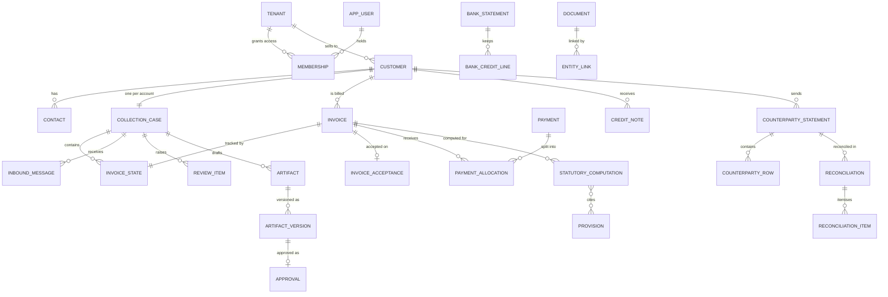

# Chukta: Data Model

| | |
|---|---|
| **Purpose** | Defines every table Chukta v1 stores, who may read and write each one, and which invariants the database itself enforces. Specifies the two database roles and their grants (SEC-01), tenant isolation down to the checkpoint tables, and the reference data the statutory engine reads. |
| **Intended reader** | The developer writing migrations, the data-access layer and the engines. Hat C, for delta 2. Hat B, for `07` and `11`. |
| **Status** | Approved by the owner 2026-09-13. Revised the same day by ADR-0040 (§6.8, §6.9). Frozen for delta 2. Later changes go through an ADR. |
| **Author hat** | Hat A, Systems Architect |
| **Last updated** | 2026-09-13 |
| **Depends on** | [`00-PRD.md`](00-PRD.md), [`01-ARCHITECTURE.md`](01-ARCHITECTURE.md) §7, [`12-DATA-CLASSIFICATION.md`](12-DATA-CLASSIFICATION.md), and ADR-0009, ADR-0012, ADR-0013, ADR-0014, ADR-0021, ADR-0023, ADR-0027, ADR-0030, ADR-0036, ADR-0038 |

### Conventions

- **Scope:** v1 only. Tables for later features (Phase 2 retrieval, MFA, mobile tokens, erasure tooling) are listed in §9 with the decision that brings them in. They are not created by v1 migrations.
- **Names:** tables are singular `snake_case`. Primary keys are `id uuid`, generated by the application.
- **IDs used here:** decisions made first in this document are D2-01 onward (§11). Open questions are D2-Q1 onward (§12).
- **Data classes** (DC-0 to DC-5) come from `12` §1. Each table's class is in §8.
- **No statutory values appear here.** The statutory tables store verified text and rates, loaded by the owner (ADR-0005, ADR-0033).

---

## 1. Storage rules

These apply to every table unless the table's row in §6 says otherwise.

| Rule | Detail | Why |
|---|---|---|
| **Money** | `bigint` paise, with a check that the value is not negative. A negative movement is modelled as its own row type (a credit note or a reversal), never as a negative amount. | No rounding error, and ledger arithmetic ties out exactly (SM-11) |
| **Business dates** | `date`, meaning the calendar date in IST | Due dates, acceptance dates and statement dates are calendar facts, not instants |
| **Instants** | `timestamptz`. Every due-time comparison uses Postgres `now()` (ADR-0022). | One clock |
| **Tenant scope** | Every tenant-scoped table has `tenant_id uuid not null`. Foreign keys between tenant-scoped tables include `tenant_id`: `(tenant_id, x_id)` references `(tenant_id, id)`. | A row cannot point at another tenant's row, even through a bug (D2-02) |
| **Effective dating** | `effective_from date not null` and `effective_to date null`, with an exclusion constraint so that versions never overlap | NFR-09: a past computation reproduces with the values in force on its date |
| **Immutability** | Rows that record a decision or a fact that must not change are insert-only. The runtime role has no UPDATE or DELETE grant on them (§3). | Tamper resistance comes from grants, not from code discipline |
| **Trust label** | Tables that hold ingested text carry `trust text not null check (trust in ('untrusted', 'system'))` (`12` §2) | The prompt builder reads the label, and never infers trust |
| **Soft delete** | Not used. Erasure pseudonymises or deletes under `12` §6 (DF-04). | A `deleted_at` flag leaves personal data in place while looking erased |
| **Enums** | Postgres enums generated by Prisma | Invalid states cannot be stored |

---

## 2. Schemas and ownership

| Schema | Holds | Created by | Managed by |
|---|---|---|---|
| `app` | Every application table in §6 | The migrate job, running Prisma migrations | Prisma, the only migration owner (ADR-0014) |
| `agent_runtime` | LangGraph's checkpoint tables | The migrate job, running LangGraph's checkpointer setup with `search_path` set to `agent_runtime` | The LangGraph library. Prisma does not see this schema. |

Phase 2 adds retrieval tables to `app` (§9). Nothing else creates schemas.

---

## 3. Database roles and grants (SEC-01, ADR-0027)

### 3.1 Roles

| Role | Login | Owns | Attributes | Used by |
|---|---|---|---|---|
| `chukta_migrator` | Yes | Both schemas and every table, sequence and type in them | `NOSUPERUSER`, `NOCREATEROLE`. Owner, so RLS does not bind it. | Only the one-shot `migrate` job and the one-shot `load-reference` job (§3.3) |
| `chukta_runtime` | Yes | **Nothing** | `NOSUPERUSER`, `NOCREATEDB`, `NOCREATEROLE`, `NOBYPASSRLS`. Subject to forced RLS on every tenant-scoped table. | Every running service |

- **The startup check.** Each service refuses to start if its connection role owns any object, or has `BYPASSRLS` or superuser rights (`06` §3.2, layer 4).
- **The DDL test.** A test connects as `chukta_runtime` and asserts that `CREATE`, `ALTER`, `DROP` and `TRUNCATE` fail on every schema.
- **Credentials.** The two roles have separate secrets. The migrator's secret is mounted only into the two one-shot jobs, never into a long-running service (ADR-0027).

### 3.2 Which component connects as which role

| Component | Role | Runs |
|---|---|---|
| `migrate` job | `chukta_migrator` | Once per deploy, before any service starts. Then it exits. |
| `load-reference` job | `chukta_migrator` | On demand, when the owner loads verified statute text or bank rates. Then it exits. |
| Console, including `/api/v1` | `chukta_runtime` | Always |
| Agent API | `chukta_runtime` | Always |
| Workers | `chukta_runtime` | Always |
| Scheduler, including the outbox relay | `chukta_runtime` | Always |
| Eval harness | `chukta_runtime` | On demand, against synthetic tenants only |

### 3.3 Grants, table class by table class

"CRUD" means SELECT, INSERT, UPDATE and DELETE. The tables in each class are listed in §6.

| Table class | `chukta_runtime` grant | Why |
|---|---|---|
| Mutable tenant tables | CRUD, under forced RLS | Normal application state |
| Insert-only tenant tables: `audit_event`, `approval`, `artifact_version`, `sent_mark`, `ca_attestation`, `share_link`, `seller_text`, `case_event`, `review_resolution`, `statutory_computation`, `computation_provision`, `computation_bank_rate`, `spend_ledger` | SELECT and INSERT only, under forced RLS | These record decisions and facts. Nothing in the application may rewrite them (ADR-0023). |
| Reference tables: `provision`, `bank_rate`, `method_profile`, `template` | SELECT only | Verified statute text, rates and templates change only through the owner-run `load-reference` job (ADR-0005). A compromised service cannot rewrite the law it cites. |
| Deployment-wide operational tables: `outbox`, `processed_task`, `dead_letter`, `quota_usage` | CRUD. `outbox`, `processed_task` and `dead_letter` carry `tenant_id` and are under RLS, and are claimed across tenants only through §4.4's functions. `quota_usage` is not tenant-scoped (D2-05). | Durable execution and quota windows |
| Identity tables: `app_user`, `membership`, `session` | CRUD, under user-scoped RLS (§4.2) | Sign-in happens before a tenant is chosen |
| `agent_runtime` checkpoint tables | CRUD, under RLS keyed on the thread-ID prefix (§4.3) | LangGraph writes and prunes its own rows |
| Sequences and enum types | USAGE | Inserts need them |

---

## 4. Tenant isolation in the database

### 4.1 Tenant-scoped tables

- **The data-access wrapper** (one in TypeScript for the Console, one in Python for workers) opens a transaction and runs `SET LOCAL app.tenant_id = '<uuid>'` before any query. The tenant comes from the session or the case record, never from input (ADR-0012).
- **Every tenant-scoped table** has RLS enabled and forced, with one policy:

```sql
USING      (tenant_id = nullif(current_setting('app.tenant_id', true), '')::uuid)
WITH CHECK (tenant_id = nullif(current_setting('app.tenant_id', true), '')::uuid)
```

- **If the setting is missing,** the expression is null, so no row matches. Reads return nothing and writes are rejected. Failing closed at this layer is only safe because the layer above treats an unexpected empty result as a failure (§4.3, and the lesson from DLT-03).
- **The migration lint** fails CI if any `app` table with a `tenant_id` column lacks `ENABLE`, `FORCE` and a policy.

### 4.2 Identity tables, before a tenant is chosen

Signing in has to find a user, and that user's memberships, before any tenant is active. These tables use a user-scoped setting instead:

| Table | Policy |
|---|---|
| `app_user` | A row is visible when `id = current_setting('app.user_id', true)::uuid`, or, only inside the credential-check function, looked up by email |
| `membership` | Visible when `user_id` matches `app.user_id` |
| `session` | Visible when `user_id` matches `app.user_id` |

- The credential check is a `SECURITY DEFINER` function owned by `chukta_migrator`. It takes an email and returns only that user's ID and password hash, so the Console can verify the password itself (§4.4). It is the one place a user row is read before `app.user_id` is set.
- Once a tenant is chosen, the session pins it (`06` §3.5), and the wrapper sets both `app.user_id` and `app.tenant_id`.

### 4.3 Checkpoint tables (SR-04, DLT-03)

- **Thread IDs** have the form `tenant:case`, both UUIDs.
- **RLS** on every `agent_runtime` table keys on the prefix:

```sql
USING (split_part(thread_id, ':', 1) = current_setting('app.tenant_id', true))
```

- **The checkpoint wrapper** sits between the graph runner and LangGraph's checkpointer:
  1. **Before any query,** it asserts that a tenant is bound. If none is, it raises. It never queries and interprets an empty result (DLT-03).
  2. It checks the thread ID's prefix against the bound tenant, on every read and write.
  3. It runs the checkpointer's statements inside the wrapper's own transaction, so `SET LOCAL` applies to them.
  4. **If a read returns no checkpoint,** it looks up the case row in `app.case`. If the case exists and `run_count > 0`, the empty checkpoint is an error. The case moves to NeedsHuman with `halt_reason = 'CHECKPOINT_MISSING'`, and an audit event is written. It is never treated as a new thread (DLT-03).
- **ST-03** covers all four: a read with no tenant bound, a wrong prefix, a cross-tenant thread, and an empty checkpoint for a case that has run.
- **If LangGraph's connection handling cannot run inside the wrapper's transaction** (D2-Q2), steps 1, 2 and 4 stay in the wrapper, and the RLS policy becomes a second line that is logged as not yet effective.

### 4.4 Cross-tenant functions (D2-04)

Some work has to happen before any tenant is bound: signing in, routing an inbound message, applying a webhook, and sweeping timers and the outbox across tenants. The runtime role never gets `BYPASSRLS` for this. Instead, each of these is a `SECURITY DEFINER` function owned by `chukta_migrator` and callable by `chukta_runtime`.

| Function | Called by | Returns | Why it cannot run under a bound tenant |
|---|---|---|---|
| `verify_credentials(email)` | Console sign-in | That user's ID and password hash, or nothing | No user or tenant is known yet |
| `resolve_inbound_address_tenant(address)` | Mail fixture receiver | A tenant ID, or nothing | The recipient address is what identifies the tenant (`01` §5.1) |
| `resolve_payment_link_tenant(provider_link_id)` | Razorpay receiver | A tenant ID and our `payment_link` ID, or nothing | The tenant comes from our own link record, not from the payload (ADR-0025) |
| `claim_due_cases(limit)` | Scheduler | `(tenant_id, case_id)` pairs, claimed with `FOR UPDATE SKIP LOCKED` | The `wake_at` sweep covers every tenant |
| `claim_outbox_batch(limit)` | Outbox relay | `(tenant_id, outbox_id, topic, dedupe_key)` rows, claimed the same way | The relay covers every tenant |

**Rules for every one of them:**
- Each sets `search_path = app, pg_temp`, so a caller cannot redirect it to a table of their own.
- Each returns IDs and keys only, never content. The caller then binds the returned tenant and reads everything else under RLS.
- A test per function asserts that it returns no content column.
- The migration lint holds the list of allowed `SECURITY DEFINER` functions. Any other fails CI.

---

## 5. Entity overview

The main relationships only. Column-level detail is in §6. `collection_case` is named that way because `case` is a reserved SQL word.



---

## 6. Table catalogue

Each table lists its key columns and the constraints that matter. Every tenant-scoped table also has `tenant_id`, `created_at`, forced RLS (§4) and composite tenant foreign keys (§1). Those are not repeated per row.

### 6.1 Identity and tenancy

| Table | Key columns | Constraints and notes |
|---|---|---|
| `tenant` | `id`, `name`, `gstin`, `synthetic boolean not null default true` | **`check (synthetic = true)`** while ADR-0030 is in force. Only a migration that follows the ADR replacing ADR-0030 may drop it. RLS on this table matches `id` to `app.tenant_id`. |
| `app_user` | `id`, `email citext unique`, `password_hash`, `totp_secret_enc null`, `totp_enrolled_at null`, `status` | Not tenant-scoped. User-scoped RLS (§4.2). The TOTP columns exist from day one, so DF-01 needs no migration of existing rows (ADR-0028). |
| `membership` | `tenant_id`, `user_id`, `role`, `can_approve_messages boolean default false` | Primary key `(tenant_id, user_id)`. `role` is one of owner, accountant, collections_staff, read_only_ca. `can_approve_messages` is the owner's grant to named staff (PRD §7.2). |
| `session` | `id` (a hash of the cookie token), `user_id`, `tenant_id null`, `expires_at`, `revoked_at null`, `last_seen_at` | `tenant_id` is null until a tenant is chosen. Rotation writes a new row and revokes the old one (`06` §3.5). |
| `udyam_classification` | `id`, `udyam_number`, `category`, `activity`, `effective_from`, `effective_to`, `document_id`, `confirmed_by null`, `confirmed_at null` | `category` is micro, small or medium. `activity` is manufacturing, services or trading. Versions never overlap. **The eligibility engine ignores unconfirmed rows** (PRD §3.2, E1 to E3). |
| `seller_bank_details` | `id`, `account_number_enc`, `ifsc`, `upi_id null`, `verified_by`, `verified_at`, `effective_from`, `effective_to` | The only source of the seller's payment details in any artifact (ADR-0024). Every change writes an audit event. Step-up is added with DF-01. |

### 6.2 Counterparties

| Table | Key columns | Constraints and notes |
|---|---|---|
| `customer` | `id`, `legal_name`, `gstin null`, `is_company boolean default false`, `buyer_type` | Unique `(tenant_id, gstin)` where `gstin` is not null. `is_company` defaults to false, so a counterparty is treated as an individual (DC-3) until the tenant marks it a company (`12` §1). `buyer_type` is business, government, presumptive or unknown, and it feeds E6. |
| `contact` | `id`, `customer_id`, `name`, `email null`, `phone null`, `designation null`, `purpose`, `trust` | `purpose` is required: the recorded reason this personal data is held (`06` §3.7). Contacts arrive untrusted and are confirmed by a user. |

### 6.3 Receivables and ledgers

**Balances are signed. Movements are never negative.** Opening and closing balances are signed `bigint` paise, with a debit balance positive. Every movement column has a not-negative check.

| Table | Key columns | Constraints and notes |
|---|---|---|
| `invoice` | `id`, `customer_id`, `number`, `issue_date`, `amount_paise`, `po_reference null`, `agreed_payment_days null`, `terms_written`, `terms_confirmed_by null`, `terms_confirmed_at null`, `source` | Unique `(tenant_id, number)`. `terms_written` is unknown, written or not_written. **Payment terms count for E5 only once confirmed.** |
| `invoice_acceptance` | `invoice_id` (primary key), `acceptance_date`, `basis`, `document_id null`, `confirmed_by`, `confirmed_at` | `basis` is delivery, objection_removed or manual. Only a confirmed row exists: the review queue holds proposals until then (FR-HQ-1). A dispute moves the date only through a resolved review item (FR-DSP-2). |
| `credit_note` | `id`, `customer_id`, `invoice_id null`, `number`, `issue_date`, `amount_paise`, `reason`, `source` | Issued by the seller outside Chukta and imported here. Chukta never issues one (NG10). |
| `payment` | `id`, `customer_id`, `amount_paise`, `received_on`, `utr null`, `source`, `bank_credit_line_id null`, `webhook_event_id null` | Unique `(tenant_id, utr)` where `utr` is not null. `source` is bank_csv, razorpay or manual. **A claimed UTR in a message never creates a payment.** Only a bank line or a verified webhook does (PRD §5.4). |
| `payment_allocation` | `payment_id`, `invoice_id`, `amount_paise` | Primary key `(payment_id, invoice_id)`. A constraint trigger checks that allocations never exceed the payment's amount. |
| `counterparty_statement` | `id`, `customer_id`, `document_id`, `period_from`, `period_to`, `opening_paise`, `closing_paise`, `layout_mapping jsonb`, `tied_out boolean` | `tied_out` is set by code only: opening plus debits minus credits equals closing (PRD §5.2). A statement that does not tie out raises a review item. |
| `counterparty_row` | `statement_id`, `row_no`, `entry_date`, `narration`, `reference null`, `debit_paise`, `credit_paise`, `trust` | Primary key `(statement_id, row_no)`. Exactly one of debit or credit is above zero. `narration` is untrusted. |
| `bank_statement` | `id`, `document_id`, `account_label`, `period_from`, `period_to`, `raw_deleted_at null` | The raw file is deleted 7 days after parsing (`12` §5). |
| `bank_credit_line` | `id`, `bank_statement_id`, `value_date`, `amount_paise`, `utr null`, `narration`, `trust` | **Only credit lines that could match a customer are kept** (ADR-0029). Debits and unrelated credits are never stored. |
| `reconciliation` | `id`, `customer_id`, `statement_id`, `status` | `status` is open or confirmed |
| `reconciliation_item` | `id`, `reconciliation_id`, `cause`, `amount_paise`, `counterparty_row_no null`, `internal_type null`, `internal_id null`, `proposed_by`, `verified_by_code boolean` | `cause` is tds, credit_note, short_pay, timing, missing_entry or unexplained. `proposed_by` is rule or model. **A model-proposed cause is accepted only when `verified_by_code` is true**, meaning its amount reconciles (FR-REC-2). The BCS renders from these rows, and the gate checks the tie-out. |

### 6.4 Documents and the entity graph

| Table | Key columns | Constraints and notes |
|---|---|---|
| `document` | `id`, `kind`, `object_key`, `sha256`, `mime`, `size_bytes`, `trust`, `kind_source`, `uploaded_by` | Unique `(tenant_id, sha256)`. `object_key` is built from the bound tenant, never from input (`06` §3.2, layer 6). `kind_source` is manual in v1. The model value arrives with OCR (DF-06). The file type allowlist and size limits apply before the row exists (FR-ING-6). |
| `entity_link` | `id`, `from_type`, `from_id`, `to_type`, `to_id`, `relation`, `basis`, `created_by` | `relation` is one of po_of, challan_of, grn_of, pod_of, payment_for, credit_note_for, dispute_about, document_of. `basis` names the field the link was based on (FR-EVD-2). Unlinking deletes the row and writes an audit event. Walked with recursive CTEs, with a depth limit. Phase 2 retrieval walks the same table (ADR-0032), so v1 stores links from the start. |

### 6.5 Cases, messages and workflow

| Table | Key columns | Constraints and notes |
|---|---|---|
| `collection_case` | `id`, `customer_id`, `state`, `wake_at null`, `dirty boolean`, `run_count int`, `last_run_at null`, `halt_reason null` | **Unique `(tenant_id, customer_id)`: one case per account** (ADR-0009). `state` is active, waiting, needs_human or closed. `halt_reason` is spend_cap, quota_window, checkpoint_missing or review_blocked. A partial index on `wake_at` where state is waiting serves the sweep (ADR-0013). `run_count` is what the checkpoint wrapper checks (§4.3). |
| `invoice_state` | `invoice_id` (primary key), `case_id`, `state`, `ladder_step null`, `promise_date null` | `state` follows PRD §5.9. `ladder_step` is l0 to l4. Transitions happen only through the state-machine function (`03`), and each writes a `case_event`. |
| `case_event` | `id`, `case_id`, `kind`, `subject_type`, `subject_id`, `detail jsonb` | Insert-only. `kind` is message, upload, webhook, timer, transition, run_started, run_ended or halted. `detail` holds IDs and codes, never free text. |
| `inbound_message` | `id`, `case_id null`, `customer_id null`, `channel`, `sender_address`, `sender_contact_id null`, `message_id`, `received_at`, `body`, `trust` | Unique `(tenant_id, channel, message_id)`, which makes ingestion idempotent. `channel` is mail_fixture or paste in v1. `trust` is always untrusted. The tenant comes from the recipient address or the session, never from the body (`01` §5.1). |
| `message_classification` | `message_id` (primary key), `labels`, `entities jsonb`, `confidence`, `spend_ledger_id`, `validation` | `validation` is passed, failed or low_confidence. **`entities` holds only values that passed code validation.** Anything else becomes a review item. |
| `promise` | `id`, `invoice_id`, `promised_on`, `amount_paise null`, `message_id`, `confirmed boolean` | A confirmed promise sets `wake_at` to the promised date plus grace (PRD §5.4) |

### 6.6 Human review queue (FR-HQ)

| Table | Key columns | Constraints and notes |
|---|---|---|
| `review_item` | `id`, `case_id`, `invoice_id null`, `type`, `source_type`, `source_id`, `proposal jsonb`, `confidence null`, `reason`, `assigned_role`, `blocks`, `status`, `due_at`, `escalated_at null`, `dedupe_key` | Partial unique `(tenant_id, dedupe_key)` where `status = 'open'`, so one question makes one item (FR-HQ-6). `blocks` is statutory_steps, state_change, draft or none, and is scoped to `invoice_id` (FR-HQ-4). `due_at` comes from the per-type age limit. Past it, the item escalates and still blocks. **No code path resolves an item by timeout** (FR-HQ-5). `proposal` is data: a resolution never executes it, and code applies the accepted value. |
| `review_resolution` | `id`, `review_item_id`, `decision`, `before jsonb`, `after jsonb`, `resolved_by`, `reason null` | Insert-only (FR-HQ-3). `decision` is accepted, corrected, rejected or obsolete. |

### 6.7 Statutory reference data and computations

| Table | Key columns | Constraints and notes |
|---|---|---|
| `provision` | `provision_id`, `version`, `act`, `section`, `clause null`, `heading`, `text`, `effective_from`, `effective_to`, `text_as_of`, `source_url`, `source_type`, `gazette_ref null`, `verified_by`, `verified_on`, `status` | Primary key `(provision_id, version)`. Not tenant-scoped (DC-0). Versions never overlap. `status` is verified, unverified or test_fixture. **The gate cites only verified rows in force on the relevant date** (ADR-0005). The runtime role can only read it. |
| `bank_rate` | `effective_from` (primary key), `rate_basis_points int`, `source_url`, `retrieved_on` | Basis points, never floats. The loader rejects gaps. No rate appears in any document (V13). |
| `method_profile` | `id`, `version`, `params jsonb`, `effective_from`, `effective_to`, `notes` | The versioned s.16 method parameters (ADR-0004). Read-only for runtime. |
| `template` | `id`, `kind`, `version`, `body`, `slot_schema jsonb`, `effective_from` | Read-only for runtime. Statutory templates have no model prose blocks (ADR-0024). |
| `statutory_computation` | `id`, `invoice_id`, `as_of_date`, `eligibility`, `reason_codes text[]`, `due_date null`, `interest_paise null`, `exposure_43bh`, `method_profile_id`, `method_profile_version`, `inputs_hash`, `computed_at` | Insert-only. `eligibility` is qualifying, not_qualifying or undetermined. `exposure_43bh` is none, deferred or undetermined, never "lost" (PRD §5.8). Gate stage G5 recomputes from the same inputs and compares (`06` §3.3). |
| `computation_provision` | `computation_id`, `provision_id`, `provision_version` | Insert-only. A join table instead of an array, so every citation is a real foreign key to a real provision version. |
| `computation_bank_rate` | `computation_id`, `bank_rate_effective_from` | Insert-only. The rates a computation used. |

### 6.8 Artifacts, approvals and payments

| Table | Key columns | Constraints and notes |
|---|---|---|
| `artifact` | `id`, `case_id`, `kind`, `status`, `current_version int` | `kind` is message, bcs, l4_notice, or evidence_packet (build-if-time). `status` is drafting, gate_blocked, pending_approval, approved, rejected, finalised or sent. |
| `artifact_version` | `artifact_id`, `version`, `rendered_text`, `render_map jsonb`, `content_sha256`, `gate_result jsonb`, `template_id`, `template_version`, `prose_source` | Primary key `(artifact_id, version)`. Unique `(artifact_id, version, content_sha256)`. Insert-only: any edit writes a new version (PRD §7.1, A3). `render_map` maps every regulated-token span to its slot and source record (ADR-0010, ADR-0024). `prose_source` is model_hosted, model_local, template_fallback or template_only, and SM-25 is computed from it (ADR-0040). |
| `seller_text` | `id`, `body`, `approved_artifact_id`, `approved_version`, `trust` | Insert-only, with `trust = 'system'`. **Approved seller free text is stored as a record and rendered into later artifacts as a slot, after generation. It is never a prompt input** (DLT-02, ADR-0029). |
| `approval` | `id`, `artifact_id`, `version`, `content_sha256`, `decision`, `ca_waived boolean`, `decided_by`, `decided_at`, `reason null` | Insert-only. **The foreign key `(artifact_id, version, content_sha256)` references `artifact_version`,** so an approval is bound to exact bytes (A3, bypass path P-6). A CA waiver requires `ca_waived` plus an audit event. |
| `ca_attestation` | `id`, `artifact_id`, `version`, `attested_by`, `note`, `attested_at` | Insert-only. Required before an L4 approval, unless the approval records a waiver. |
| `sent_mark` | `id`, `artifact_id`, `version`, `channel`, `marked_by`, `marked_at` | Insert-only. A trigger rejects a sent mark for a version with no approved `approval` row (A4). |
| `share_link` | `id`, `artifact_id`, `version`, `kind`, `issued_to`, `issued_at` | Insert-only. `kind` is wa_me or mailto. A trigger rejects issuing one for a version with no approved `approval` row (ADR-0038). |
| `payment_link` | `id`, `artifact_id`, `version`, `provider_link_id`, `amount_paise`, `status` | Build-if-time item 2. Created only after approval. `amount_paise` must equal the approved balance slot (FR-PAY-1). Unique `provider_link_id`. |
| `webhook_event` | `id`, `provider`, `event_id`, `payment_link_id`, `signature_valid`, `payload jsonb`, `applied_at null`, `outcome` | Unique `(provider, event_id)`. The tenant is resolved from our own `payment_link` row through a lookup function (§4.4), never from payload fields (ADR-0025). |

### 6.9 Durable execution, cost, audit and pseudonyms

| Table | Key columns | Constraints and notes |
|---|---|---|
| `outbox` | `id`, `topic`, `payload jsonb`, `dedupe_key`, `published_at null` | Unique `dedupe_key`. `payload` holds IDs and codes only. Written in the same transaction as the fact that caused it (ADR-0013). Claimed through `claim_outbox_batch` (§4.4). |
| `processed_task` | `dedupe_key` (primary key), `task`, `processed_at` | Checked in the same transaction as the task's effect (SM-06) |
| `dead_letter` | `id`, `task`, `dedupe_key`, `error_code`, `attempts`, `failed_at`, `review_item_id` | No payload text. Every dead letter raises a review item. |
| `spend_ledger` | `id`, `case_id null`, `task`, `mode`, `provider`, `tier`, `model`, `requests int`, `input_tokens`, `output_tokens`, `cost_paise`, `quota_window_hit null`, `outcome` | Insert-only. The source of truth for cost (ADR-0030). `mode` is local_only or hosted, and `tier` is free or paid (ADR-0036). Per-case caps are summed from it (NFR-14). `outcome` is ok, schema_failed or quota_deferred (ADR-0040). |
| `quota_usage` | `provider`, `tier`, `window`, `window_start`, `requests`, `tokens` | Primary key `(provider, tier, window, window_start)`. `window` is rpm, rpd, tpm or tpd. **Deployment-wide and not tenant-scoped,** because a free-tier quota belongs to the API key, not to a tenant (D2-05). It holds no tenant data. |
| `pseudonym_map` | `case_id`, `token`, `value_enc` | Primary key `(case_id, token)`. DC-5. The value is encrypted in the application (D2-Q3). Only the gateway module reads it, which ST-05 checks. Deleted with the case's inbound messages (`12` §3). |
| `audit_event` | `id bigint identity`, `tenant_id null`, `actor_type`, `actor_id`, `action`, `subject_type`, `subject_id`, `before jsonb null`, `after jsonb null`, `at`, `prev_hash null`, `hash null` | Insert-only. `tenant_id` is null only for sign-in events, which RLS shows only to the same `app.user_id`. `before` and `after` hold IDs and codes, never free text. `prev_hash` and `hash` are filled once build-if-time item 4 is built (ADR-0023). |

### 6.10 The `agent_runtime` schema

- **Contents:** the tables LangGraph's Postgres checkpointer creates. Their names depend on the library version, which is pinned, and `10` records the list (D2-Q1).
- **Created by** the migrate job, as `chukta_migrator`.
- **Read and written by** `chukta_runtime`, under RLS keyed on the thread-ID prefix, and only through the checkpoint wrapper (§4.3).
- **Holds** case state that can include DC-2 and DC-3 data. It is backed up and erased along with its case.

---

## 7. Invariants the database enforces

These hold even if application code has a bug. Everything else (state-machine transitions, the gate, eligibility, drafting inputs) is enforced in code and tested in `11`.

| Invariant | Enforced by | Source |
|---|---|---|
| One case per customer account | Unique `(tenant_id, customer_id)` | ADR-0009 |
| v1 holds synthetic data only | Check constraint on `tenant.synthetic` | ADR-0030 |
| A row cannot reference another tenant's row | Composite tenant foreign keys | D2-02 |
| Tenant rows are invisible without a bound tenant | Forced RLS, and a runtime role without `BYPASSRLS` | ADR-0012, ADR-0027 |
| An approval covers exact bytes | Foreign key on `(artifact_id, version, content_sha256)` | PRD §7.1 A3 |
| Decisions and facts cannot be rewritten | Insert-only grants | ADR-0023 |
| Law, rates, methods and templates change only through the owner's job | Read-only grants for runtime | ADR-0005, D2-03 |
| A share link or sent mark needs an approval | Triggers | ADR-0038, A4 |
| Ingestion and effects are idempotent | Unique `message_id`, `sha256`, `(provider, event_id)`, `dedupe_key` | SM-06 |
| Effective-dated versions never overlap | Exclusion constraints | NFR-09 |
| No negative movement | Check constraints | §1 |
| Allocations never exceed a payment | Constraint trigger | §6.3 |
| One open review item per question | Partial unique index | FR-HQ-6 |
| Running services own nothing | Startup check and a DDL test | ADR-0027 |

---

## 8. Data class per table

| Class (`12` §1) | Tables |
|---|---|
| DC-0 Public | `provision`, `bank_rate`, `method_profile`, `template` |
| DC-1 Internal | `quota_usage`, `processed_task`, `dead_letter`, `spend_ledger`, `outbox`, `case_event` |
| DC-2 Tenant confidential | `tenant`, `invoice`, `invoice_acceptance`, `credit_note`, `payment`, `payment_allocation`, `counterparty_statement`, `reconciliation`, `reconciliation_item`, `entity_link`, `collection_case`, `invoice_state`, `statutory_computation`, `computation_provision`, `computation_bank_rate`, `artifact`, `approval`, `share_link`, `payment_link`, `audit_event` |
| DC-3 Personal | `app_user`, `membership`, `session`, `customer` (when not a company), `contact`, `counterparty_row`, `inbound_message`, `message_classification`, `promise`, `review_item`, `review_resolution`, `artifact_version`, `seller_text`, `sent_mark`, `ca_attestation`, `webhook_event`, `document` (scans), `udyam_classification` (a proprietor's) |
| DC-4 Sensitive financial | `seller_bank_details`, `bank_statement`, `bank_credit_line` |
| DC-5 Secret | `pseudonym_map`, and the columns `app_user.password_hash`, `app_user.totp_secret_enc`, `session.id` |

---

## 9. Tables that v1 does not create

| Tables | Arrive with | Decision |
|---|---|---|
| `chunk`, `embedding` (pgvector), `retrieval_profile` | Phase 2, designed in `04` on its first day | ADR-0032, ADR-0035 |
| `dispute`, `dispute_finding` | Phase 2 | ADR-0032 |
| `device`, `refresh_token` | The bearer-token strategy for a mobile client | ADR-0038 |
| `recovery_code`, `step_up_event` | DF-01 | ADR-0028 |
| `erasure_request`, `legal_hold` | DF-04 | `12` §6 |
| `mail_route`, `chat_import` | DF-08 | ADR-0031 |
| `mcp_token` | DF-12 | ADR-0026 |

---

## 10. Migrations and one-shot jobs

- **`migrate`:**
  1. Runs `prisma migrate deploy` for `app`. This includes the RLS policies, triggers, exclusion constraints and grants, written as SQL migrations.
  2. Runs LangGraph's checkpointer setup, with `search_path` set to `agent_runtime`.
  3. Applies that schema's grants and RLS policies.
  4. Exits.
- **CI checks:**
  - `prisma migrate diff` against a migrated database fails on drift (ADR-0014).
  - The migration lint checks RLS on every tenant table (§4.1).
  - The runtime role cannot run DDL (§3.1).
  - Insert-only tables reject UPDATE and DELETE from the runtime role.
  - Composite foreign keys reject a cross-tenant reference.
- **`load-reference`:**
  - Validates the files in PRD Appendix B.
  - Accepts only allowlisted source domains.
  - Refuses `test_fixture` rows outside the test environment.
  - Inserts new versions. It never updates a verified row.
  - Exits.
- **Backups in v1:** `pg_dump` run as the migrator on the developer's machine, plus the MinIO data directory (`01` §10.1).

---

## 11. Decisions made in this document

These are promoted to ADRs at the next Hat A revision. Until then, this table is their only record.

| ID | Decision | Why | Alternatives rejected |
|---|---|---|---|
| D2-01 | Money is `bigint` paise. Balances are signed. Movements are never negative. | Exact tie-outs, and a negative movement cannot hide inside a sum | `numeric` rupees: invites rounding at boundaries. Signed movements: a sign error becomes silent. |
| D2-02 | Foreign keys between tenant tables include `tenant_id` | A bug cannot link one tenant's invoice to another's case | Single-column foreign keys with RLS alone: RLS hides rows but does not stop a write that references a guessed ID |
| D2-03 | Provisions, bank rates, method profiles and templates are read-only for the runtime role, and written only by the owner-run `load-reference` job | A compromised service cannot rewrite the law or the rates it cites | Runtime writes guarded by code: one bug away from altering the statutory corpus |
| D2-04 | Every cross-tenant sweep and every lookup from an infrastructure identifier goes through a `SECURITY DEFINER` function that returns IDs only: `claim_due_cases`, `claim_outbox_batch`, `resolve_inbound_address_tenant`, `resolve_payment_link_tenant` and `verify_credentials` (§4.4) | Schedulers and receivers must work before a tenant is bound, without giving the runtime role `BYPASSRLS` | A privileged service role: a second role that can read everything. Per-tenant loops: the scheduler would need to list tenants without a tenant. |
| D2-05 | `quota_usage` is deployment-wide | A free-tier quota belongs to the API key, not to a tenant | Per-tenant windows: they would not match the limit the provider actually enforces |
| D2-06 | Approved seller free text is a `seller_text` record, rendered as a slot after generation | Carries out DLT-02 in the schema: there is no column a prompt builder could read it from | Storing it inside `artifact_version` only: the drafting node could be pointed at it |
| D2-07 | No soft delete. Unlinking or erasing deletes the row or pseudonymises it, and writes an audit event. | A `deleted_at` flag keeps personal data while looking erased | Soft delete everywhere |

---

## 12. Open questions

| ID | Question | Answered by | Lands in |
|---|---|---|---|
| D2-Q1 | The exact LangGraph checkpointer tables and statements for the pinned library version | Hat B | `10` |
| D2-Q2 | Can LangGraph's Postgres checkpointer run its statements inside the wrapper's transaction, so that `SET LOCAL` applies? If not, §4.3's fallback applies. | A spike on build day 9 (feasibility review §9) | `03`, and an ADR if the fallback is needed |
| D2-Q3 | Column encryption for DC-4 and DC-5 values in v1: application-level envelope encryption with a key from the local env file (proposed), or `pgcrypto` | Hat C | Delta 2 |

---

## 13. Revision history

| Date | Change | Why |
|---|---|---|
| 2026-09-13 | First version | Hat A, step 5a |
| 2026-09-13 | `spend_ledger.outcome` and `artifact_version.prose_source`, for SM-25 | ADR-0040 (FB-03) |
