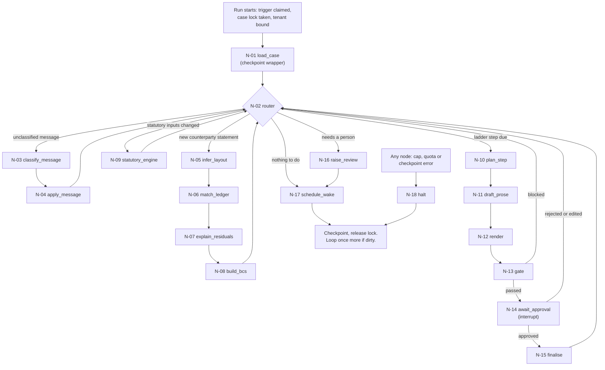
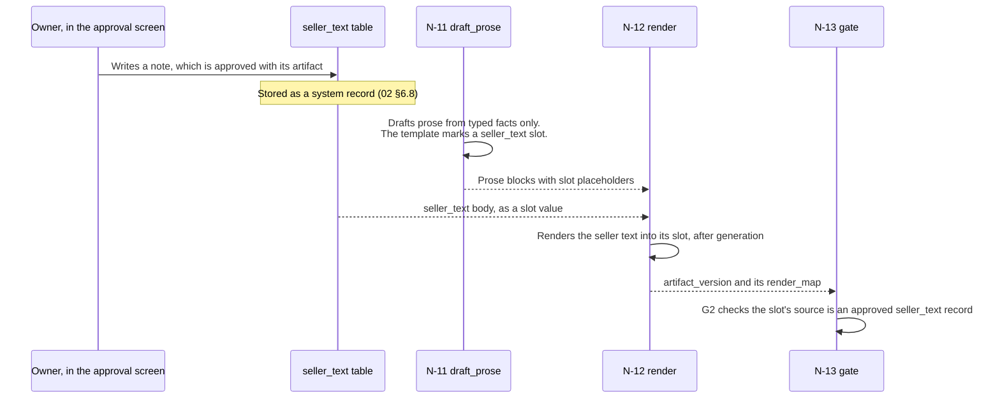

# Chukta: Agent and Engine Design

| | |
|---|---|
| **Purpose** | Defines the case graph, the deterministic router, every node, and exactly what each node may read and write. It is the node input contract that SR-06, SR-15 and DLT-02 required: which content can reach which prompt. It also covers the deterministic engines, durable execution inside the graph, and how model calls are budgeted. |
| **Intended reader** | The developer building the case engine, the nodes and the prompt builder. Hat C, for delta 2. Hat B, for `05`, `07` and `11`. |
| **Status** | In Review |
| **Author hat** | Hat A, Systems Architect |
| **Last updated** | 2026-09-13 |
| **Depends on** | [`00-PRD.md`](00-PRD.md) §5, §6; [`01-ARCHITECTURE.md`](01-ARCHITECTURE.md) §5, §6, §8; [`02-DATA-MODEL.md`](02-DATA-MODEL.md); ADR-0007, ADR-0009, ADR-0010, ADR-0021, ADR-0024, ADR-0027, ADR-0029, ADR-0031, ADR-0032, ADR-0036 |

### Conventions

- **Scope:** v1 nodes in full. Nodes for build-if-time items, deferred items and Phase 2 are listed in §4.3, with only their contract.
- **IDs used here:** nodes are N-01 onward. Decisions made first here are D3-01 onward (§12). Open questions are D3-Q1 onward (§13).
- **Every number here is a configuration default,** not a target. Targets live in PRD §10.
- **"Agent"** means a model-driven node (ADR-0007). The orchestrator and the engines are plain code.

---

## 1. Principles for the graph

| ID | Principle | Source |
|---|---|---|
| G-1 | **Routing is code.** The next node is a pure function of typed case state. No model chooses a path. | ADR-0007 |
| G-2 | **A model reads or writes prose, and returns JSON.** No node gives a model a tool, and no model output changes state until code has validated it. | P1, `06` §3.1 |
| G-3 | **Inputs are allow-listed per node** (§5). A prompt builder that is handed a value outside its node's list raises. | SR-06, SR-15, DLT-02 |
| G-4 | **Drafting prompts carry typed facts and templates only.** No untrusted span and no seller free text, ever. Seller text is rendered afterwards as a slot. | ADR-0021, ADR-0029 |
| G-5 | **The tenant is bound in a closure** when the graph starts. It is never part of model-visible state, and never a tool or node argument. | ADR-0012 |
| G-6 | **Every model call goes through the gateway,** which checks the per-case caps and the quota windows before calling. | ADR-0021, ADR-0036, NFR-14 |
| G-7 | **Side effects are idempotent.** Each node's writes carry a dedupe key, and follow-up work goes through the outbox. | ADR-0013, SM-06 |
| G-8 | **Uncertainty goes to a person,** as a review item. It never goes to a bigger model by default. | D-09, FR-HQ-1 |

---

## 2. The case graph

One LangGraph thread per customer account. The thread ID is `tenant:case` (ADR-0027). A run starts from a trigger and ends in one of four outcomes (`01` §6).

### 2.1 Case state

LangGraph state holds IDs, codes and validated values. Content stays in the tables, and nodes load what their contract allows (§5).

| Field | Type | Written by | Visible to a model? |
|---|---|---|---|
| `case_id` | UUID | N-01 | No |
| `tenant_id` | UUID, bound in the closure and not stored in state | Run start | No, never (G-5) |
| `invoices` | Per invoice: state, ladder step, promise date, the latest statutory computation ID, and the review items blocking it | N-01, N-04, N-09, N-16 | No |
| `pending` | Unprocessed message IDs, statement IDs and approval decisions | N-01 | No |
| `planned_step` | Artifact kind, invoice IDs, ladder step, template ID | N-10 | No |
| `draft` | Artifact ID and version | N-11 to N-13 | No |
| `budget` | Calls, tokens and quota state for this wake | Gateway | No |
| `halt` | Reason code, or null | N-18 | No |

---

## 3. The router (N-02)

A pure function of case state. It checks the rows below in order and takes the first match, so a run clears incoming information before it plans any outbound work. It never calls a model.

| Order | Condition | Next | Why this order |
|---|---|---|---|
| 1 | `halt` is set | N-18 | Stop before any further call |
| 2 | An approval decision is pending on a draft | N-15 if approved, otherwise back to planning | Unblock work a person already decided |
| 3 | An unprocessed inbound message exists | N-03 | New buyer information changes every later decision |
| 4 | An unprocessed counterparty statement exists | N-05 | Reconciliation can change balances before any draft |
| 5 | A confirmed input to the statutory engine changed (acceptance date, payment terms, classification, payment) | N-09 | Statutory figures must be current before a ladder step is planned |
| 6 | A ladder step is due for any invoice, **and** no open review item blocks that step (FR-HQ-4), **and** no draft for this account is pending approval | N-10 | At most one outbound draft per account per wake (FR-CASE-3) |
| 7 | Any open review item blocks every remaining step | N-16, then N-17 | Wait for a person without spending calls |
| 8 | Otherwise | N-17 | Sleep until the next trigger or timer |

---

## 4. Nodes

### 4.1 v1 nodes

"Local" means the local SLM. "Hosted" means the configured frontier provider (ADR-0036). Tables are named as in `02`.

| ID | Node | Kind | Model: local-only mode, hosted mode | Reads | Writes | On failure or low confidence |
|---|---|---|---|---|---|---|
| N-01 | `load_case` | code | None | `collection_case`, `invoice_state`, pending triggers, and the checkpoint through the wrapper (`02` §4.3) | Case state | An empty checkpoint for a case that has run goes to N-18 with `checkpoint_missing` (DLT-03) |
| N-02 | `router` | code | None | Case state | The next node (§3) | Not applicable |
| N-03 | `classify_message` | LLM + code | **Local in both modes.** Raw buyer text never leaves the machine (P9). | §5.1 | `message_classification` | Invalid, low-confidence or unsupported-language output raises a review item (FR-CNV-3) |
| N-04 | `apply_message` | code | None | Validated `message_classification`, `invoice_state`, `bank_credit_line` | `invoice_state` transitions, `promise`, `case_event`, `outbox` | A claimed UTR with no matching bank credit raises a review item. It never marks an invoice paid (PRD §5.4). |
| N-05 | `infer_layout` | LLM + code | Local in both modes | §5.1 | `counterparty_statement.layout_mapping`, `counterparty_row` | A statement that does not tie out raises a review item (FR-ING-2) |
| N-06 | `match_ledger` | code (the matcher engine, §8) | None | `counterparty_row`, `invoice`, `payment`, `credit_note`, `bank_credit_line` | `reconciliation`, and `reconciliation_item` rows with rule-based causes | Unsure rows stay unmatched. A false match is worse than a miss (PRD §5.2). |
| N-07 | `explain_residuals` | LLM + code | Local in both modes. The hosted path waits for DF-14. | §5.1 | Proposed `reconciliation_item` causes | A proposal whose amount does not reconcile gets the cause "unexplained" (FR-REC-2) |
| N-08 | `build_bcs` | code | None | `reconciliation_item` | The reconciliation's BCS data and status | A failed tie-out keeps it open, and the gate blocks any BCS artifact (SM-11) |
| N-09 | `statutory_engine` | code (§8) | None | Confirmed `invoice_acceptance`, confirmed terms, confirmed `udyam_classification`, `customer.buyer_type`, `payment_allocation`, verified `provision`, `bank_rate`, `method_profile` | `statutory_computation` and its join tables | An undetermined result raises a review item naming the missing input (PRD §3.2) |
| N-10 | `plan_step` | code | None | `invoice_state`, the latest `statutory_computation`, the B-1 rules (PRD §5.8), open review items, the tenant's ladder settings | `planned_step`: artifact kind, invoices, ladder step, template | If nothing is eligible, go to N-17 |
| N-11 | `draft_prose` | LLM | Local in local-only mode, hosted in hosted mode | **Typed facts only** (§5.1, §5.3) | Prose blocks that contain slot placeholders | Schema failure falls back to the template's fixed prose. **Statutory artifacts (L3, L4) skip this node entirely** (ADR-0024). |
| N-12 | `render` | code | None | The template, the prose blocks, slot sources, and `seller_text` as a slot | `artifact_version` with `rendered_text`, `render_map` and `content_sha256` | A slot with no source record blocks at the gate |
| N-13 | `gate` | code | None | `artifact_version` and every source record in its `render_map` | `gate_result`, artifact status | A block returns to the router with the reason. The same block three times raises a review item (D3-03). |
| N-14 | `await_approval` | code (LangGraph `interrupt()`) | None | Not applicable | Artifact status `pending_approval` | The run ends and resumes on the approval decision |
| N-15 | `finalise` | code | None | `approval` bound to the version's hash | `share_link`, `payment_link` (build-if-time item 2), artifact status `finalised`, `wake_at` | A hash mismatch voids the approval and returns to the router (PRD §7.1 A3) |
| N-16 | `raise_review` | code | None | The triggering condition | `review_item`, deduplicated on `dedupe_key` | Not applicable |
| N-17 | `schedule_wake` | code | None | Promises, ladder intervals, review items' `due_at` | `collection_case.wake_at`, state `waiting` | Not applicable |
| N-18 | `halt` | code | None | The halt reason | `collection_case` state `needs_human` (spend cap, missing checkpoint) or `waiting` (quota window), plus `audit_event` | Not applicable |

**v1 has four model nodes (N-03, N-05, N-07, N-11) and fourteen code nodes.** Only N-11 can ever reach a hosted model, and only in hosted mode.

### 4.2 Nodes outside v1 (contract only)

| ID | Node | Arrives with | Kind | Input contract |
|---|---|---|---|---|
| N-19 | `parse_ap_request` | Build-if-time item 1 | LLM + code, local | One inbound message body (untrusted, delimited), plus the document kind enum |
| N-20 | `assemble_packet` | Build-if-time item 1 | code | `entity_link` and `document`. Only the requested items go into the packet (FR-EVD-3). |
| N-21 | `classify_scan` | DF-06 | LLM + code, local | OCR text of one document (untrusted). The image never goes to a hosted model (D-04). |
| N-22 | `extract_payment_terms` | DF-06 and DF-07 | LLM + code, local | Text of one PO or contract (untrusted). The output is a proposal that a person always confirms. |
| N-23 | `investigate_dispute` | Phase 2 (ADR-0032) | LLM + code. Hosted only after DF-14's pipeline exists, otherwise local. | Spans retrieved through `04`'s retrieval profiles (untrusted, delimited), the claim, and evidence IDs. Returns a JSON assessment only, where every finding cites span IDs and code checks quantities and dates. |
| N-24 | `analyst` | DF-10 | code | Not a model node |

---

## 5. Input contracts: the content boundary

### 5.1 What each model node may see

| Node | May include | Must never include | Enforced by |
|---|---|---|---|
| N-03 | One message body (untrusted, delimited). The customer's open invoice numbers and amounts (system). The label enum. | Any other message body. Any other customer's data. Seller text. Approver edits. | The allow-list in N-03's prompt builder, a loader scoped to the case, ST-01 |
| N-05 | The header rows and the first sample rows of one statement (untrusted, delimited). The target column enum. | Rows beyond the sample. Any other statement. Message bodies. | The builder allow-list, ST-01 |
| N-07 | The narration and amount of each residual row in one reconciliation (untrusted, delimited). The cause enum. Candidate internal amounts (system). | The full statement. Message bodies. Any other customer's rows. | The builder allow-list, ST-01 |
| N-11 | Slot values for the planned step, with identifiers pseudonymised. The template's prose-block instructions. The thread's language code. The tone setting. | **Any untrusted span. Any `seller_text` or approver edit. Message bodies, narrations or document text of any kind.** | The drafting builder has no parameter that accepts free text (§5.2). ST-01's stub half. ST-05's pre-send scan. |

### 5.2 The prompt builders

- **One builder per model node,** generated from §5.1. A builder rejects any argument outside its allow-list when it is constructed (G-3).
- **Untrusted text goes only into a data block,** wrapped in a delimiter generated per call. Any copy of the delimiter inside the content is removed first (`06` §3.1, layer 2).
- **The system message** says that the data block is material to analyse, never instructions, and gives the JSON schema to return.
- **The drafting builder accepts only typed values** from the template's `slot_schema`: amounts, dates, document references, codes, pseudonymised names and short enums. **It has no string parameter for free text.** That makes DLT-02 structural, not a rule someone has to remember: there is nowhere to pass seller text or an untrusted span.
- **Builders never read the database.** A node loads exactly the values its contract allows and passes them in.

### 5.3 How seller text reaches an artifact without ever reaching a model (DLT-02)

The drafting model writes around a placeholder, and never sees what fills it.

---

## 6. Output schemas and validation

A model's JSON is a proposal. Code checks every value against our own records before anything is written (G-2).

| Node | Output | Code checks before any write | When it is not trusted |
|---|---|---|---|
| N-03 | `labels` from the six-label enum. `entities`: UTRs, amounts, date phrases, invoice references. `language`. `confidence`. | Labels are in the enum. A UTR matches a bank-reference pattern and is looked up in `bank_credit_line`. Amounts parse to paise and do not exceed the open balance. **Date phrases like "month-end tak" are resolved to dates by code, in IST, never by the model** (D3-04). Invoice references exist for this customer. | Below the per-label threshold, or any check fails: a review item (FR-CNV-3) |
| N-05 | The header row index, a column mapping (date, narration, reference, debit, credit, balance) and the sign convention | The mapped columns exist. Every row parses. Opening plus debits minus credits equals closing, exactly. | Tie-out fails: a review item (FR-ING-2) |
| N-07 | For each residual row: a cause from the enum, and an internal reference where one applies | The row belongs to this reconciliation. The proposed cause reconciles to the rupee. A deduction is derived from the arithmetic, never from a hard-coded rate. Any internal reference exists. | Any check fails: the cause is "unexplained" (FR-REC-2) |
| N-11 | Prose blocks, each keyed by the template's block ID | The block IDs match the template. Length limits hold. The language matches the thread's. **The authoritative check for regulated tokens is the gate's scanner at N-13** (ADR-0024), which runs on the rendered result. | Schema failure: the template's fixed prose (D-09) |

**Thresholds are configuration.** They are calibrated on the development split of the H set, and never tuned on its test split (ADR-0017). `05` sets the procedure.

---

## 7. Model routing and modes

| Node | Local-only mode | Hosted mode | Why |
|---|---|---|---|
| N-03 `classify_message` | Local SLM | Local SLM | Raw buyer text never leaves the machine (P9, D3-02) |
| N-05 `infer_layout` | Local SLM | Local SLM | Counterparty rows are raw and untrusted |
| N-07 `explain_residuals` | Local SLM | Local SLM | Hosted residual reasoning waits for DF-14 |
| N-11 `draft_prose` | Local SLM | Frontier provider (the Gemini API free tier in v1) | Its input is typed facts only (§5.1), so a hosted call carries no free text (ADR-0037) |

- **The mode is fixed when the process starts,** from configuration, and a run never switches mode (ADR-0036).
- **Each node declares a token budget.** The gateway sums them per wake and over the case's lifetime, against NFR-14's caps. The cap on frontier tokens is lower.
- **Quota windows:** the gateway waits out a short window. An exhausted daily window sends the run to N-18 with `quota_window`, and the case waits until the window resets.
- **Every call writes a `spend_ledger` row** with the node, mode, provider, tier and model (`02` §6.9). Quota use is counted when the request is sent, so a retry after a crash still counts (D3-07).

---

## 8. Deterministic engines

### 8.1 The matcher (N-06)

- **Rules run in a fixed order** (PRD §5.2):
  1. an exact reference
  2. an amount within a date window
  3. deduction patterns, where code derives the deduction from the arithmetic
  4. credit-note links
  5. one payment spread across several invoices, searched only up to a configured number of invoices
- **Every match records the rule and the rows it used.** An unsure row stays unmatched.
- **It is a pure function** of the rows and its configuration, so the same input always gives the same output (NFR-06).

### 8.2 The statutory engine (N-09)

- **It uses confirmed inputs only.** Unconfirmed acceptance dates, payment terms and classifications are invisible to it.
- **Its steps:**
  1. eligibility E1 to E6, with reason codes (PRD §3.2)
  2. the acceptance date
  3. the statutory due date
  4. s.16 interest to date, under the method profile and the effective-dated bank rates
  5. 43B(h) exposure by date, under B-1
- **It records the provision IDs and versions it applied** (`02` §6.7), because the notice cites exactly those and nothing else (ADR-0008).
- **It hard-codes no statutory number** (D3-06). Day limits and the rate multiplier are parameters of the method profile, each tied to the provision that states it, and they are verified along with the corpus (ADR-0004, ADR-0005, PRD Appendix A). Before the owner loads verified text, the engine runs on test fixtures, and the gate blocks every statutory draft (ADR-0005).
- **It is a pure function** with an inputs hash, so gate stage G5 can recompute and compare (`06` §3.3).

### 8.3 Planning a step (N-10)

- **Implements PRD §5.8's B-1 rules 1 to 7 as code.** "Today" is Postgres `now()` in IST, so tests freeze it by setting the database clock (SM-08).
- **Blockers come first** (rule 7). An open document request or an unconfirmed reconciliation difference is offered before any statutory step.
- **At most one draft per account per wake** (FR-CASE-3). Ladder intervals come from the tenant's settings.

### 8.4 The analyst

Deferred (DF-10).

---

## 9. Durable execution inside the graph

- **Checkpoints** are written after every node, through the wrapper in `02` §4.3.
- **Idempotent side effects.** Every write a node makes carries a dedupe key built from the run, the node and the subject. Re-running a node after a crash produces no second effect (SM-06). Follow-up work goes through the outbox in the same transaction.
- **Approval** is a LangGraph `interrupt()` at N-14. The run ends. The approval decision arrives through the outbox, and the thread resumes with that decision.
- **Dirty-flag loop.** A trigger that arrives mid-run makes the worker run the router once more before releasing the lock (ADR-0022).
- **A crash mid-call** loses the response, and the call is retried. The quota was counted at send time (D3-07), and no `spend_ledger` row exists without a response.
- **Halts** end the run. A halted case resumes only through a person (spend cap, missing checkpoint) or its timer (quota window).

---

## 10. Review items raised by nodes (FR-HQ-1)

| Node | Item type | Blocks (FR-HQ-4) | Assigned to (FR-HQ-2) |
|---|---|---|---|
| N-01 | `checkpoint_missing` | The whole case | Owner |
| N-03 | `low_confidence_classification`, `unsupported_language` | State changes from that message only | Collections staff or accountant |
| N-04 | `utr_without_bank_credit` | The Paid transition for that invoice | Accountant |
| N-05 | `ledger_does_not_tie_out` | That reconciliation | Accountant |
| N-09 | `missing_statutory_input`, naming the input: acceptance date, payment terms or classification | Statutory steps for that invoice. L0 to L2 continue. | Owner |
| N-13 | `repeated_gate_block` | That draft | Owner |
| Any node | `dead_letter` | The task's subject | Owner |

N-07 raises no item. An unexplained residual stays visible on the BCS as "unexplained", which is itself the honest output.

---

## 11. Decisions made in this document

These are promoted to ADRs at the next Hat A revision. Until then, this table is their only record.

| ID | Decision | Why | Alternatives rejected |
|---|---|---|---|
| D3-01 | The router clears incoming information (approvals, messages, statements, statutory inputs) before it plans any outbound step | A draft planned before a new message is read may already be wrong | Priority by invoice age: drafts would race new information |
| D3-02 | N-03, N-05 and N-07 run on the local SLM in both modes | They read raw untrusted text, which never needs a hosted model in v1, so P9 holds without any exception | Hosted classification in hosted mode: sends raw buyer text out for a small quality gain |
| D3-03 | The same gate block three times on one draft raises a review item instead of drafting again | Stops a spend loop on a draft that cannot pass | Retry until the spend cap: wastes the budget, then halts the whole case |
| D3-04 | Relative date phrases are resolved by code in IST. The model only returns the phrase. | Date arithmetic is deterministic, and a model getting "next Tuesday" wrong would move a promise | Models returning resolved dates |
| D3-05 | The drafting builder has no free-text parameter | Makes DLT-02 a property of the code's types, not a rule someone must remember | A runtime trust check alone |
| D3-06 | The statutory engine hard-codes no statutory number. Day limits and multipliers live in the verified method profile. | No statute from memory, in code any more than in documents (brief rule 3) | Constants in code with a comment |
| D3-07 | Quota use is counted when a request is sent | A retried call after a crash still used the provider's quota | Counting on response: under-counts and trips the provider's limit first |

---

## 12. Open questions

| ID | Question | Answered by | Lands in |
|---|---|---|---|
| D3-Q1 | How per-label confidence thresholds are calibrated on the H development split, and how often | Hat A | `05` |
| D3-Q2 | Do LangGraph's interrupt and resume work when every checkpoint statement runs inside the wrapper's transaction? This is tied to D2-Q2. | The build-day-9 spike | An ADR if the fallback is needed |
| D3-Q3 | Detecting an unsupported language: a small local library, or the SLM's `language` field | Hat A, through evals | `05` |

---

## 13. Revision history

| Date | Change | Why |
|---|---|---|
| 2026-09-13 | First version | Hat A, step 5a |
