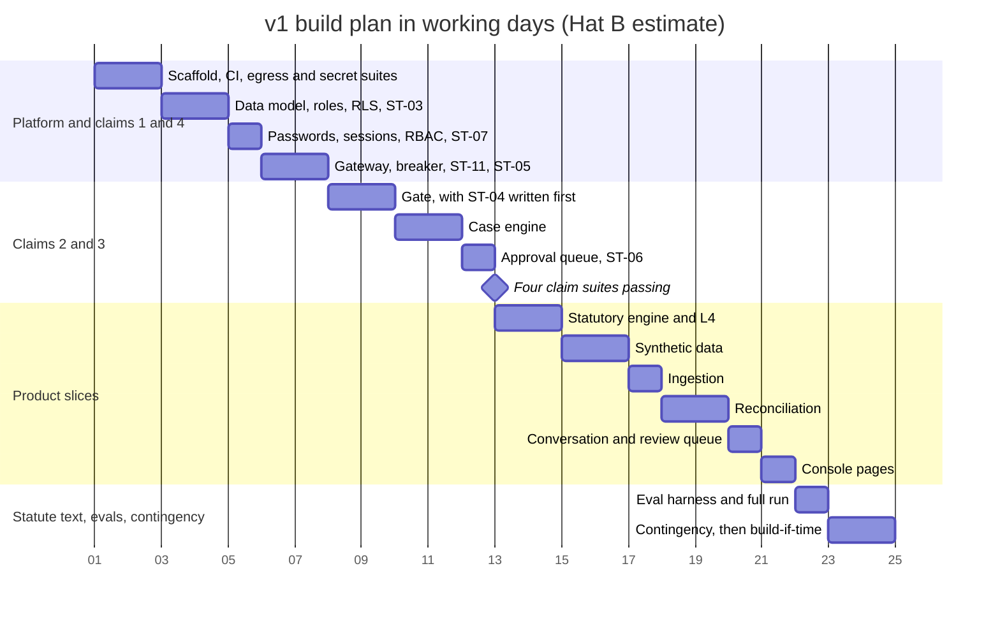

# Chukta: Implementation Feasibility Review (Hat B)

| | |
|---|---|
| **Purpose** | A blunt review of what the doc set asks for, measured against 28 days and one developer. It names every feature that does not fit and labels what happens to it, ranks the security test suites, costs authentication, and sequences the build so the project's claims are tested early. |
| **Intended reader** | The owner, who decides the cuts. Hat A, who turns them into ADRs at step 4. Hat C, whose controls this review shrinks. |
| **Status** | Approved by the owner 2026-09-11, including the §3 disagreement. The owner's decisions and fixes FB-01 and FB-02 were applied at step 4 (§10). |
| **Author hat** | Hat B, Implementation Lead |
| **Last updated** | 2026-09-12 |
| **Reviewed** | `00-PRD.md` at `078b7d4`, `01-ARCHITECTURE.md` at `762d8b7`, ADR-0001 to 0019, `06`, `12` and `SEC-REVIEW-ARCH.md` at `7c66d16`, and the owner's SEC-01. `02` to `05` do not exist yet. |

### Conventions

- **Day figures are Hat B's planning estimates** in developer-days, given as a range with a midpoint. They are not System or Business-outcome metrics, and nothing here claims them as results.
- **Every item gets one label:**

| Label | Meaning |
|---|---|
| KEEP | Built in v1 as written |
| SHRINK | Built in v1 in a smaller form. What is cut is stated. |
| BUILD-IF-TIME | Built only from contingency, in the order given in §5.3. Each has a pre-declared fallback in case it is not built. |
| **DEFER (DF-nn)** | Not in v1. Written into `12` §9.2 as a pilot-gate item, so it cannot be forgotten. |
| **SKIP (SK-nn)** | Not built, and not coming back unless a new ADR reverses it. Never listed in `12` §9. |

- Build items are numbered B1 to B15 (§2). Stance: hostile to scope. Anything not needed to prove the project's claims within 28 days is out.

---

## 0. Verdict

- **As written, the doc set is about 65 to 70 developer-days of work.** 28 days holds about 20 planned days. Nothing has been cut since checkpoint 1, and everything has grown: 42 FRs, 14 NFRs, 24 system metrics, 9 architecture decisions, 14 security decisions, 15 security test suites and a 13-point pilot gate.
- **What v1 becomes after the cuts:**
  - the four claims the project makes, each tested within the first twelve days
  - the statutory engine, as the carrier for the citation gate
  - two AI slices: Reconciliation and Conversation

  Everything else is labelled below.
- **The committed scope is 22.0 days at midpoint, against 20 planned.** It is over by 2 days, and this review says so rather than hiding it. A scope rule at the day-12 checkpoint decides what drops if the claims slip (§6).
- **The biggest cuts:**
  - the RAG layer, which has no consumer once the dispute agent is deferred
  - the dispute agent, the analyst, OCR and scans, and MCP
  - full MFA, malware scanning and Prometheus

  Evidence packets and the Razorpay loop become build-if-time.
- **Where Hat B disagrees with the owner:** the PRD states seven safety invariants, not four. So ST-01, ST-05 and ST-07 (the role matrix) join the must-build list, and ST-08 becomes mandatory if Razorpay ships. Each costs half a day or less. The argument is in §3.
- **Three decisions only the owner can make** (§5.2):
  - OD-1: deferring the RAG layer conflicts with the brief's §2 (DF-11).
  - OD-2: moving the Razorpay loop to build-if-time reverses part of the checkpoint-1 change to ADR-0011.
  - OD-3: moving evidence packets to build-if-time touches the PRD's primary product.

---

## 1. Assumptions

| Assumption | Value | If it is wrong |
|---|---|---|
| Calendar | 28 calendar days in six-day weeks: 24 working days | If the owner means 28 working days, the 4 extra days go to build-if-time items, in order |
| Planned versus contingency | 20 days planned, 4 days of contingency (about 17%) | Less contingency means the day-12 rule fires sooner |
| Developer | One developer fluent in the stack, using AI coding assistance. Estimates include integration and debugging, which is where one-person projects lose time. | If slower, the day-12 rule fires |
| Runtime | Docker Compose on the developer's machine (`01` §10.1). Nothing is deployed. | Not applicable |
| Local model | The configured SLM runs on the developer's machine (PROJECT_CONTEXT O-06) | A smaller model changes eval results, not the plan |
| Owner inputs | O-06 by elapsed day 4, the H set (O-05) by day 18, statute text (O-04) by day 21 | Each slip and its effect is listed in §7 |

---

## 2. The full scope, costed

This table lists every build item the documents ask for. For each it gives an estimate for the scope as written, a verdict, and what v1 spends on it. Rows B1 to B15 cover everything inside them. The rows after them list only work that sits in none of B1 to B15.

| # | Item | Source | As written (days) | Verdict | v1 days |
|---|---|---|---|---|---|
| B1 | Repo, Compose with the five networks and the proxy, CI with the doc lint | `01` §10.1 | 1.5 (1 to 2) | KEEP. Includes ST-09 and ST-13. | 1.5 |
| B2 | Data model, migration and runtime roles (SEC-01), forced RLS, migration lint, `tenant:case` checkpoints (S-07), append-only audit table, `synthetic` flag | PRD, `01` §7, ADR-0012, ADR-0014 | 2.5 (2 to 3) | KEEP. Includes ST-03. | 2.5 |
| B3 | Authentication and RBAC | `06` S-02, PRD §7.2 | 4.5 (3.5 to 6) | SHRINK to passwords, server sessions and RBAC (§4). MFA becomes DF-01. | 1.0 |
| B4 | Model gateway: routing, local and hosted clients, spend ledger, circuit breaker, slot-level pseudonymisation with a blocking pre-send scan | `01` §8, NFR-14, S-05 | 1.5 (1 to 2) | KEEP. Includes ST-11 and ST-05. | 1.5 |
| B5 | Case engine: account cases, invoice state machine, LangGraph threads, `wake_at`, outbox, lock and dirty flag | ADR-0009, ADR-0013, `01` §6 | 2.0 (1.5 to 2.5) | KEEP. The outbox relay runs inside the scheduler process instead of as its own process. | 2.0 |
| B6 | Renderer, slots, gate stages G1 to G5, S-04's extra tokens, echo check | ADR-0010, `06` §3.3 | 2.5 (2 to 3) | KEEP. Includes ST-04 and the deterministic cases of ST-02. | 2.5 |
| B7 | Approval queue: hash binding, finalise, `wa.me` and `mailto` links, sent-mark, CA attestation, pending-draft watermark | PRD §7, S-13 | 1.0 (1 to 1.5) | KEEP. Includes ST-06, minus its MCP cases. | 1.0 |
| B8 | Statutory engine: eligibility with reason codes, due date, s.16 interest, bank-rate table, B-1 ladder, corpus loader with test fixtures, L3 and L4 notices | PRD §3.2, §5.3, §5.8, ADR-0004, ADR-0005 | 3.0 (2.5 to 3.5) | SHRINK: one method profile, the L4 template only, no model prose (SK-02). L3 becomes DF-15. | 2.0 |
| B9 | Ingestion, excluding OCR | PRD FR-ING-1 to 3 | 3.5 (3 to 4.5) | SHRINK to: CSV and XLSX registers in a fixed schema; XLSX and CSV ledgers; CSV bank statements; pasted messages; mail fixture replay; uploads with a manual document-type tag; and S-08's cheap controls (type allowlist with macro rejection, size limits, hardened XML parsing). PDF ledgers become DF-07, live mail and WhatsApp DF-08, the mapping UI DF-16. | 1.0 |
| B10 | Conversation: multi-label classification, extraction, code validation, review routing | PRD FR-CNV-1 to 3 | 1.5 (1 to 2) | SHRINK to English and Hinglish. Devanagari becomes DF-13. Includes the stub-model half of ST-01. | 1.0 |
| B11 | Reconciliation: layout inference, matcher, residual causes, BCS with tie-out | PRD FR-REC-1 to 3 | 3.0 (2.5 to 4) | SHRINK: residual causes come from code rules (deduction arithmetic, credit-note links, timing), and the local model reads narrations. The frontier path becomes DF-14. | 2.0 |
| B12 | Human review queue | PRD FR-HQ-1 to 6 | 1.5 (1 to 2) | SHRINK to one queue with list and resolve, coarse per-invoice blocking, and an age flag in the Console. The digest is SK-03. | 0.5 |
| B13 | Console UI | PRD §5 | 3.0 (2.5 to 4) | SHRINK to plain server-rendered pages: case list, case view, uploads, approval screen and review queue. No dashboards. | 1.0 |
| B14 | Synthetic data generator | `08`, `12` §8 | 2.5 (2 to 3) | SHRINK to two tenants, their customers and invoices, ledgers with known discrepancies, messages generated by a different model family, and adversarial fixtures | 1.5 |
| B15 | Eval harness | `05`, PRD §10.1 | 3.0 (2.5 to 4) | SHRINK to per-source metrics with bootstrap intervals, and cost per case from the spend ledger. Trajectory evals go with DF-09, retrieval metrics with DF-11, faithfulness with SK-01. | 1.0 |
| | **Committed v1** | | **36.5** | | **22.0** |
| | Evidence packets | PRD FR-EVD-1 to 3 | 1.5 | BUILD-IF-TIME 1 (fallback DF-17) | (1.0) |
| | Razorpay loop, with S-06, S-12 and ST-08 | PRD FR-PAY-1, FR-PAY-2 | 1.0 | BUILD-IF-TIME 2 (fallback DF-18) | (1.0) |
| | Langfuse tracing with masking | ADR-0015, NFR-10 | 0.5 | BUILD-IF-TIME 3 (fallback DF-19) | (0.5) |
| | Audit anchoring and ST-12 | `01` D-08, S-10 | 0.75 | BUILD-IF-TIME 4 (fallback DF-20) | (0.75) |
| | Real-data detection and ST-14 | S-11 | 0.5 | BUILD-IF-TIME 5 (fallback SK-06) | (0.5) |
| | Manual acceptance-reset action | PRD FR-DSP-2 | 0.5 | BUILD-IF-TIME 6 (fallback DF-21) | (0.25) |
| | Real-model cases of ST-01 and ST-02, and an ST-10 smoke test | `06` §5 | 0.5 | BUILD-IF-TIME 7 (fallback DF-22) | (0.5) |
| | Dispute agent and its trajectory evals | PRD FR-DSP-1 | 3.0 | DEFER DF-09 | 0 |
| | Analyst | PRD FR-ANL-1, FR-ANL-2 | 2.0 | DEFER DF-10 | 0 |
| | RAG layer: hybrid retrieval, reranking, three corpora, multi-hop | Brief §2, `04` | 4.0 | DEFER DF-11. The owner decides. | 0 |
| | MCP endpoint | PRD FR-INT-3, S-01 | 1.5 | DEFER DF-12 | 0 |
| | OCR and scan classification | PRD FR-ING-4, `01` A-Q6 | 2.5 | DEFER DF-06 | 0 |
| | Malware scanning and the full ST-10 | S-08 | 1.0 | DEFER DF-02 | 0 |
| | Minimisation tooling and ST-15 | `12` §5 | 1.0 | DEFER DF-03 | 0 |
| | Erasure tooling | `12` §6 | 2.0 | DEFER DF-04 | 0 |
| | Prometheus metrics and alerts | `01` §11 | 1.0 | DEFER DF-05 | 0 |
| | Name-finding pseudonymisation pass for hosted free-text calls | `01` §8, S-05 | 1.0 | DEFER DF-14 | 0 |
| | G6 entailment check | `06` §3.3 | 1.0 | SKIP SK-01 | 0 |
| | Production target on AWS | `01` §10.3 | Out of scope since F-03 | Not built. Nothing to cut. | 0 |
| | Tally adapter and send adapter | PRD FR-INT-1, FR-INT-2 | Specification only | Written in `07`. Not built. | 0 |

**The rows sum to about 62 days,** before the integration and debugging time that any system this size needs. That puts the doc set at 65 to 70 days: three times what 28 days can hold.

---

## 3. Security test suites, ranked

The owner ranks four suites as non-negotiable, because they verify the four claims the project makes: tenant isolation, the citation gate, no send path, and the spend cap. **Hat B agrees on all four.**

But the PRD makes more than four claims. §10.2 states **seven** safety invariants as [System] targets of zero or 100%: SM-01 to SM-06 and SM-24. A suite that is not built leaves one of those numbers untested. The extra suites below are cheap, because the cuts in §2 shrink what they have to cover.

| Suite | What it proves | Owner | Hat B | Extra cost in v1 | Reason |
|---|---|---|---|---|---|
| ST-03 | SM-02, tenant isolation (claim 1) | Must | **Must** | 0.75, inside B2 | Agree |
| ST-04 | SM-01, the citation gate (claim 2) | Must | **Must** | 1.0, inside B6 | Agree. It also absorbs ST-02's deterministic cases, which run through the same scanner. |
| ST-06 | SM-03, no send path (claim 3) | Must | **Must** | 0.5, inside B7 | Agree. Its MCP cases move with MCP (DF-12). |
| ST-11 | SM-24, the spend cap (claim 4) | Must | **Must** | 0.25, inside B4 | Agree |
| ST-09 | D-03's egress rule | Keep, cheap | **Must** | 0.25, inside B1 | Agree. It is the network half of claim 3. |
| ST-13 | Secrets and supply chain | Keep, cheap | **Must** | 0.25, inside B1 | Agree |
| ST-01 | SM-04: injected text causes no state change | Not ranked | **Must, stub-model half** | 0.5, inside B10 | **Disagree.** SM-04 = 0 is a stated invariant. The stub half tests the deterministic controls that make it true: reading nodes with no tools, schema rejection, UTR corroboration and delimiter stripping. The real-model half is BUILD-IF-TIME 7. |
| ST-05 | SM-05: no unredacted identifiers leave | Not ranked | **Must, slot level** | 0.25, inside B4 | **Disagree.** SM-05 = 0 is a stated invariant. After the cuts, the only hosted calls are drafting prompts built from slots (DF-14 defers free text), so the suite is small. |
| ST-07 | Who may approve what | Not ranked | **Must, role matrix only** | 0.5, inside B3 | **Disagree.** A wrong role approving is bypass path P-7, which makes this half of claim 3. The MFA and step-up cases go with DF-01. |
| ST-08 | Webhook forgery and replay | Not ranked | **Must if Razorpay ships** | 0.25, inside BUILD-IF-TIME 2 | **Partly disagree.** A webhook shipped without it is an untested way to change an invoice's state, so the two ship together or not at all. |
| ST-02, end to end | Laundering through a real model | Not ranked | BUILD-IF-TIME 7 | 0.25 | Its deterministic half is already inside ST-04 |
| ST-12 | Audit tamper detection | Not ranked | BUILD-IF-TIME 4 | 0.25 | Meaningful only once the chain is anchored |
| ST-14 | The real-data gate | Not ranked | BUILD-IF-TIME 5 | 0.25 | The `synthetic` flag in B2 carries the gate in v1 |
| ST-10 | File-borne attacks | Defer | **Defer as DF-02, plus a three-case smoke test in BUILD-IF-TIME 7** | 0.25 for the smoke test | **Agree on the scanner and the full suite.** But B9 keeps three cheap controls (type allowlist, size limits, hardened XML), and a control with no test at all is exactly the pattern this review argues against. |
| ST-15 | Minimisation | Defer | **Defer as DF-03** | 0 | Agree. It matters once real exports arrive, not in v1. |

**Result.** Nine suites are committed in v1, and a tenth (ST-08) ships with Razorpay if Razorpay ships. Every safety invariant in the PRD has a suite in v1, except SM-06, which the exactly-once tests in `11` cover instead. Hat B's additions over the owner's list cost 1.25 days, and they are already inside the committed 22.

---

## 4. What authentication v1 actually needs (S-02, costed)

`06` S-02 specifies full authentication. Here it is costed honestly for what v1 is: three seeded demo users, synthetic data, one machine.

| Part of S-02 | Days | What it protects in v1 |
|---|---|---|
| Password login with Argon2id, server-side sessions, session rotation, CSRF and origin checks | 0.5 | Everything. Without it there are no roles. |
| Server-side RBAC matrix, active-tenant pinning, and the ST-07 role-matrix tests | 0.5 | Claim 3: only the right role approves (bypass path P-7) |
| TOTP enrolment and login verification, with encrypted seeds | 1.0 | Nothing of value in v1: synthetic data, one machine, three known users |
| Step-up on seven action types, with a freshness window | 1.0 | The same, and it adds friction to every demo run |
| Recovery codes | 0.5 | Needed only once MFA exists |
| Audited admin CLI reset | 0.25 | The seeding CLI already creates users, and a reset is the same command |
| Login rate limits and lockout | 0.25 | Low value in v1. nginx's per-IP limits cover it. |
| MFA and step-up tests | 0.5 | Tests for controls that would not be built |
| **Full S-02** | **4.5 (3.5 to 6)** | |
| **v1 recommendation** | **1.0** | The first two rows, plus the seeding CLI and nginx's login limit |

**Recommendation**
- **Build** the first two rows, a CLI that creates and resets the seeded users and writes an audit event, and nginx's login rate limit.
- **Defer** TOTP, step-up and recovery codes to the pilot gate as DF-01. Condition 9 in `12` §9.1 already requires them before real data. **This saves 3.5 days.**
- **Make the deferral cheap to undo.** The user table carries nullable TOTP fields from day one, and the step-up action list is a single enumeration in code, so adding the check later touches one place.
- **Do not build a no-op step-up check.** A security check that always passes is worse than no check, because it reads as protection.
- **Auth.js caveat.** Its credentials (password) provider is built around JWT sessions, while S-02 asks for database sessions. Confirm this against current Auth.js documentation in `07`. If it holds, v1 skips Auth.js and uses a small hand-written session module (a session table and a signed cookie), instead of fighting the library.

---

## 5. What does not fit, and what happens to it

### 5.1 Deferred to the pilot gate

DF-01 to DF-16 are written into `12` §9.2, each marked Required before the pilot or needing a decision. Grouped by theme:

- **Security controls:** DF-01 MFA, DF-02 malware scanning, DF-03 minimisation, DF-04 erasure, DF-05 alerts, DF-14 the free-text redaction pass
- **Ingestion breadth:** DF-06 OCR, DF-07 PDF ledgers, DF-08 live mail and WhatsApp, DF-13 Devanagari, DF-16 the mapping UI
- **Product features:** DF-09 the dispute agent, DF-10 the analyst, DF-11 RAG, DF-12 MCP, DF-15 the L3 template

### 5.2 Decisions only the owner can make

| ID | Decision | Hat B recommends | Why it needs the owner |
|---|---|---|---|
| OD-1 | Defer the RAG layer (DF-11) | **Defer.** Once the dispute agent is deferred, nothing in v1 retrieves from a corpus. Conversation classifies one message at a time. Reconciliation reads the file in front of it. Drafting sees only typed facts (SR-06). Evidence uses the entity graph, which stays. Building hybrid retrieval now would mean building it only to feed its own metric. If the owner wants retrieval shown in v1, the cheapest real consumer is "find the message where this buyer promised to pay", at about 2 days from contingency. | The brief's §2 specifies the RAG layer, and rule 9 says no requirement is cut silently |
| OD-2 | Move the Razorpay loop to build-if-time | **Build-if-time, second in line.** It proves none of the four claims, and it adds a send path that SR-02 had to close. Counting S-06, S-12 and ST-08, it costs 1 day, not the half day estimated at checkpoint 1. | The owner added it at checkpoint 1 (ADR-0011) |
| OD-3 | Move evidence packets to build-if-time | **Build-if-time, first in line.** For a proof, Reconciliation is the richer half of the primary product: AI layout reading, a deterministic matcher, and an artifact that passes through the gate. Without OCR (DF-06), an evidence packet is mostly file bundling. | The PRD names Evidence and Reconciliation as the primary product (§1.3) |

**Owner decisions (2026-09-11):** OD-2 and OD-3 agreed. OD-1 agreed for v1, with a correction to the plan's shape: the RAG layer returns together with the dispute agent in a bounded 8-day Phase 2 after v1 (ADR-0032). They are the two components that demonstrate retrieval engineering, so deferring them is right for v1 and wrong permanently. Phase 2 restores RAG with its consumer, which answers this review's objection instead of overriding it.

### 5.3 Build-if-time, in order

These are built only from contingency, strictly in this order, after the committed 22 days. Each has its fallback declared now, so nothing is quietly dropped.

| Order | Item | Days | If not built by day 24 |
|---|---|---|---|
| 1 | Evidence packets: AP request parsing and packet assembly (FR-EVD-1 to 3) | 1.0 | DF-17. Decide before the pilot. |
| 2 | The Razorpay test-mode loop, with S-06, S-12 and ST-08 | 1.0 | DF-18. Decide before the pilot. |
| 3 | Langfuse tracing with masking | 0.5 | DF-19. Required (`12` §9.1, condition 11). |
| 4 | Audit chain anchoring, and ST-12 | 0.75 | DF-20. Required. |
| 5 | Real-data detection, and ST-14 | 0.5 | SK-06. Moot once the pilot gate lifts. |
| 6 | A manual acceptance-reset action (FR-DSP-2) | 0.25 | DF-21. Decide, together with DF-09. |
| 7 | Real-model cases of ST-01 and ST-02, and the ST-10 smoke test | 0.5 | DF-22. Required. |

The seven items total 4.5 days. Only 2 days of contingency remain after the committed scope, so expect items 1 and 2 at best.

### 5.4 Skipped

These are not built, not in the pilot gate, and not coming back without a new ADR.

| ID | Skipped | Why |
|---|---|---|
| SK-01 | The G6 entailment check, and SM-18 | Statutory artifacts are template-only (SK-02), so there is no model prose around a citation to check. It returns only with an ADR that allows model prose in statutory artifacts. |
| SK-02 | Model-written prose in statutory artifacts (the model part of FR-STA-5) | Templates only. ADR-0010 already names fixed templates as the fallback, and v1 makes the fallback the design. |
| SK-03 | The review queue's daily digest (part of FR-HQ-5) | v1 sends no email to anyone. The Console flag is the escalation. |
| SK-04 | AWS Network Firewall | `06` S-03 already found it unnecessary |
| SK-05 | A separate staging environment | Nothing is deployed in v1 |
| SK-06 | Real-data detection, if build-if-time item 5 is not built | The `synthetic` flag carries the gate in v1, and detection becomes moot once the pilot gate lifts |

---

## 6. Build sequence: the claims first

**Rule: each claim's test suite lands with its feature, or before it, and runs on every push from the day it exists.** ST-04, the gate's mutation suite, is written before the gate and fails until the gate passes it. No suite waits for a final hardening phase.

| Elapsed days | Build | Suite that lands |
|---|---|---|
| 0 to 1.5 | B1: repo, Compose networks, proxy, CI, doc lint | ST-09, ST-13, and ST-06's static half (no messaging dependency) |
| 1.5 to 4.0 | B2: data model, migration and runtime roles, forced RLS, `tenant:case` checkpoints | **ST-03, claim 1** |
| 4.0 to 5.0 | B3: passwords, sessions, RBAC | ST-07 role matrix |
| 5.0 to 6.5 | B4: model gateway, spend ledger, breaker, slot pseudonymiser, pre-send scan | **ST-11, claim 4**, and ST-05 |
| 6.5 to 9.0 | B6: renderer, slots and gate. ST-04 is written first, on day 6.5, and fails until the gate passes it. | **ST-04, claim 2**, with ST-02's deterministic cases |
| 9.0 to 11.0 | B5: case engine | The exactly-once tests (SM-06, in `11`) |
| 11.0 to 12.0 | B7: approval queue, hash binding, finalise, sent-mark | **ST-06 complete, claim 3** |
| **12.0** | **Checkpoint: all four claim suites exist and pass on every push** | The scope rule below |
| 12.0 to 14.0 | B8: statutory engine, B-1, L4 template, corpus loader with fixtures | The R set: SM-07, SM-08. The L4 notice now runs through ST-04. |
| 14.0 to 15.5 | B14: synthetic data generator | Fixtures for everything after it |
| 15.5 to 16.5 | B9: ingestion | File-type allowlist tests |
| 16.5 to 18.5 | B11: reconciliation | SM-09 to SM-12 |
| 18.5 to 19.5 | B10: conversation | ST-01 stub half, SM-13, SM-14 |
| 19.5 to 20.0 | B12: review queue | FR-HQ tests |
| 20.0 to 21.0 | B13: Console pages | None |
| 21.0 to 22.0 | B15: eval harness and the first full eval run | The per-source report, and cost per case |
| 22.0 to 24.0 | Contingency, then build-if-time items in order | |

**The PRD's "Phase 4"** (Appendix B) is elapsed days 21 to 24. The owner loads the verified statute text (O-04), so the final eval run exercises the L4 notice against real provisions, not fixtures.

**The scope rule at the day-12 checkpoint:**
- **All four claim suites pass:** continue as planned.
- **Up to 1 day behind:** B10 Conversation drops to build-if-time, first in line. The H set waits for it.
- **More than 1 day behind:** stop and re-plan with the owner. The claims come first, and the product slices shrink to fit.

The chart below uses whole days. The table above is exact.

---

## 7. Owner inputs, and when they are needed

| Input | Needed by (elapsed day) | Why | If it is late |
|---|---|---|---|
| O-06: confirm the local model fits the developer's machine, and name the frontier model | 4 | B4 wires up both clients | B4 is built against a stub, and real-model evals slip |
| O-05: the 80-message H set | 18 | B10 is evaluated against it | Conversation ships with G-set scores only. H-set results follow later. |
| O-04: verified statute text (PRD Appendix B) | 21 | The final eval run uses real provisions | The L4 notice is shown on test fixtures only, and says so |
| O-03: verify V01 to V24 | 21, alongside O-04 (FB-01, ADR-0033) | The final eval run exercises the L4 notice against verified provisions. The earlier trigger, "before any statutory output leaves the developer's machine", never fires in v1. | Unverified tags are listed in the eval report, and dependent artifacts stay labelled unverified |
| OD-1 to OD-3 (§5.2) | Before day 12 | They change what gets built after the checkpoint | Hat B's recommendations apply by default |
| `01` A-Q1 (mail provider) and A-Q6 (OCR engine) | Not needed in v1 | Deferred as DF-08 and DF-06 | Not applicable |

---

## 8. Changes Hat A must make at step 4

These cuts touch frozen documents. Each needs an ADR at step 4, not a quiet edit.

- **PRD goals:** G1 (Evidence) and G7 (payments) become build-if-time (OD-3, OD-2). G5 (disputes) and G6 (cash questions) are deferred (DF-09, DF-10).
- **PRD requirements:**
  - FR-EVD-1 to 3 and FR-PAY-1 to 2 become build-if-time.
  - FR-DSP-1, FR-ANL-1 to 2 and FR-INT-3 are deferred.
  - FR-ING-1 to 4 shrink as described in B9.
  - FR-STA-5 becomes template-only (SK-02).
  - FR-HQ-5 loses its digest (SK-03).
- **PRD metrics:**
  - SM-15, SM-16, SM-17, SM-19 and SM-20 are not measured in v1, because their features are deferred.
  - SM-18 is skipped (SK-01).
  - SM-21 and SM-22 are still reported. SM-21 becomes easier to meet, because hosted calls are drafting only. A high SM-21 in v1 is therefore partly a consequence of deferring DF-14, not a routing optimisation. The PRD row and every eval report say so next to the figure (FB-02, ADR-0034).
- **PRD §3.1:** Devanagari support is deferred (DF-13).
- **NFR-10:** full trace coverage depends on build-if-time item 3. The spend ledger stays the source of truth for cost.
- **ADR-0011:** the Razorpay loop moves to build-if-time, if the owner agrees (OD-2).
- **ADR-0013:** the outbox relay runs inside the scheduler process. This is a deployment detail, not a new decision.
- **ADR-0015:** Langfuse becomes build-if-time.
- **ADR-0016:** in v1, the only hosted calls are drafting prompts built from slots. Free-text hosted calls wait for DF-14.
- **`01` §11:** Prometheus is deferred (DF-05).
- **`06`:**
  - S-02 shrinks, with the rest deferred as DF-01.
  - S-08 keeps its cheap controls and defers malware scanning (DF-02).
  - S-10 and S-11 become build-if-time.
  - S-01 falls to option (c) until MCP exists (DF-12).
- **The brief:** the RAG layer is deferred, if the owner agrees (OD-1).
- **`02`:** the two database roles (SEC-01, O-14), which B2 builds from elapsed day 1.5.

---

## 9. Risks to this plan

| Risk | Effect | Mitigation |
|---|---|---|
| The configured SLM does not fit the developer's machine, or runs too slowly | Eval runs take hours, and a smaller model changes the results | Settle O-06 by day 4. Run evals overnight. Use stub models for every per-push suite. |
| LangGraph checkpoints with the `tenant:case` prefix and RLS on `agent_runtime` | B5 slips | A spike on day 9. If RLS on LangGraph's own tables fights the library, keep the prefix wrapper and log the RLS part as a finding for step 4. |
| Prisma and RLS: `SET LOCAL` needs an interactive transaction around every tenant query | B2 slips, and query code gets noisy | One data-access wrapper that opens the transaction and sets the tenant, written on day 2 and used everywhere |
| Auth.js with password login and database sessions (§4) | B3 slips | The hand-written session module |
| Synthetic ledgers are too regular to test layout inference | SM-09 looks better than reality | The generator varies headers, sign conventions and merged cells on purpose. G and H results are reported separately (ADR-0017). |
| One developer means no reviewer | Defects reach `main` | Every claim suite runs on every push, and the owner reviews at each checkpoint |
| The plan is 2 days over from day one | Contingency is thin | The day-12 rule (§6) |

---

## 10. Revision history

| Date | Change | Why |
|---|---|---|
| 2026-09-11 | First version | Hat B, step 3 |
| 2026-09-11 | Approved by the owner, including the §3 disagreement | Owner's review |
| 2026-09-12 | Owner decisions recorded under §5.2. §7's O-03 row pinned to build day 21. §8's SM-21 note given its cause. | OD-1 to OD-3, FB-01 (ADR-0033), FB-02 (ADR-0034) |
